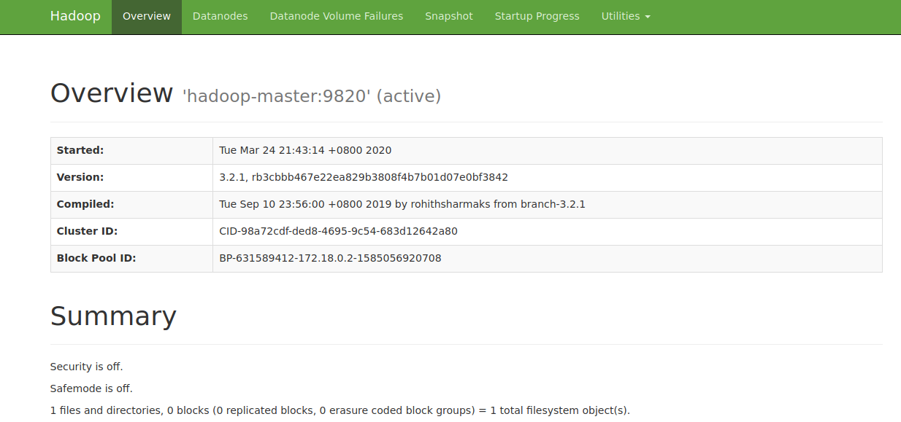
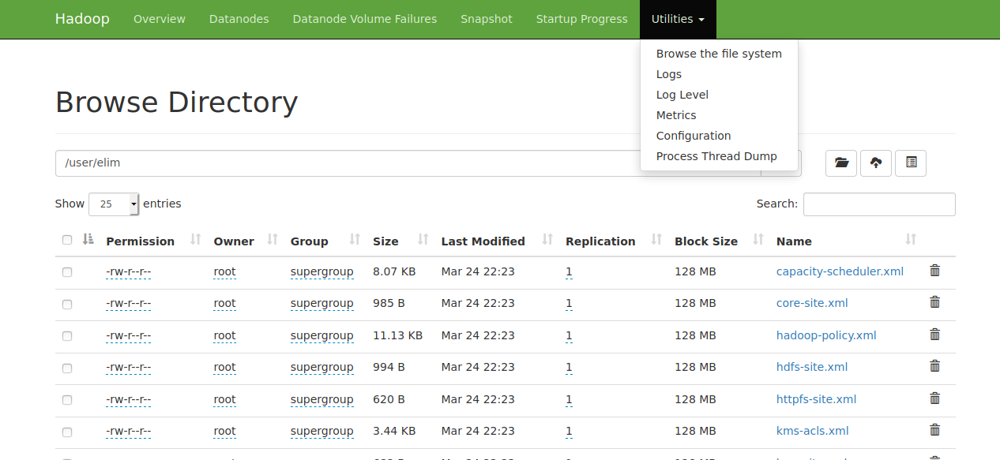

# 伪分布式hadoop集群搭建

> 为了方便今后搭建多机器的hadoop集群，伪分布式hadoop集群也采用docker进行搭建

1. 下载hadoop包

从官网[https://www.apache.org/dyn/closer.cgi/hadoop/common/hadoop-3.2.1/hadoop-3.2.1.tar.gz](https://www.apache.org/dyn/closer.cgi/hadoop/common/hadoop-3.2.1/hadoop-3.2.1.tar.gz)下载当前最新的hadoop-3.2.1版本的包。把它放在`/root/dev/tools`目录下，并解压为`/root/dev/tools/hadoop-3.2.1`。


2. 创建一个专用的docker网络

方便后续搭建多节点的hadoop集群时节点之间的通信，创建一个专用的网络。运行`docker network create hadoop`创建一个名为hadoop的桥接网络。

3. 启动docker容器

这里采用当前最新的ubuntu容器，在宿主机上运行下面命令。它将以交互模式运行一个ubuntu容器，该容器的名字是hadoop-master，host也是hadoop-master，使用的网络就是刚刚创建的hadoop桥接网络。它把宿主机的`/root/dev/tools/jdk1.8.0_211`映射为容器中的`/opt/jdk1.8`了。

```shell
docker run -ti -P --name hadoop-master -h hadoop-master --network hadoop -v /root/dev/tools/jdk1.8.0_211:/opt/jdk1.8 ubuntu /bin/bash
```

运行上述指令后就以交互模式进去了容器的命令行。

4. 拷贝hadoop安装程序到容器

重新打开宿主机上的一个终端，通过运行如下命令就把宿主机上的`/root/dev/tools/hadoop-3.2.1`复制到了容器中的`/opt/hadoop-3.2.1`了。

```shell
docker cp /root/dev/tools/hadoop-3.2.1 hadoop-master:/opt
```

5. 容器中安装ssh

先在容器中执行`apt-get update`再执行以下指令安装ssh和pdsh，因为hadoop的namenode操作其它datanode需要进行ssh免密登录

```shell
apt-get install ssh
apt-get install pdsh
```

> 安装完后需要运行`service ssh start`启动sshd服务。

> pdsh默认采用的是rsh登录，需要修改成ssh登录，在/etc/profile里加入`export PDSH_RCMD_TYPE=ssh`。然后再运行`source /etc/profile`使其生效。不进行该配置时启动hadoop时会出现`pdsh@hadoop-master: localhost: connect: Connection refused`。

6. 设置免密登录

在容器中执行以下指令以生成RSA密钥，然后把公钥存放到`~/.ssh/authorized_keys`中，这样就能免密登录到本机了。hadoop伪分布式在对本机操作时也需要使用ssh进行免密登录。

```shell
ssh-keygen -t rsa -P '' -f ~/.ssh/id_rsa
cat ~/.ssh/id_rsa.pub >> ~/.ssh/authorized_keys
chmod 0600 ~/.ssh/authorized_keys
```

7. 配置hadoop

7.1 在`/opt/hadoop-3.2.1/etc/hadoop/hadoop-env.sh`的末尾增加如下内容：

```text
export JAVA_HOME=/opt/jdk1.8
export HDFS_NAMENODE_USER=root
export HDFS_DATANODE_USER=root
export HDFS_SECONDARYNAMENODE_USER=root
```

> 这时候可以运行`bin/hadoop`指令，其会输出该指令的使用方法。

7.2 配置`/opt/hadoop-3.2.1/etc/hadoop/core-site.xml`

在该配置文件的configuration标签中配置两个property，配置后的内容如下。其中`172.18.0.2`是容器hadoop-master的IP地址，可以通过`docker network inspect hadoop`进行查看。

```xml
<configuration>
    <!--指定默认的文件系统-->
    <property>
        <name>fs.defaultFS</name>
        <value>hdfs://172.18.0.2:9820</value>
    </property>
    <!--指定临时目录，hadoop内部多种路径默认都会基于该路径进行定义-->
    <property>
        <name>hadoop.tmp.dir</name>
        <value>/var/hadoop/data</value>
    </property>
</configuration>
```

> core-site.xml中的更多配置信息可以参考[https://hadoop.apache.org/docs/stable/hadoop-project-dist/hadoop-common/core-default.xml](https://hadoop.apache.org/docs/stable/hadoop-project-dist/hadoop-common/core-default.xml)


7.3 配置`/opt/hadoop-3.2.1/etc/hadoop/dfs-site.xml`

在该配置文件的configuration标签中配置两个property，配置后的内容如下。

```xml
<configuration>
    <!--指定副本数，伪分布式的副本数配置1即可-->
    <property>
        <name>dfs.replication</name>
        <value>1</value>
    </property>
    <!--配置secondary namenode的http协议地址-->
    <property>
        <name>dfs.namenode.secondary.http-address</name>
        <value>172.18.0.2:9868</value>
    </property>
</configuration>
```

> secondary namenode是用来合并NameNode的edit logs到fsimage文件中
> dfs-site.xml中的更多配置信息可以参考[https://hadoop.apache.org/docs/stable/hadoop-project-dist/hadoop-hdfs/hdfs-default.xml](https://hadoop.apache.org/docs/stable/hadoop-project-dist/hadoop-hdfs/hdfs-default.xml)

7.4 配置datanode

在`/opt/hadoop-3.2.1/etc/hadoop/workers`中加入datanode的IP地址或hostname，即`172.18.0.2`或hadoop-master。

> 其它配置IP地址的地方也是可以配置hostname的。

7.5 格式化文件系统

执行下面的指令进行文件系统的格式化。

```shell
bin/hdfs namenode -format
```

上述指令执行后看到日志信息中会输出类似下面这样一行，其表示文件系统已经被正确的格式化了。

```text
2020-03-24 13:35:20,923 INFO common.Storage: Storage directory /var/hadoop/data/dfs/name has been successfully formatted.
```

7.6 启动namenode和datanode

之后可以运行如下指令来启动namenode和datanode。

```shell
sbin/start-dfs.sh
```

正常情况下你会看到类似下面这样的输出。

```text
root@hadoop-master:/opt/hadoop-3.2.1# sbin/start-dfs.sh 
Starting namenodes on [hadoop-master]
Starting datanodes
Starting secondary namenodes [hadoop-master]
```

之后就可以打开浏览器访问`http://172.18.0.2:9870`，其中`172.18.0.2`是我们容器hadoop-master的IP地址。



7.7 操作文件系统

刚搭建起来的hadoop集群中是还没有文件的。这时候可以使用`bin/hdfs`的子命令`dfs`对文件系统进行操作。可以通过运行`bin/hdfs dfs -h`查看该子命令的用法。

```text
root@hadoop-master:/opt/hadoop-3.2.1# bin/hdfs dfs -h 
-h: Unknown command
Usage: hadoop fs [generic options]
	[-appendToFile <localsrc> ... <dst>]
	[-cat [-ignoreCrc] <src> ...]
	[-checksum <src> ...]
	[-chgrp [-R] GROUP PATH...]
	[-chmod [-R] <MODE[,MODE]... | OCTALMODE> PATH...]
	[-chown [-R] [OWNER][:[GROUP]] PATH...]
	[-copyFromLocal [-f] [-p] [-l] [-d] [-t <thread count>] <localsrc> ... <dst>]
	[-copyToLocal [-f] [-p] [-ignoreCrc] [-crc] <src> ... <localdst>]
	[-count [-q] [-h] [-v] [-t [<storage type>]] [-u] [-x] [-e] <path> ...]
	[-cp [-f] [-p | -p[topax]] [-d] <src> ... <dst>]
	[-createSnapshot <snapshotDir> [<snapshotName>]]
	[-deleteSnapshot <snapshotDir> <snapshotName>]
	[-df [-h] [<path> ...]]
	[-du [-s] [-h] [-v] [-x] <path> ...]
	[-expunge [-immediate]]
	[-find <path> ... <expression> ...]
	[-get [-f] [-p] [-ignoreCrc] [-crc] <src> ... <localdst>]
	[-getfacl [-R] <path>]
	[-getfattr [-R] {-n name | -d} [-e en] <path>]
	[-getmerge [-nl] [-skip-empty-file] <src> <localdst>]
	[-head <file>]
	[-help [cmd ...]]
	[-ls [-C] [-d] [-h] [-q] [-R] [-t] [-S] [-r] [-u] [-e] [<path> ...]]
	[-mkdir [-p] <path> ...]
	[-moveFromLocal <localsrc> ... <dst>]
	[-moveToLocal <src> <localdst>]
	[-mv <src> ... <dst>]
	[-put [-f] [-p] [-l] [-d] <localsrc> ... <dst>]
	[-renameSnapshot <snapshotDir> <oldName> <newName>]
	[-rm [-f] [-r|-R] [-skipTrash] [-safely] <src> ...]
	[-rmdir [--ignore-fail-on-non-empty] <dir> ...]
	[-setfacl [-R] [{-b|-k} {-m|-x <acl_spec>} <path>]|[--set <acl_spec> <path>]]
	[-setfattr {-n name [-v value] | -x name} <path>]
	[-setrep [-R] [-w] <rep> <path> ...]
	[-stat [format] <path> ...]
	[-tail [-f] [-s <sleep interval>] <file>]
	[-test -[defswrz] <path>]
	[-text [-ignoreCrc] <src> ...]
	[-touch [-a] [-m] [-t TIMESTAMP ] [-c] <path> ...]
	[-touchz <path> ...]
	[-truncate [-w] <length> <path> ...]
	[-usage [cmd ...]]

Generic options supported are:
-conf <configuration file>        specify an application configuration file
-D <property=value>               define a value for a given property
-fs <file:///|hdfs://namenode:port> specify default filesystem URL to use, overrides 'fs.defaultFS' property from configurations.
-jt <local|resourcemanager:port>  specify a ResourceManager
-files <file1,...>                specify a comma-separated list of files to be copied to the map reduce cluster
-libjars <jar1,...>               specify a comma-separated list of jar files to be included in the classpath
-archives <archive1,...>          specify a comma-separated list of archives to be unarchived on the compute machines

The general command line syntax is:
command [genericOptions] [commandOptions]
```

> 从上面可以看出子命令`dfs`的用法与标准的文件系统操作的指令是差不多的。


a. 可以通过如下指令在hadoop文件系统中创建`/user/elim`目录。

```shell
bin/hdfs dfs -mkdir -p /user/elim
```

b. 上传文件

运行`bin/hdfs dfs -put etc/hadoop/*.xml /user/elim`可以把`/opt/hadoop-3.2.1/etc/hadoop`目录下的所有XML文件都上传到我们刚刚在hadoop文件系统上新建的`/user/elim`目录下。

```text
root@hadoop-master:/opt/hadoop-3.2.1# bin/hdfs dfs -put etc/hadoop/*.xml /user/elim
2020-03-24 14:23:52,693 INFO sasl.SaslDataTransferClient: SASL encryption trust check: localHostTrusted = false, remoteHostTrusted = false
2020-03-24 14:23:54,022 INFO sasl.SaslDataTransferClient: SASL encryption trust check: localHostTrusted = false, remoteHostTrusted = false
2020-03-24 14:23:54,123 INFO sasl.SaslDataTransferClient: SASL encryption trust check: localHostTrusted = false, remoteHostTrusted = false
2020-03-24 14:23:54,212 INFO sasl.SaslDataTransferClient: SASL encryption trust check: localHostTrusted = false, remoteHostTrusted = false
2020-03-24 14:23:54,312 INFO sasl.SaslDataTransferClient: SASL encryption trust check: localHostTrusted = false, remoteHostTrusted = false
2020-03-24 14:23:54,456 INFO sasl.SaslDataTransferClient: SASL encryption trust check: localHostTrusted = false, remoteHostTrusted = false
2020-03-24 14:23:54,533 INFO sasl.SaslDataTransferClient: SASL encryption trust check: localHostTrusted = false, remoteHostTrusted = false
2020-03-24 14:23:55,123 INFO sasl.SaslDataTransferClient: SASL encryption trust check: localHostTrusted = false, remoteHostTrusted = false
2020-03-24 14:23:55,199 INFO sasl.SaslDataTransferClient: SASL encryption trust check: localHostTrusted = false, remoteHostTrusted = false
```

在我们刚刚在浏览器中打开的hadoop控制台的右上方有个`Utilities`菜单，点开进入第一项子菜单`Browse the file system`可以浏览hadoop的文件系统，然后进入到`/user/elim`目录即可看到我们刚上传的文件。




> 默认的块大小是128M，可以在上传文件时通过属性`dfs.block.size`指定文件的块大小，单位是字节，默认该值不能超过最小值1048576，如`bin/hdfs dfs -D dfs.block.size=1048576 -put share/hadoop/common/hadoop-common-3.2.1.jar /user/elim`则指定了文件块大小为1048576。

c. 获取文件

可以通过dfs的get指令从hadoop文件系统获取文件。比如通过执行`bin/hdfs dfs -get /user/elim elim2`可以把hadoop文件系统的`/user/elim`目录拿到本地并重命名为elim2。

7.8 停止namenode和datanode

当不再需要hadoop服务时可以运行如下指令来停止namenode和datanode。

```shell
sbin/stop-dfs.sh
```

7.9 查看日志

相关的日志信息都可以从`/opt/hadoop-3.2.1/logs`目录下查看相应的日志文件。


