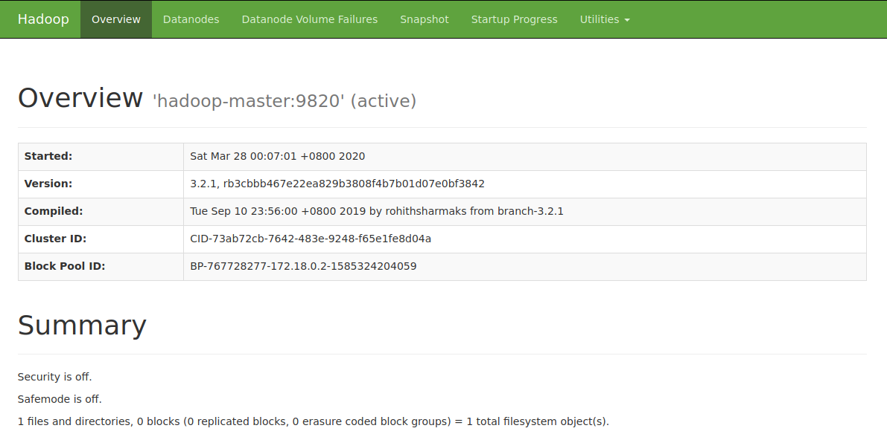
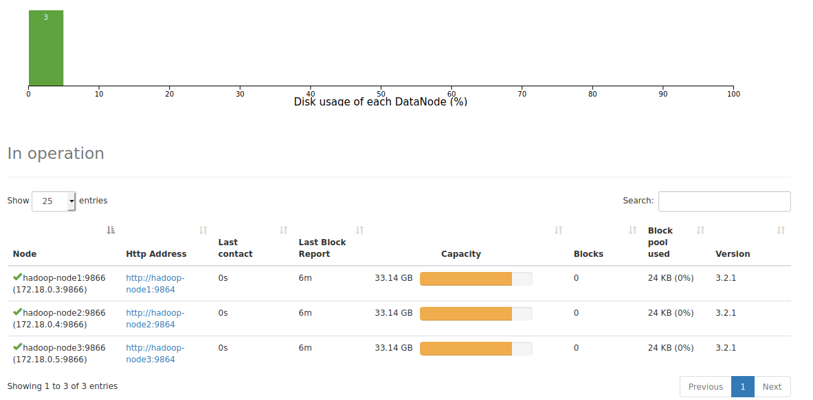
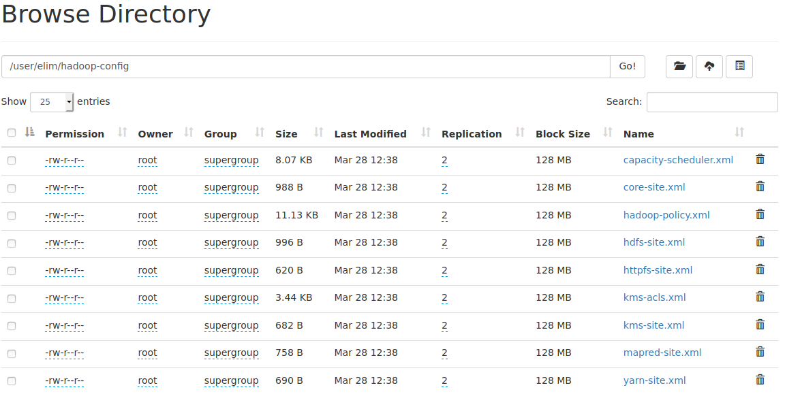

# 全分布式hadoop集群搭建

由于手上只有一台电脑，hadoop集群采用docker进行搭建，docker不是重点。计划基于Ubuntu启4个docker容器，hostname分别为hadoop-master\hadoop-data1\hadoop-data2\hadoop-data3。其中hadoop-master为NameNode，另外三个为DataNode。


## 准备docker容器

为了简便起见，先准备一台已经包含了JDK和hadoop，以及安装了必要的SSH等工具的容器，再把该容器保存为本地镜像，基于它再启动另外3台容器。这样就相当于有了四台已经安装了JDK和Hadoop的机器。

1. 下载hadoop包

从官网[https://www.apache.org/dyn/closer.cgi/hadoop/common/hadoop-3.2.1/hadoop-3.2.1.tar.gz](https://www.apache.org/dyn/closer.cgi/hadoop/common/hadoop-3.2.1/hadoop-3.2.1.tar.gz)下载当前最新的hadoop-3.2.1版本的包。把它放在`/root/dev/tools`目录下，并解压为`/root/dev/tools/hadoop-3.2.1`。


2. 创建一个专用的docker网络

运行`docker network create hadoop`创建一个名为hadoop的桥接网络。

3. 启动docker容器

这里采用当前最新的ubuntu容器，在宿主机上启动一个终端运行下面命令。它将以交互模式运行一个ubuntu容器，该容器的名字是hadoop-master，host也是hadoop-master，使用的网络就是刚刚创建的hadoop桥接网络。

```shell
docker run -ti -P --name hadoop-master -h hadoop-master --network hadoop ubuntu /bin/bash
```

运行上述指令后就以交互模式进去了容器的命令行。

4. 拷贝jdk和hadoop安装程序到容器

重新打开宿主机上的一个终端，通过运行如下命令就把宿主机上的`/root/dev/tools/jdk1.8.0_211`复制到了容器中的`/opt/jdk1.8`，`/root/dev/tools/hadoop-3.2.1`复制到了容器中的`/opt/hadoop-3.2.1`了。

```shell
docker cp /root/dev/tools/jdk1.8.0_211 hadoop-master:/opt/jdk1.8
docker cp /root/dev/tools/hadoop-3.2.1 hadoop-master:/opt
```

并在`~/.bashrc`的最后面加上JAVA_HOME的环境变量，并把执行程序加入到PATH变量中。

5. 容器中安装ssh

先在容器中执行`apt-get update`再执行以下指令安装ssh和pdsh，因为hadoop的namenode操作其它datanode需要进行ssh免密登录

```shell
apt-get install ssh
apt-get install pdsh
```

> 安装完后运行`systemctl enable ssh`设置ssh服务开机自启动。

> pdsh默认采用的是rsh登录，需要修改成ssh登录，在/etc/profile里加入`export PDSH_RCMD_TYPE=ssh`。不进行该配置时启动hadoop时会出现`pdsh@hadoop-master: localhost: connect: Connection refused`。

6. 保存hadoop-master容器为镜像

重新打开一个终端，运行`docker commit hadoop-master hadoop-node:1.0`把hadoop-master容器保存为名为hadoop-node，tag为1.0的镜像。

运行`docker images`可以看到刚刚创建的hadoop-node镜像。

```text
REPOSITORY          TAG                 IMAGE ID            CREATED             SIZE
hadoop-node         1.0                 649b0a650f45        3 minutes ago       701MB
ubuntu              latest              4e5021d210f6        5 days ago          64.2MB
```

7. 启动hadoop-node容器

重新打开一个终端分别启动hadoop-node1、hadoop-node2和hadoop-node3。启动hadoop-node1运行如下指令。

```shell
docker run -ti -P --name hadoop-node1 -h hadoop-node1 --network hadoop hadoop-node:1.0 /bin/bash
```

> 上面使用的镜像就是刚刚基于hadoop-master创建的hadoop-node:1.0。启动hadoop-node2和hadoop-node3只需要重新打开一个新的终端，把上面的指令中的hadoop-node1换成相应的节点名称即可。

至此，我们已经有了4个安装了hadoop的容器。运行`docker network inspect hadoop`可以看到这四个容器对应的IP地址。下面只列出了IP地址相关的部分，可以看到它们的IP地址分别是172.18.0.2/172.18.0.3/172.18.0.4/172.18.0.5。

```text
"Containers": {
    "31897e3763c2f15fc37c16303367d28238439a9b6b8e90c5014dd80d420b38e5": {
        "Name": "hadoop-node3",
        "EndpointID": "a2ce87fe6c70383a2c76db2838e96898e270ec57fc13c5fe3a1d4ee9f76bf37a",
        "MacAddress": "02:42:ac:12:00:05",
        "IPv4Address": "172.18.0.5/16",
        "IPv6Address": ""
    },
    "337c9f97761c0589825008be95a35e2c55fe3dd4fdc8db0ae514baa129035a5a": {
        "Name": "hadoop-master",
        "EndpointID": "d51003e986d87f3464bd588e08f9fd9728d1db9e8abfbce3f504da86784376fb",
        "MacAddress": "02:42:ac:12:00:02",
        "IPv4Address": "172.18.0.2/16",
        "IPv6Address": ""
    },
    "35abe9a1066330c995b894deb636e6af48ea73b12903cf7d28747a5ae3596ca8": {
        "Name": "hadoop-node1",
        "EndpointID": "f2a420f9f794a52192843100240bd7019cb4d9e2d70ae47d56f47f0ee5d2a49a",
        "MacAddress": "02:42:ac:12:00:03",
        "IPv4Address": "172.18.0.3/16",
        "IPv6Address": ""
    },
    "ddc15ed037e4937f647c65b4f1cca5a20bd152b5eb045836dbabb28907b2f791": {
        "Name": "hadoop-node2",
        "EndpointID": "f84cc158db8c6a7b31ba54b325681701e2af559be0b5bd6b7a253c783d150d85",
        "MacAddress": "02:42:ac:12:00:04",
        "IPv4Address": "172.18.0.4/16",
        "IPv6Address": ""
    }
}
```

7. 设置免密登录

> 刚刚设置的自动启动ssh服务的没生效，如果没生效可以分别在4台容器中通过`service ssh start`启动ssh服务。

在hadoop-master容器中执行以下指令以生成RSA密钥，然后把公钥存放到`~/.ssh/authorized_keys`中，hadoop-master操作自己时也会使用ssh免密登录。

```shell
ssh-keygen -t rsa -P '' -f ~/.ssh/id_rsa
cat ~/.ssh/id_rsa.pub >> ~/.ssh/authorized_keys
chmod 0600 ~/.ssh/authorized_keys
```

然后把hadoop-master容器中`~/.ssh/authorized_keys`文件分别拷贝到hadoop-node1、hadoop-node2和hadoop-node3中的`/root/.ssh`目录下。这样hadoop-master就可以免密登录到其它节点了。

## 配置hadoop

### 配置hadoop-master节点

以下操作都是在hadoop-master容器中执行。

1. 配置环境变量

在`/opt/hadoop-3.2.1/etc/hadoop/hadoop-env.sh`的末尾增加如下内容：

```text
export JAVA_HOME=/opt/jdk1.8
export HDFS_NAMENODE_USER=root
export HDFS_DATANODE_USER=root
export HDFS_SECONDARYNAMENODE_USER=root
```

2. 配置`/opt/hadoop-3.2.1/etc/hadoop/core-site.xml`

在该配置文件的configuration标签中配置两个property，配置后的内容如下。其中`172.18.0.2`是容器hadoop-master的IP地址，可以通过`docker network inspect hadoop`进行查看。

```xml
<configuration>
    <!--指定默认的文件系统-->
    <property>
        <name>fs.defaultFS</name>
        <value>hdfs://hadoop-master:9820</value>
    </property>
    <!--指定临时目录，hadoop内部多种路径默认都会基于该路径进行定义-->
    <property>
        <name>hadoop.tmp.dir</name>
        <value>/var/hadoop/data</value>
    </property>
</configuration>
```

> core-site.xml中的更多配置信息可以参考[https://hadoop.apache.org/docs/stable/hadoop-project-dist/hadoop-common/core-default.xml](https://hadoop.apache.org/docs/stable/hadoop-project-dist/hadoop-common/core-default.xml)


3. 配置`/opt/hadoop-3.2.1/etc/hadoop/dfs-site.xml`

在该配置文件的configuration标签中配置两个property，配置后的内容如下。

```xml
<configuration>
    <!--指定副本数，默认副本数是3,这里配置为2-->
    <property>
        <name>dfs.replication</name>
        <value>2</value>
    </property>
    <!--配置secondary namenode的http协议地址-->
    <property>
        <name>dfs.namenode.secondary.http-address</name>
        <value>hadoop-node1:9868</value>
    </property>
</configuration>
```

> secondary namenode是用来合并NameNode的edit logs到fsimage文件中的。默认的`dfs.namenode.secondary.http-address`的值是`0.0.0.0:9868`，即本机地址。即默认每一个DataNode都是一个Secondary NameNode。上面配置为hadoop-node1的地址则只有一个Secondary NameNode。
> dfs-site.xml中的更多配置信息可以参考[https://hadoop.apache.org/docs/stable/hadoop-project-dist/hadoop-hdfs/hdfs-default.xml](https://hadoop.apache.org/docs/stable/hadoop-project-dist/hadoop-hdfs/hdfs-default.xml)

4. 配置datanode

在`/opt/hadoop-3.2.1/etc/hadoop/workers`中加入datanode的IP地址或hostname，每台机器写一行，这里配置如下。

```text
hadoop-node1
hadoop-node2
hadoop-node3
```

### 分发配置到DataNode

把hadoop-master上的配置分发到DataNode节点上。以下操作是在hadoop-master机器的`/opt/hadoop-3.2.1`目录下执行的。由于配置了ssh免密登录，下面的指令执行将不需要输入密码。它会把hadoop-master机器的`/opt/hadoop-3.2.1/etc/hadoop`目录copy到hadoop-node1机器的`/opt/hadoop-3.2.1/etc`目录下。

```shell
root@hadoop-master:/opt/hadoop-3.2.1# scp -r etc/hadoop/ hadoop-node1:/opt/hadoop-3.2.1/etc
```

再以同样的方式把配置信息copy到hadoop-node2和hadoop-node3机器上。


## 格式化文件系统

在hadoop-master机器的`/opt/hadoop-3.2.1`目录下执行下面的指令进行文件系统的格式化。

```shell
root@hadoop-master:/opt/hadoop-3.2.1# bin/hdfs namenode -format
```

上述指令执行后看到日志信息中会输出类似下面这样一行，其表示文件系统已经被正确的格式化了。

```text
2020-03-27 15:50:04,349 INFO common.Storage: Storage directory /var/hadoop/data/dfs/name has been successfully formatted.
```

## 启动集群

启动集群一共有两种方式。

### 方式一

在hadoop-master上运行如下命令。运行该命令可以一次性启动集群中所有的节点，包括NameNode、Secondary NameNode和DataNode。

```shell
root@hadoop-master:/opt/hadoop-3.2.1# sbin/start-dfs.sh
```

正常情况下你会看到类似下面这样的输出。

```text
root@hadoop-master:/opt/hadoop-3.2.1# sbin/start-dfs.sh 
Starting namenodes on [hadoop-master]
Starting datanodes
Starting secondary namenodes [hadoop-node1]
```

之后就可以打开浏览器访问`http://172.18.0.2:9870`，其中`172.18.0.2`是我们容器hadoop-master的IP地址。



点击Datanodes可以查看DataNode的相关信息。




在hadoop-master上运行如下命令可以停止集群中所有的节点，包括NameNode、Secondary NameNode和DataNode。

```shell
root@hadoop-master:/opt/hadoop-3.2.1# sbin/stop-dfs.sh
```

### 方式二

单独启动NameNode和DataNode。

1. 在NameNode上运行如下指令可以单独启动NameNode

```shell
root@hadoop-master:/opt/hadoop-3.2.1# bin/hdfs --daemon start namenode
```

> 可以通过`bin/hdfs --daemon stop namenode`停止NameNode。

2. 在DataNode上运行如下指令可以单独启动DataNode

```shell
root@hadoop-node1:/opt/hadoop-3.2.1# bin/hdfs --daemon start datanode
```

在hadoop-node2和hadoop-node3上分别执行上面的指令则可以启动上面的DataNode。

> 可以通过`bin/hdfs --daemon stop datanode`停止DataNode。

3. 启动SecondaryNameNode

在hadoop-node1上运行如下指令则可以启动上面的SecondaryNameNode。

```shell
root@hadoop-node1:/opt/hadoop-3.2.1# bin/hdfs --daemon start secondarynamenode
```

> 在hadoop-node1上运行`jps`可以看到其上启动了如下组件。
> 
> ```text
> root@hadoop-node1:/opt/hadoop-3.2.1# jps
> 418 DataNode
> 549 SecondaryNameNode
> 585 Jps
> ```

> 可以通过`bin/hdfs --daemon stop secondarynamenode`停止Secondary NameNode。

> 通过这种方式后续如果集群中加入了新的DataNode，可以在新的DataNode节点上通过上面的方式启动DataNode。

## 操作文件系统

刚搭建起来的hadoop集群中是还没有文件的。这时候可以使用`bin/hdfs`的子命令`dfs`对文件系统进行操作。可以通过运行`bin/hdfs dfs -h`查看该子命令的用法。

```text
root@hadoop-master:/opt/hadoop-3.2.1# bin/hdfs dfs -h 
-h: Unknown command
Usage: hadoop fs [generic options]
	[-appendToFile <localsrc> ... <dst>]
	[-cat [-ignoreCrc] <src> ...]
	[-checksum <src> ...]
	[-chgrp [-R] GROUP PATH...]
	[-chmod [-R] <MODE[,MODE]... | OCTALMODE> PATH...]
	[-chown [-R] [OWNER][:[GROUP]] PATH...]
	[-copyFromLocal [-f] [-p] [-l] [-d] [-t <thread count>] <localsrc> ... <dst>]
	[-copyToLocal [-f] [-p] [-ignoreCrc] [-crc] <src> ... <localdst>]
	[-count [-q] [-h] [-v] [-t [<storage type>]] [-u] [-x] [-e] <path> ...]
	[-cp [-f] [-p | -p[topax]] [-d] <src> ... <dst>]
	[-createSnapshot <snapshotDir> [<snapshotName>]]
	[-deleteSnapshot <snapshotDir> <snapshotName>]
	[-df [-h] [<path> ...]]
	[-du [-s] [-h] [-v] [-x] <path> ...]
	[-expunge [-immediate]]
	[-find <path> ... <expression> ...]
	[-get [-f] [-p] [-ignoreCrc] [-crc] <src> ... <localdst>]
	[-getfacl [-R] <path>]
	[-getfattr [-R] {-n name | -d} [-e en] <path>]
	[-getmerge [-nl] [-skip-empty-file] <src> <localdst>]
	[-head <file>]
	[-help [cmd ...]]
	[-ls [-C] [-d] [-h] [-q] [-R] [-t] [-S] [-r] [-u] [-e] [<path> ...]]
	[-mkdir [-p] <path> ...]
	[-moveFromLocal <localsrc> ... <dst>]
	[-moveToLocal <src> <localdst>]
	[-mv <src> ... <dst>]
	[-put [-f] [-p] [-l] [-d] <localsrc> ... <dst>]
	[-renameSnapshot <snapshotDir> <oldName> <newName>]
	[-rm [-f] [-r|-R] [-skipTrash] [-safely] <src> ...]
	[-rmdir [--ignore-fail-on-non-empty] <dir> ...]
	[-setfacl [-R] [{-b|-k} {-m|-x <acl_spec>} <path>]|[--set <acl_spec> <path>]]
	[-setfattr {-n name [-v value] | -x name} <path>]
	[-setrep [-R] [-w] <rep> <path> ...]
	[-stat [format] <path> ...]
	[-tail [-f] [-s <sleep interval>] <file>]
	[-test -[defswrz] <path>]
	[-text [-ignoreCrc] <src> ...]
	[-touch [-a] [-m] [-t TIMESTAMP ] [-c] <path> ...]
	[-touchz <path> ...]
	[-truncate [-w] <length> <path> ...]
	[-usage [cmd ...]]

Generic options supported are:
-conf <configuration file>        specify an application configuration file
-D <property=value>               define a value for a given property
-fs <file:///|hdfs://namenode:port> specify default filesystem URL to use, overrides 'fs.defaultFS' property from configurations.
-jt <local|resourcemanager:port>  specify a ResourceManager
-files <file1,...>                specify a comma-separated list of files to be copied to the map reduce cluster
-libjars <jar1,...>               specify a comma-separated list of jar files to be included in the classpath
-archives <archive1,...>          specify a comma-separated list of archives to be unarchived on the compute machines

The general command line syntax is:
command [genericOptions] [commandOptions]
```

> 从上面可以看出子命令`dfs`的用法与标准的文件系统操作的指令是差不多的。

> 文件操作的指令可以在<font color="red">任何一个</font>Hadoop集群中的节点上执行，而不只是NameNode。

1. 创建目录

可以通过如下指令在hadoop文件系统中创建`/user/elim/hadoop-config`目录。

```shell
bin/hdfs dfs -mkdir -p /user/elim/hadoop-config
```

2. 上传文件

运行`bin/hdfs dfs -put etc/hadoop/*.xml /user/elim/hadoop-config`可以把`/opt/hadoop-3.2.1/etc/hadoop`目录下的所有XML文件都上传到我们刚刚在hadoop文件系统上新建的`/user/elim/hadoop-config`目录下。

> 也可以用上面的语法上传一个目录到Hadoop集群。比如`bin/hdfs dfs -put /opt/jdk1.8 /user`则可以把本地的`/opt/jdk1.8`目录上传到Hadoop的`/user`目录下，即hadoop上有了`/user/jdk1.8`目录。也可以进行上传后重命名，比如`bin/hdfs dfs -put /opt/jdk1.8 /user/jdk`（假设Hadoop集群上没有`/user/jdk`目录）则可以把本地的`/opt/jdk1.8`目录上传到Hadoop的`/user`目录下重命名为jdk，即Hadoop集群上有了`/user/jdk`目录。

在我们刚刚在浏览器中打开的hadoop控制台的右上方有个`Utilities`菜单，点开进入第一项子菜单`Browse the file system`可以浏览hadoop的文件系统，然后进入到`/user/elim/hadoop-config`目录即可看到我们刚上传的文件。




3. 获取文件

可以通过dfs的get指令从hadoop文件系统获取文件。比如通过执行`bin/hdfs dfs -get /user/elim elim2`可以把hadoop文件系统的`/user/elim`目录拿到本地并重命名为elim2。`bin/hdfs dfs -get /user/elim .`则是把Hadoop文件系统的`/user/elim`目录拿到当前目录下。

## 停止namenode和datanode

当不再需要hadoop服务时可以在hadoop-master机器上运行如下指令来停止所有的namenode、SecondaryNameNode和datanode。

```shell
sbin/stop-dfs.sh
```

需要单独停止某个namenode时可以到对应的机器运行`bin/hdfs --daemon stop namenode`。

需要单独停止某个datanode时可以到对应的机器运行`bin/hdfs --daemon stop datanode`。

停止单个SecondaryNameNode也是同样的操作。
