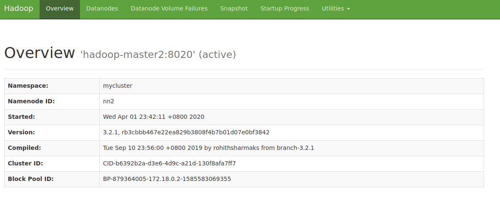
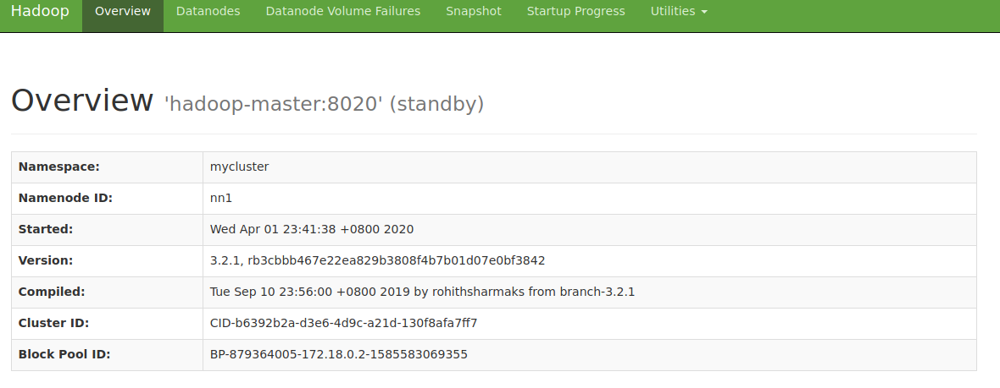

# 基于QJM的Hadoop NameNode高可用环境搭建

在之前介绍的Hadoop集群中NameNode是单点，所以才有了NameNode的高可用搭建。在NameNode的高可用方案中通常会部署两个或多个NameNode，但同一时间只有一个NameNode是Active状态，其它的都是Standby状态。Active状态的NameNode负责处理Hadoop集群的所有客户端请求，而Standby状态的NameNode会与Active状态的NameNode同步数据，同时在Active状态的NameNode不可用时接管它的工作变为Active。它们之间的状态同步是通过“JournalNodes” (JNs)实现的，它只允许Active NameNode。当Active的NameNode进行了任何更改操作后，其会把更改日志持久化到JNs，然后Standby的NameNode会从JNs读取这些更改日志并在自己节点进行同样的操作，从而达到Standby NameNode和Active NameNode同步的目的。当Active NameNode出错了，在Standby NameNode提升为Active NameNode前，它需要确保自己已经从JNs同步了所有的数据才可以。换言之，Standby NameNode需要从JNs同步了所有的数据后才可以提升为Active NameNode。然后所有的DataNode会发送所有的文件block信息给所有的NameNode，包括Active和Standby的，这样所有NameNode上的block信息都是一致的。

## 配置

现在手上有5台机器，hostname分别为hadoop-master、hadoop-master2、hadoop-node1、hadoop-node2和hadoop-node3。其中hadoop-master和hadoop-master用来部署NameNode，hadoop-node1、hadoop-node2和hadoop-node3部署DataNode和JournalNode。下面的配置文件先在hadoop-master上配置。

### 配置hadoop-env.sh

在`etc/hadoop/hadoop-env.sh`文件的末尾加上如下内容，相比非高可用的集群而言，多增加了HDFS_JOURNALNOE_USER环境变量，然后拿掉了HDFS_SECONDARYNAMENODE_USER环境变量，因为现在有了JournalNode，在这种NameNode高可用的方案下已经不需要Secondary NameNode了。

```text
export JAVA_HOME=/opt/jdk1.8
export HDFS_NAMENODE_USER=root
export HDFS_DATANODE_USER=root
#export HDFS_SECONDARYNAMENODE_USER=root
export HDFS_JOURNALNODE_USER=root
```

### 配置hdfs-site.xml

对hadoop目录下的`etc/hadoop/hdfs-site.xml`文件进行如下配置。从中可以看到我们拿掉了Secondary NameNode的配置，因为现在有了JournalNode，在这种NameNode高可用的方案下已经不需要Secondary NameNode了。各配置信息解释如下：

* dfs.nameservices 用来给当前的高可用配置集群定义一个名字，下面定义为`mycluster`，该名字在其它地方会用到。
* dfs.ha.namenodes.mycluster 中的`mycluster`来自`dfs.nameservices`中的定义，下面还有一些配置中的mycluster也是来自`dfs.nameservices`中的定义，就不每次赘述了。该参数中来定义集群中的NameNode的ID，这里指定了有两个NameNode，分别为nn1和nn2。
* dfs.namenode.rpc-address.mycluster.nn1 用于集群中的一个NameNode的RPC地址。nn1是上面的`dfs.ha.namenodes.mycluster`中定义的NameNode的ID。nn2的配置项也是类似的，就不赘述了。
* dfs.namenode.http-address.mycluster.nn1 用于集群中的一个NameNode的Http地址。
* dfs.namenode.shared.edits.dir 用于定义JournalNode的地址。
* dfs.client.failover.proxy.provider.mycluster 用于定义Hadoop客户端与NameNode通信时判断哪个NameNode是Active状态的Java Class。可以选择ConfiguredFailoverProxyProvider或RequestHedgingProxyProvider。
* dfs.ha.fencing.methods 用来指定发生失败转移时隔离Active NameNode的方法。这里指定为SSH。这样当一个Standby NameNode提升为Active NameNode前会通过ssh方式连接到原Active NameNode机器，并通过fuser命令杀死监听了8020端口的进程（查看日志得知）。原文为“The sshfence option SSHes to the target node and uses fuser to kill the process listening on the service’s TCP port.”。

> 笔者使用的hadoop-master和hadoop-master2上没有fuser命令，需要使用`apt-get install psmisc`对应命令工具。

* dfs.ha.fencing.ssh.private-key-files 用来指定隔离方法为SSH时对应的私钥位置。
* dfs.journalnode.edits.dir 用来指定JournalNode存放数据的目录。
* dfs.ha.automatic-failover.enabled 用来指定是否自动进行失败转移，即当一个Active NameNode挂了后是否自动提升另一个Standby NameNode为Active NameNode。

```xml
<configuration>
    <property>
        <name>dfs.replication</name>
        <value>2</value>
    </property>
    <!--
    <property>
        <name>dfs.namenode.secondary.http-address</name>
        <value>hadoop-node1:9868</value>
    </property>
    -->
    <property>
        <name>dfs.nameservices</name>
        <value>mycluster</value>
    </property>
    <property>
        <name>dfs.ha.namenodes.mycluster</name>
        <value>nn1,nn2</value>
    </property>
    <property>
        <name>dfs.namenode.rpc-address.mycluster.nn1</name>
        <value>hadoop-master:8020</value>
    </property>
    <property>
        <name>dfs.namenode.rpc-address.mycluster.nn2</name>
        <value>hadoop-master2:8020</value>
    </property>
    <property>
        <name>dfs.namenode.http-address.mycluster.nn1</name>
        <value>hadoop-master:9870</value>
    </property>
    <property>
        <name>dfs.namenode.http-address.mycluster.nn2</name>
        <value>hadoop-master2:9870</value>
    </property>
    <property>
        <name>dfs.namenode.shared.edits.dir</name>
        <value>qjournal://hadoop-node1:8485;hadoop-node2:8485;hadoop-node3:8485/mycluster</value>
    </property>
    <property>
        <name>dfs.client.failover.proxy.provider.mycluster</name>
        <value>org.apache.hadoop.hdfs.server.namenode.ha.ConfiguredFailoverProxyProvider</value>
    </property>
    <property>
      <name>dfs.ha.fencing.methods</name>
      <value>sshfence</value>
    </property>
    <property>
      <name>dfs.ha.fencing.ssh.private-key-files</name>
      <value>/root/.ssh/id_rsa</value>
    </property>
    <property>
        <name>dfs.journalnode.edits.dir</name>
	<value>/var/hadoop/journalnode</value>
    </property>
    <property>
        <name>dfs.ha.automatic-failover.enabled</name>
        <value>true</value>
    </property>
</configuration>
```

### 配置core-site.xml

对hadoop-master上的hadoop目录下的`etc/hadoop/core-site.xml`进行如下配置。各配置信息说明如下：

* fs.defaultFS 用于指定默认的文件系统。单NameNode环境下这里直接指定的是NameNode的地址，如`hdfs://hadoop-master:9820`。多NameNode高可用场景下这里配置为`hdfs://mycluster`，其中mycluster是在hdfs-site.xml中定义的`dfs.nameservices`属性的值。
* ha.zookeeper.quorum 用于指定做自动失败转移的Zookeeper集群包含的节点信息。


```xml
<configuration>
    <property>
        <name>fs.defaultFS</name>
        <value>hdfs://mycluster</value>
    </property>
    <property>
        <name>hadoop.tmp.dir</name>
	<value>/var/hadoop/data</value>
    </property>
    <property>
        <name>ha.zookeeper.quorum</name>
        <value>hadoop-node1:2181,hadoop-node2:2181,hadoop-node3:2181</value>
    </property>
</configuration>
```

### 配置workers

在`etc/hadoop/workers`文件中写入以下内容，表示我们的DataNode是如下三台机器。

```text
hadoop-node1
hadoop-node2
hadoop-node3
```

### 分发配置

然后需要把hadoop-master上在hadoop目录下的`etc/hadoop`子目录下配置的所有信息都分发到其它的节点上，包括hadoop-master2/hadoop-node1/hadoop-node2/hadoop-node3，这样所有节点上的配置信息都一致了。

## 配置免密登录

配置NameNode到各个节点的SSH免密登录。（具体的这里不再赘述）

## 启动

### 启动JournalNode

分别在hadoop-node1、hadoop-node2和hadoop-node3上的hadoop目录下执行`bin/hdfs --daemon start journalnode`以启动JournalNode。

### NameNode format

如果是搭建一个全新的集群，必须先在一台NameNode上进行文件系统的格式化，这里选择在hadoop-master上进行如下操作。

```shell
bin/hdfs namenode -format
```

> 如果你不是搭建一个全新的集群，而只是想把一个非高可用的集群转换为高可用集群则可以忽略此步骤。

### 启动进行了文件系统格式化的NameNode

笔者这里格式化的是hadoop-master，所以在hadoop-master上运行`bin/hdfs --daemon start namenode`启动NameNode。

### 同步NameNode元数据

需要把数据同步到未格式化的NameNode节点上。在未格式化的NameNode节点上运行`bin/hdfs namenode -bootstrapStandby`。看到类似如下这样的输出表示同步成功了。

```text
2020-03-31 15:26:16,228 INFO namenode.NameNode: registered UNIX signal handlers for [TERM, HUP, INT]
2020-03-31 15:26:16,743 INFO namenode.NameNode: createNameNode [-bootstrapStandby]
2020-03-31 15:26:17,344 INFO ha.BootstrapStandby: Found nn: nn1, ipc: hadoop-master/172.18.0.2:8020
=====================================================
About to bootstrap Standby ID nn2 from:
           Nameservice ID: mycluster
        Other Namenode ID: nn1
  Other NN's HTTP address: http://hadoop-master:9870
  Other NN's IPC  address: hadoop-master/172.18.0.2:8020
             Namespace ID: 1934903936
            Block pool ID: BP-879364005-172.18.0.2-1585583069355
               Cluster ID: CID-b6392b2a-d3e6-4d9c-a21d-130f8afa7ff7
           Layout version: -65
       isUpgradeFinalized: true
=====================================================
2020-03-31 15:26:20,487 INFO common.Storage: Storage directory /var/hadoop/data/dfs/name has been successfully formatted.
2020-03-31 15:26:20,652 INFO namenode.FSEditLog: Edit logging is async:true
```

> 如果你不是搭建一个全新的集群，而只是想把一个非高可用的集群转换为高可用集群则还需要运行`bin/hdfs namenode -initializeSharedEdits`，它会初始化JournalNode的数据。

### 启动其它NameNode

在其它未启动的NameNode上通过`bin/hdfs --daemon start namenode`启动NameNode服务。

### 初始化Zookeeper状态

在任意一个NameNode节点上执行`bin/hdfs zkfc -formatZK`以在Zookeeper集群中初始化对应的目录信息。

### 运行start-dfs.sh

运行`sbin/start-dfs.sh`将启动整个集群中的所有节点，它还将在所有的NameNode节点上运行一个ZKFC，NameNode将基于该进程来做切换。如果需要在NameNode节点上手动启动ZKFC，则可以在NameNode节点上运行`bin/hdfs --daemon start zkfc`。在NameNode节点上运行`jps`可以看到有ZKFC进程（DFSZKFailoverController）。

```text
root@hadoop-master:/opt/hadoop-3.2.1# jps
418 DFSZKFailoverController
183 NameNode
635 Jps
```

之后可以在浏览器访问`http://hadoop-master:9870`可以看到如下界面，可以看到它为Active NameNode。


访问`http://hadoop-master2:9870`可以看到如下界面，可以看到它为Standby NameNode。


### 自动失败转移验证

上面启动的高可用集群中hadoop-master是Active NameNode，hadoop-master2是Standby NameNode。这个时候我们在hadoop-master上运行`bin/hdfs --daemon stop zkfc`停止上面的运行的zkfc。这个时候再访问`http://hadoop-master2:9870`可以看到如下界面，hadoop-master2已经提升为Active NameNode了。



而hadoop-master已经变为standby了。




重新在hadoop-master上运行`bin/hdfs --daemon start zkfc`启动zkfc，此时hadoop-master仍然会是Standby NameNode。然后把hadoop-master2上的zkfc停止，这时候可以看到hadoop-master又变成了Active NameNode，而hadoop-master2变成了Standby NameNode。

除了停止ZKFC外，停止Active NameNode也会触发失败转移。即如果hadoop-master是Active NameNode，hadoop-master2是Standby NameNode，停止hadoop-master上的Active NameNode，则hadoop-master2上的Standby NameNode也会提升为Active NameNode。

### 节点宕机，自动失败转移失败

按照我们上面的配置，如果一开始hadoop-master是Active NameNode，hadoop-master2是Standby NameNode。然后hadoop-master宕机了，这个时候会发现hadoop-master2没有提升为Active NameNode。这是因为我们配置的隔离方法`dfs.ha.fencing.methods`是通过SSH隔离的，该方法需要hadoop-master2在提升为Active NameNode前ssh到hadoop-master，而hadoop-master已经宕机了，显然会ssh失败。在hadoop-master2上查看`/opt/hadoop-3.2.1/logs/`目录下的ZKFC日志文件`hadoop-root-zkfc-hadoop-master2.log`可以看到如下内容。

```text
2020-04-05 03:40:45,286 INFO org.apache.hadoop.ha.ActiveStandbyElector: Checking for any old active which needs to be fenced...
2020-04-05 03:40:45,287 INFO org.apache.hadoop.ha.ActiveStandbyElector: Old node exists: 0a096d79636c757374657212036e6e311a0d6861646f6f702d6d617374657220d43e28d33e
2020-04-05 03:40:45,287 INFO org.apache.hadoop.ha.ZKFailoverController: Should fence: NameNode at hadoop-master:8020
2020-04-05 03:40:45,288 WARN org.apache.hadoop.ha.FailoverController: Unable to gracefully make NameNode at hadoop-master:8020 standby (unable to connect)
java.net.UnknownHostException: Invalid host name: local host is: (unknown); destination host is: "hadoop-master":8020; java.net.UnknownHostException; For more details see:  http://wiki.apache.org/hadoop/UnknownHost
```

这个时候要求我们调整配置的隔离方法`dfs.ha.fencing.methods`的值。官网原文中有这么一句话，`However, to improve the availability of the system in the event the fencing mechanisms fail, it is advisable to configure a fencing method which is guaranteed to return success as the last fencing method in the list. Note that if you choose to use no actual fencing methods, you still must configure something for this setting, for example “shell(/bin/true)”.`。这句话的意思是说为了在配置的隔离机制失败时保证系统的可用性，我们应该再配置一个保证可以返回true的隔离方法，比如`shell(/bin/true)`。`The fencing methods used during a failover are configured as a carriage-return-separated list, which will be attempted in order until one indicates that fencing has succeeded. `。隔离方法是可以同时配置多个的，多个之间通过回车/换行分隔，当配置了多个隔离方法时，hadoop会依次轮循每一个方法，直到其中有一个成功了。所以为了处理宕机的这种失败转移问题，我们可以把`dfs.ha.fencing.methods`配置为如下这样。

```xml
    <property>
      <name>dfs.ha.fencing.methods</name>
      <value>
              sshfence
              shell(/bin/true)
      </value>
    </property>
```

这个时候我们再来模拟hadoop-master宕机的情况，然后查看hadoop-master2上的ZKFC日志可以看到，在运行隔离方法时，第一次通过ssh失败了，第二次通过配置的`shell(/bin/true)`成功了，然后就把hadoop-master2提升为Active NameNode了。

```text
2020-04-05 04:14:00,701 INFO org.apache.hadoop.ha.ActiveStandbyElector: Checking for any old active which needs to be fenced...
2020-04-05 04:14:00,719 INFO org.apache.hadoop.ha.ActiveStandbyElector: Old node exists: 0a096d79636c757374657212036e6e311a0d6861646f6f702d6d617374657220d43e28d33e
2020-04-05 04:14:01,876 INFO org.apache.hadoop.ha.ZKFailoverController: Should fence: NameNode at hadoop-master:8020
2020-04-05 04:14:01,887 WARN org.apache.hadoop.ha.FailoverController: Unable to gracefully make NameNode at hadoop-master:8020 standby (unable to connect)
java.net.UnknownHostException: Invalid host name: local host is: (unknown); destination host is: "hadoop-master":8020; java.net.UnknownHostException; For more details see:  http://wiki.apache.org/hadoop/UnknownHost
	at sun.reflect.NativeConstructorAccessorImpl.newInstance0(Native Method)
	at sun.reflect.NativeConstructorAccessorImpl.newInstance(NativeConstructorAccessorImpl.java:62)
	at sun.reflect.DelegatingConstructorAccessorImpl.newInstance(DelegatingConstructorAccessorImpl.java:45)
	at java.lang.reflect.Constructor.newInstance(Constructor.java:423)
	at org.apache.hadoop.net.NetUtils.wrapWithMessage(NetUtils.java:833)
	at org.apache.hadoop.net.NetUtils.wrapException(NetUtils.java:770)
	at org.apache.hadoop.ipc.Client$Connection.<init>(Client.java:459)
	at org.apache.hadoop.ipc.Client.getConnection(Client.java:1586)
	at org.apache.hadoop.ipc.Client.call(Client.java:1435)
	at org.apache.hadoop.ipc.Client.call(Client.java:1388)
	at org.apache.hadoop.ipc.ProtobufRpcEngine$Invoker.invoke(ProtobufRpcEngine.java:233)
	at org.apache.hadoop.ipc.ProtobufRpcEngine$Invoker.invoke(ProtobufRpcEngine.java:118)
	at com.sun.proxy.$Proxy9.transitionToStandby(Unknown Source)
	at org.apache.hadoop.ha.protocolPB.HAServiceProtocolClientSideTranslatorPB.transitionToStandby(HAServiceProtocolClientSideTranslatorPB.java:113)
	at org.apache.hadoop.ha.FailoverController.tryGracefulFence(FailoverController.java:172)
	at org.apache.hadoop.ha.ZKFailoverController.doFence(ZKFailoverController.java:520)
	at org.apache.hadoop.ha.ZKFailoverController.fenceOldActive(ZKFailoverController.java:510)
	at org.apache.hadoop.ha.ZKFailoverController.access$1100(ZKFailoverController.java:60)
	at org.apache.hadoop.ha.ZKFailoverController$ElectorCallbacks.fenceOldActive(ZKFailoverController.java:933)
	at org.apache.hadoop.ha.ActiveStandbyElector.fenceOldActive(ActiveStandbyElector.java:992)
	at org.apache.hadoop.ha.ActiveStandbyElector.becomeActive(ActiveStandbyElector.java:891)
	at org.apache.hadoop.ha.ActiveStandbyElector.processResult(ActiveStandbyElector.java:476)
	at org.apache.zookeeper.ClientCnxn$EventThread.processEvent(ClientCnxn.java:610)
	at org.apache.zookeeper.ClientCnxn$EventThread.run(ClientCnxn.java:508)
Caused by: java.net.UnknownHostException
	at org.apache.hadoop.ipc.Client$Connection.<init>(Client.java:460)
	... 17 more
2020-04-05 04:14:01,929 INFO org.apache.hadoop.ha.NodeFencer: ====== Beginning Service Fencing Process... ======
2020-04-05 04:14:01,929 INFO org.apache.hadoop.ha.NodeFencer: Trying method 1/2: org.apache.hadoop.ha.SshFenceByTcpPort(null)
2020-04-05 04:14:02,023 INFO org.apache.hadoop.ha.SshFenceByTcpPort: Connecting to hadoop-master...
2020-04-05 04:14:02,024 INFO org.apache.hadoop.ha.SshFenceByTcpPort.jsch: Connecting to hadoop-master port 22
2020-04-05 04:14:02,044 WARN org.apache.hadoop.ha.SshFenceByTcpPort: Unable to connect to hadoop-master as user root
com.jcraft.jsch.JSchException: java.net.UnknownHostException: hadoop-master
	at com.jcraft.jsch.Util.createSocket(Util.java:394)
	at com.jcraft.jsch.Session.connect(Session.java:215)
	at org.apache.hadoop.ha.SshFenceByTcpPort.tryFence(SshFenceByTcpPort.java:99)
	at org.apache.hadoop.ha.NodeFencer.fence(NodeFencer.java:98)
	at org.apache.hadoop.ha.ZKFailoverController.doFence(ZKFailoverController.java:537)
	at org.apache.hadoop.ha.ZKFailoverController.fenceOldActive(ZKFailoverController.java:510)
	at org.apache.hadoop.ha.ZKFailoverController.access$1100(ZKFailoverController.java:60)
	at org.apache.hadoop.ha.ZKFailoverController$ElectorCallbacks.fenceOldActive(ZKFailoverController.java:933)
	at org.apache.hadoop.ha.ActiveStandbyElector.fenceOldActive(ActiveStandbyElector.java:992)
	at org.apache.hadoop.ha.ActiveStandbyElector.becomeActive(ActiveStandbyElector.java:891)
	at org.apache.hadoop.ha.ActiveStandbyElector.processResult(ActiveStandbyElector.java:476)
	at org.apache.zookeeper.ClientCnxn$EventThread.processEvent(ClientCnxn.java:610)
	at org.apache.zookeeper.ClientCnxn$EventThread.run(ClientCnxn.java:508)
Caused by: java.net.UnknownHostException: hadoop-master
	at java.net.AbstractPlainSocketImpl.connect(AbstractPlainSocketImpl.java:184)
	at java.net.SocksSocketImpl.connect(SocksSocketImpl.java:392)
	at java.net.Socket.connect(Socket.java:589)
	at java.net.Socket.connect(Socket.java:538)
	at java.net.Socket.<init>(Socket.java:434)
	at java.net.Socket.<init>(Socket.java:211)
	at com.jcraft.jsch.Util$1.run(Util.java:362)
	at java.lang.Thread.run(Thread.java:748)
2020-04-05 04:14:02,045 WARN org.apache.hadoop.ha.NodeFencer: Fencing method org.apache.hadoop.ha.SshFenceByTcpPort(null) was unsuccessful.
2020-04-05 04:14:02,045 INFO org.apache.hadoop.ha.NodeFencer: Trying method 2/2: org.apache.hadoop.ha.ShellCommandFencer(/bin/true)
2020-04-05 04:14:02,072 INFO org.apache.hadoop.ha.ShellCommandFencer: Launched fencing command '/bin/true' with pid 4911
2020-04-05 04:14:02,142 INFO org.apache.hadoop.ha.NodeFencer: ====== Fencing successful by method org.apache.hadoop.ha.ShellCommandFencer(/bin/true) ======
2020-04-05 04:14:02,142 INFO org.apache.hadoop.ha.ActiveStandbyElector: Writing znode /hadoop-ha/mycluster/ActiveBreadCrumb to indicate that the local node is the most recent active...
2020-04-05 04:14:02,233 INFO org.apache.hadoop.ha.ZKFailoverController: Trying to make NameNode at hadoop-master2/172.18.0.3:8020 active...
2020-04-05 04:14:03,313 INFO org.apache.hadoop.ha.ZKFailoverController: Successfully transitioned NameNode at hadoop-master2/172.18.0.3:8020 to active state
```

## 负载

如果你的高可用方案配置了多个NameNode，你可能需要在前面架设一个负载均衡器，然后让每次请求都落到Active NameNode上。hadoop提供了一个`/isActive` URL供负载均衡器检测节点是否可用使用，只有Active NameNode的`/isActive`能正常返回，Standby NameNode会返回405状态码。这样就可以保证每次轻轻都落到Active NameNode上了。你也可以直接通过浏览器访问`http://hadoop-master:9870/isActive`查看节点是否为Active NameNode。

参考文档

[https://hadoop.apache.org/docs/stable/hadoop-project-dist/hadoop-hdfs/HDFSHighAvailabilityWithQJM.html](https://hadoop.apache.org/docs/stable/hadoop-project-dist/hadoop-hdfs/HDFSHighAvailabilityWithQJM.html)

