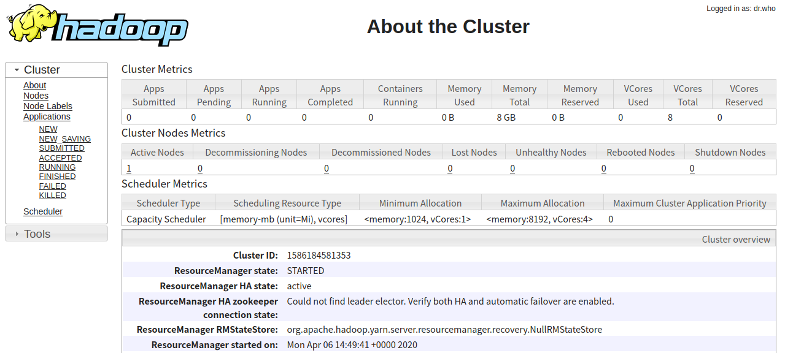

# 伪分布式hadoop集群YARN搭建

YARN是用来做资源管理的，MapReduce是运行在YARN上的。本文将介绍伪分布式hadoop集群中YARN的搭建。

## 配置

在`$HADOOP_HOME/etc/hadoop/mapred-env.sh`的最后加上如下配置，用以指定hadoop目录。

```text
export HADOOP_MAPPED_HOME=/opt/hadoop-3.2.1
```

在`$HADOOP_HOME/etc/hadoop/yarn-env.sh`的最后加上如下配置。

```text
export YARN_RESOURCEMANAGER_USER=root
export YARN_NODEMANAGER_USER=root
```

> yarn中有resourceManager和nodeManager两个角色，上面指定了运行这两个角色的用户。

在`$HADOOP_HOME/etc/hadoop/mapred-site.xml`中增加如下配置。

```xml
<configuration>
    <property>
        <name>mapreduce.framework.name</name>
        <value>yarn</value>
    </property>
    <property>
        <name>mapreduce.application.classpath</name>
        <value>$HADOOP_MAPRED_HOME/share/hadoop/mapreduce/*:$HADOOP_MAPRED_HOME/share/hadoop/mapreduce/lib/*</value>
    </property>
</configuration>
```

* mapreduce.framework.name 用来指定运行mapreduce的框架，这里指定为yarn，默认是local。
* mapreduce.application.classpath 用来指定mapreduce应用的classpath，其中的`HADOOP_MAPPED_HOME`对应于hadoop的安装目录，需要进行替换。


在`$HADOOP_HOME/etc/hadoop/yarn-site.xml`中增加如下配置。

```xml
<configuration>
    <property>
        <name>yarn.nodemanager.aux-services</name>
        <value>mapreduce_shuffle</value>
    </property>
</configuration>
```

## 启动

启动yarn。运行`$HADOOP_HOME/sbin/start-yarn.sh`可以启动yarn。

```shell
root@hadoop-master:/opt/hadoop-3.2.1# sbin/start-yarn.sh 
Starting resourcemanager
Starting nodemanagers
```

运行`jps`可以看到当前机器上已经运行了resourceManager和nodeManager。

```shell
root@hadoop-master:/opt/hadoop-3.2.1# jps
1313 ResourceManager
1445 NodeManager
968 SecondaryNameNode
649 NameNode
777 DataNode
1628 Jps
```

resourceManager默认监听在8088端口，打开浏览器访问`http://hadoop-master:8088`（hadoop-master是我部署hadoop伪分布式集群的机器）可以看到如下内容。



> 如果需要停止yarn可以运行`sbin/stop-yarn.sh`。

## 运行mapreduce示例

在hadoop的安装目录下已经提供了一个统计单词的mapreduce示例，我们将运行该示例来验证刚刚搭建好的yarn。

1. 先在本地准备一个文本文件，然后把它上传到hadoop文件系统中。下面我们指定了文件的块大小为1M，把本地当前目录下的test.txt文件上传到了hadoop的`/user/elim`目录下。

```shell
root@hadoop-master:/opt/hadoop-3.2.1# bin/hdfs dfs -D dfs.block.size=1M -put test.txt /user/elim
2020-04-06 15:54:14,682 INFO sasl.SaslDataTransferClient: SASL encryption trust check: localHostTrusted = false, remoteHostTrusted = false
2020-04-06 15:54:14,917 INFO sasl.SaslDataTransferClient: SASL encryption trust check: localHostTrusted = false, remoteHostTrusted = false
```

2. 运行单词统计任务

运行`bin/hadoop jar share/hadoop/mapreduce/hadoop-mapreduce-examples-3.2.1.jar wordcount /user/elim/test.txt /result/mapreduce/example/wordcount`提交单词统计的任务，它将读取hadoop文件系统的`/user/elim/test.txt`文件进行统计，并把结果写入到`/result/mapreduce/example/wordcount`目录下。

```shell
root@hadoop-master:/opt/hadoop-3.2.1# bin/hadoop jar share/hadoop/mapreduce/hadoop-mapreduce-examples-3.2.1.jar wordcount /user/elim/test.txt /result/mapreduce/example/wordcount
2020-04-06 15:56:40,390 INFO client.RMProxy: Connecting to ResourceManager at /0.0.0.0:8032
2020-04-06 15:56:41,263 INFO mapreduce.JobResourceUploader: Disabling Erasure Coding for path: /tmp/hadoop-yarn/staging/root/.staging/job_1586188253275_0001
2020-04-06 15:56:41,421 INFO sasl.SaslDataTransferClient: SASL encryption trust check: localHostTrusted = false, remoteHostTrusted = false
2020-04-06 15:56:41,617 INFO input.FileInputFormat: Total input files to process : 1
2020-04-06 15:56:41,784 INFO sasl.SaslDataTransferClient: SASL encryption trust check: localHostTrusted = false, remoteHostTrusted = false
2020-04-06 15:56:42,261 INFO sasl.SaslDataTransferClient: SASL encryption trust check: localHostTrusted = false, remoteHostTrusted = false
2020-04-06 15:56:42,694 INFO mapreduce.JobSubmitter: number of splits:2
2020-04-06 15:56:43,349 INFO sasl.SaslDataTransferClient: SASL encryption trust check: localHostTrusted = false, remoteHostTrusted = false
2020-04-06 15:56:43,371 INFO mapreduce.JobSubmitter: Submitting tokens for job: job_1586188253275_0001
2020-04-06 15:56:43,371 INFO mapreduce.JobSubmitter: Executing with tokens: []
2020-04-06 15:56:43,658 INFO conf.Configuration: resource-types.xml not found
2020-04-06 15:56:43,658 INFO resource.ResourceUtils: Unable to find 'resource-types.xml'.
2020-04-06 15:56:44,039 INFO impl.YarnClientImpl: Submitted application application_1586188253275_0001
2020-04-06 15:56:44,149 INFO mapreduce.Job: The url to track the job: http://hadoop-master:8088/proxy/application_1586188253275_0001/
2020-04-06 15:56:44,150 INFO mapreduce.Job: Running job: job_1586188253275_0001
2020-04-06 15:56:54,343 INFO mapreduce.Job: Job job_1586188253275_0001 running in uber mode : false
2020-04-06 15:56:54,345 INFO mapreduce.Job:  map 0% reduce 0%
2020-04-06 15:57:02,828 INFO mapreduce.Job:  map 100% reduce 0%
2020-04-06 15:57:12,981 INFO mapreduce.Job:  map 100% reduce 100%
2020-04-06 15:57:14,010 INFO mapreduce.Job: Job job_1586188253275_0001 completed successfully
2020-04-06 15:57:14,196 INFO mapreduce.Job: Counters: 54
	File System Counters
		FILE: Number of bytes read=52
		FILE: Number of bytes written=677500
		FILE: Number of read operations=0
		FILE: Number of large read operations=0
		FILE: Number of write operations=0
		HDFS: Number of bytes read=1519181
		HDFS: Number of bytes written=25
		HDFS: Number of read operations=11
		HDFS: Number of large read operations=0
		HDFS: Number of write operations=2
		HDFS: Number of bytes read erasure-coded=0
	Job Counters 
		Launched map tasks=2
		Launched reduce tasks=1
		Data-local map tasks=2
		Total time spent by all maps in occupied slots (ms)=12589
		Total time spent by all reduces in occupied slots (ms)=6615
		Total time spent by all map tasks (ms)=12589
		Total time spent by all reduce tasks (ms)=6615
		Total vcore-milliseconds taken by all map tasks=12589
		Total vcore-milliseconds taken by all reduce tasks=6615
		Total megabyte-milliseconds taken by all map tasks=12891136
		Total megabyte-milliseconds taken by all reduce tasks=6773760
	Map-Reduce Framework
		Map input records=137715
		Map output records=275430
		Map output bytes=2616585
		Map output materialized bytes=58
		Input split bytes=220
		Combine input records=275430
		Combine output records=4
		Reduce input groups=2
		Reduce shuffle bytes=58
		Reduce input records=4
		Reduce output records=2
		Spilled Records=8
		Shuffled Maps =2
		Failed Shuffles=0
		Merged Map outputs=2
		GC time elapsed (ms)=347
		CPU time spent (ms)=5890
		Physical memory (bytes) snapshot=777129984
		Virtual memory (bytes) snapshot=7907917824
		Total committed heap usage (bytes)=605028352
		Peak Map Physical memory (bytes)=305131520
		Peak Map Virtual memory (bytes)=2634645504
		Peak Reduce Physical memory (bytes)=178089984
		Peak Reduce Virtual memory (bytes)=2638721024
	Shuffle Errors
		BAD_ID=0
		CONNECTION=0
		IO_ERROR=0
		WRONG_LENGTH=0
		WRONG_MAP=0
		WRONG_REDUCE=0
	File Input Format Counters 
		Bytes Read=1518961
	File Output Format Counters 
		Bytes Written=25
```

这时候打开yarn控制台可以看到刚刚运行的任务的情况。


3. 查看结果目录可以看到一共有两个文件，`_SUCCESS`表示程序运行成功的标志文件，没有内容。结果写入到了`part-r-00000`中（一个reduce的结果）。

```shell
root@hadoop-master:/opt/hadoop-3.2.1# bin/hdfs dfs -ls /result/mapreduce/example/wordcount
Found 2 items
-rw-r--r--   1 root supergroup          0 2020-04-06 15:57 /result/mapreduce/example/wordcount/_SUCCESS
-rw-r--r--   1 root supergroup         25 2020-04-06 15:57 /result/mapreduce/example/wordcount/part-r-00000
```

4. 通过如下命令可以查看结果文件的内容

```shell
root@hadoop-master:/opt/hadoop-3.2.1# bin/hdfs dfs -cat /result/mapreduce/example/wordcount/*
2020-04-06 16:07:49,384 INFO sasl.SaslDataTransferClient: SASL encryption trust check: localHostTrusted = false, remoteHostTrusted = false
elim	137715
hello	137715
```


