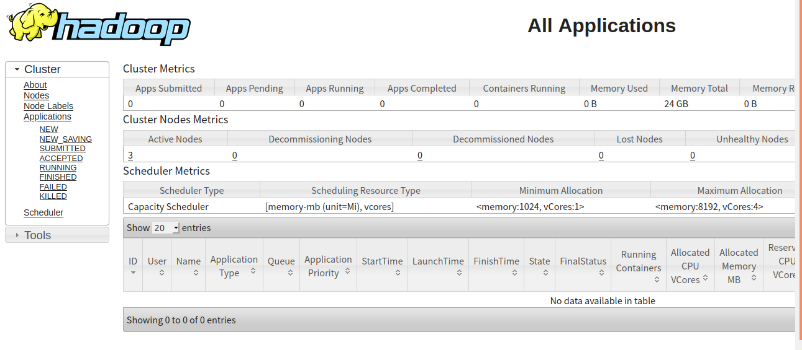

# 全分布式hadoop集群YARN搭建

前面已经介绍过了全分布式的hadoop集群搭建，本文基于全分布式的hadoop集群介绍对应的yarn集群搭建。yarn中有resourceManager和nodeManager两个角色，其中的nodeManager和dataNode节点是一致的，即每台DataNode上都会有一个nodeManager。

## 配置

在hadoop-master的`$HADOOP_HOME/etc/hadoop/yarn-env.sh`的最后加上如下配置。（以下配置都在hadoop-master上配置）

```text
export YARN_RESOURCEMANAGER_USER=root
export YARN_NODEMANAGER_USER=root
```

> yarn中有resourceManager和nodeManager两个角色，上面指定了运行这两个角色的用户。

在`$HADOOP_HOME/etc/hadoop/mapred-site.xml`中增加如下配置。

```xml
<configuration>
    <property>
        <name>mapreduce.framework.name</name>
        <value>yarn</value>
    </property>
    <property>
        <name>yarn.app.mapreduce.am.env</name>
        <value>HADOOP_MAPRED_HOME=/opt/hadoop-3.2.1</value>
    </property>
    <property>
        <name>mapreduce.map.env</name>
        <value>HADOOP_MAPRED_HOME=/opt/hadoop-3.2.1</value>
    </property>
    <property>
        <name>mapreduce.reduce.env</name>
        <value>HADOOP_MAPRED_HOME=/opt/hadoop-3.2.1</value>
    </property>
</configuration>
```

* mapreduce.framework.name 用来指定运行mapreduce的框架，这里指定为yarn，默认是local。

在`$HADOOP_HOME/etc/hadoop/yarn-site.xml`中增加如下配置，其中`yarn.resourcemanager.hostname`表示resourceManager将会运行的主机名。

```xml
<configuration>
    <property>
        <name>yarn.resourcemanager.hostname</name>
        <value>hadoop-master</value>
    </property>
    <property>
        <name>yarn.nodemanager.aux-services</name>
        <value>mapreduce_shuffle</value>
    </property>
</configuration>
```

将上述配置分发到hadoop-node1、hadoop-node2和hadoop-node3。

## 启动

启动yarn。在hadoop-master上运行`$HADOOP_HOME/sbin/start-yarn.sh`可以启动yarn。

```shell
root@hadoop-master:/opt/hadoop-3.2.1# sbin/start-yarn.sh 
Starting resourcemanager
Starting nodemanagers
```

运行`jps`可以看到当前机器上已经运行了resourceManager和NameNode。

```shell
root@hadoop-master:/opt/hadoop-3.2.1# jps
473 NameNode
1212 Jps
1069 ResourceManager
```

全分布式hadoop集群的NodeManager跟随DataNode一起部署，每台DataNode上都运行了一个NodeManager。比如选择hadoop-node3运行jps可以看到上面运行了DataNode和NodeManager，其它DataNode机器也是一样的。

```text
root@hadoop-node3:/# jps
356 Jps
100 DataNode
253 NodeManager
```

resourceManager默认监听在8088端口，打开浏览器访问`http://hadoop-master:8088`可以看到如下内容。



> 如果需要单独启动resourceManager可以运行`bin/yarn --daemon start resourcemanager`，如果需要单独停止ResourceManager，则运行`bin/yarn --daemon stop resourcemanager`,NodeManager也是类似的。也可以运行`sbin/stop-yarn.sh`停止所有的yarn服务。

## 运行mapreduce示例

在hadoop的安装目录下已经提供了一个统计单词的mapreduce示例，我们将运行该示例来验证刚刚搭建好的yarn。

1. 先在本地准备一个文本文件，然后把它上传到hadoop文件系统中。下面我们指定了文件的块大小为1M，把本地当前目录下的test.txt文件上传到了hadoop的`/user/elim`目录下。

```shell
root@hadoop-master:/opt/hadoop-3.2.1# bin/hdfs dfs -D dfs.block.size=1M -put test.txt /user/elim
2020-04-08 15:55:22,015 INFO sasl.SaslDataTransferClient: SASL encryption trust check: localHostTrusted = false, remoteHostTrusted = false
2020-04-08 15:55:23,659 INFO sasl.SaslDataTransferClient: SASL encryption trust check: localHostTrusted = false, remoteHostTrusted = false
```

2. 运行单词统计任务

运行`bin/hadoop jar share/hadoop/mapreduce/hadoop-mapreduce-examples-3.2.1.jar wordcount /user/elim/test.txt /result/mapreduce/example/wordcount`提交单词统计的任务，它将读取hadoop文件系统的`/user/elim/test.txt`文件进行统计，并把结果写入到`/result/mapreduce/example/wordcount`目录下。

```shell
root@hadoop-master:/opt/hadoop-3.2.1# bin/hadoop jar share/hadoop/mapreduce/hadoop-mapreduce-examples-3.2.1.jar wordcount /user/elim/test.txt /result/mapreduce/example/wordcount
2020-04-09 14:17:55,984 INFO client.RMProxy: Connecting to ResourceManager at hadoop-master/172.18.0.2:8032
2020-04-09 14:17:58,300 INFO mapreduce.JobResourceUploader: Disabling Erasure Coding for path: /tmp/hadoop-yarn/staging/root/.staging/job_1586441635309_0002
2020-04-09 14:17:58,895 INFO sasl.SaslDataTransferClient: SASL encryption trust check: localHostTrusted = false, remoteHostTrusted = false
2020-04-09 14:18:00,133 INFO input.FileInputFormat: Total input files to process : 1
2020-04-09 14:18:00,609 INFO sasl.SaslDataTransferClient: SASL encryption trust check: localHostTrusted = false, remoteHostTrusted = false
2020-04-09 14:18:01,009 INFO sasl.SaslDataTransferClient: SASL encryption trust check: localHostTrusted = false, remoteHostTrusted = false
2020-04-09 14:18:01,152 INFO mapreduce.JobSubmitter: number of splits:2
2020-04-09 14:18:02,214 INFO sasl.SaslDataTransferClient: SASL encryption trust check: localHostTrusted = false, remoteHostTrusted = false
2020-04-09 14:18:02,407 INFO mapreduce.JobSubmitter: Submitting tokens for job: job_1586441635309_0002
2020-04-09 14:18:02,408 INFO mapreduce.JobSubmitter: Executing with tokens: []
2020-04-09 14:18:02,946 INFO conf.Configuration: resource-types.xml not found
2020-04-09 14:18:02,947 INFO resource.ResourceUtils: Unable to find 'resource-types.xml'.
2020-04-09 14:18:03,228 INFO impl.YarnClientImpl: Submitted application application_1586441635309_0002
2020-04-09 14:18:03,346 INFO mapreduce.Job: The url to track the job: http://hadoop-master:8088/proxy/application_1586441635309_0002/
2020-04-09 14:18:03,347 INFO mapreduce.Job: Running job: job_1586441635309_0002
2020-04-09 14:18:26,377 INFO mapreduce.Job: Job job_1586441635309_0002 running in uber mode : false
2020-04-09 14:18:26,388 INFO mapreduce.Job:  map 0% reduce 0%
2020-04-09 14:19:01,165 INFO mapreduce.Job:  map 100% reduce 0%
2020-04-09 14:19:37,616 INFO mapreduce.Job:  map 100% reduce 100%
2020-04-09 14:19:41,668 INFO mapreduce.Job: Job job_1586441635309_0002 completed successfully
2020-04-09 14:19:42,387 INFO mapreduce.Job: Counters: 54
	File System Counters
		FILE: Number of bytes read=52
		FILE: Number of bytes written=678349
		FILE: Number of read operations=0
		FILE: Number of large read operations=0
		FILE: Number of write operations=0
		HDFS: Number of bytes read=1519179
		HDFS: Number of bytes written=25
		HDFS: Number of read operations=11
		HDFS: Number of large read operations=0
		HDFS: Number of write operations=2
		HDFS: Number of bytes read erasure-coded=0
	Job Counters 
		Launched map tasks=2
		Launched reduce tasks=1
		Data-local map tasks=2
		Total time spent by all maps in occupied slots (ms)=61624
		Total time spent by all reduces in occupied slots (ms)=33092
		Total time spent by all map tasks (ms)=61624
		Total time spent by all reduce tasks (ms)=33092
		Total vcore-milliseconds taken by all map tasks=61624
		Total vcore-milliseconds taken by all reduce tasks=33092
		Total megabyte-milliseconds taken by all map tasks=63102976
		Total megabyte-milliseconds taken by all reduce tasks=33886208
	Map-Reduce Framework
		Map input records=137715
		Map output records=275430
		Map output bytes=2616585
		Map output materialized bytes=58
		Input split bytes=218
		Combine input records=275430
		Combine output records=4
		Reduce input groups=2
		Reduce shuffle bytes=58
		Reduce input records=4
		Reduce output records=2
		Spilled Records=8
		Shuffled Maps =2
		Failed Shuffles=0
		Merged Map outputs=2
		GC time elapsed (ms)=290
		CPU time spent (ms)=6460
		Physical memory (bytes) snapshot=640364544
		Virtual memory (bytes) snapshot=7925387264
		Total committed heap usage (bytes)=443023360
		Peak Map Physical memory (bytes)=243642368
		Peak Map Virtual memory (bytes)=2639044608
		Peak Reduce Physical memory (bytes)=155107328
		Peak Reduce Virtual memory (bytes)=2647355392
	Shuffle Errors
		BAD_ID=0
		CONNECTION=0
		IO_ERROR=0
		WRONG_LENGTH=0
		WRONG_MAP=0
		WRONG_REDUCE=0
	File Input Format Counters 
		Bytes Read=1518961
	File Output Format Counters 
		Bytes Written=25
```

这时候打开yarn控制台可以看到刚刚运行的任务的情况。


3. 查看结果目录可以看到一共有两个文件，`_SUCCESS`表示程序运行成功的标志文件，没有内容。结果写入到了`part-r-00000`中（一个reduce的结果）。

```shell
root@hadoop-master:/opt/hadoop-3.2.1#  bin/hdfs dfs -ls /result/mapreduce/example/wordcount
Found 2 items
-rw-r--r--   2 root supergroup          0 2020-04-09 14:19 /result/mapreduce/example/wordcount/_SUCCESS
-rw-r--r--   2 root supergroup         25 2020-04-09 14:19 /result/mapreduce/example/wordcount/part-r-00000
```

4. 通过如下命令可以查看结果文件的内容

```shell
root@hadoop-master:/opt/hadoop-3.2.1# bin/hdfs dfs -cat /result/mapreduce/example/wordcount/*
2020-04-09 14:30:02,388 INFO sasl.SaslDataTransferClient: SASL encryption trust check: localHostTrusted = false, remoteHostTrusted = false
elim	137715
hello	137715
```


**参考文档**

[https://hadoop.apache.org/docs/stable/hadoop-project-dist/hadoop-common/ClusterSetup.html](https://hadoop.apache.org/docs/stable/hadoop-project-dist/hadoop-common/ClusterSetup.html)


