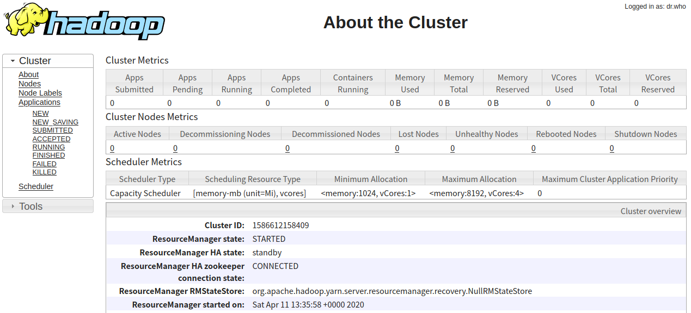

# 高可用ResourceManager搭建

Yarn主要包括ResourceManager和NodeManager两个角色，当搭建了hadoop集群后，NodeManager与DataNode一一对应，但是ResourceManager只有一个，这里就有一个单点问题。本文将介绍ResourceManager的高可用搭建方案。官网给的架构图如下。


在任何时候都只会有一个处于Active状态的ResourceManager，其它的ResourceManager都处于Standby状态。当Active ResourceManager宕机后会由一台Standby ResourceManager来提升为Active ResourceManager。

前面已经介绍过了全分布式的hadoop集群搭建，本文基于全分布式的hadoop集群介绍对应的ResourceManager高可用的yarn集群搭建。yarn中有resourceManager和nodeManager两个角色，其中的nodeManager和dataNode节点是一致的，即每台DataNode上都会有一个nodeManager。

## 配置

**规划**，一共有四台机器，主机名分别为hadoop-master\hadoop-node1\hadoop-node2\hadoop-node3，其中hadoop-master和hadoop-node1部署ResourceManager，hadoop-node1\hadoop-node2\hadoop-node3部署NodeManager。

在hadoop-master的`$HADOOP_HOME/etc/hadoop/yarn-env.sh`的最后加上如下配置。（以下配置都在hadoop-master上配置）

```text
export YARN_RESOURCEMANAGER_USER=root
export YARN_NODEMANAGER_USER=root
```

> yarn中有resourceManager和nodeManager两个角色，上面指定了运行这两个角色的用户。

在`$HADOOP_HOME/etc/hadoop/mapred-site.xml`中增加如下配置。

```xml
<configuration>
    <property>
        <name>mapreduce.framework.name</name>
        <value>yarn</value>
    </property>
    <property>
        <name>yarn.app.mapreduce.am.env</name>
        <value>HADOOP_MAPRED_HOME=/opt/hadoop-3.2.1</value>
    </property>
    <property>
        <name>mapreduce.map.env</name>
        <value>HADOOP_MAPRED_HOME=/opt/hadoop-3.2.1</value>
    </property>
    <property>
        <name>mapreduce.reduce.env</name>
        <value>HADOOP_MAPRED_HOME=/opt/hadoop-3.2.1</value>
    </property>
</configuration>
```

* mapreduce.framework.name 用来指定运行mapreduce的框架，这里指定为yarn，默认是local。

在`$HADOOP_HOME/etc/hadoop/yarn-site.xml`中增加如下配置。

```xml
<configuration>
    <!--指定启用ResourceManager的高可用方案-->
    <property>
        <name>yarn.resourcemanager.ha.enabled</name>
        <value>true</value>
    </property>
    <!-- 定义ResourceManager的高可用集群名称 -->
    <property>
        <name>yarn.resourcemanager.cluster-id</name>
        <value>cluster1</value>
    </property>
    <!-- 定义ResourceManager高可用集群中各ResourceManager的id -->
    <property>
        <name>yarn.resourcemanager.ha.rm-ids</name>
        <value>rm1,rm2</value>
    </property>
    <!--指定rm1这个ResourceManager的主机名-->
    <property>
        <name>yarn.resourcemanager.hostname.rm1</name>
        <value>hadoop-master</value>
    </property>
    <!--指定rm2这个ResourceManager的主机名-->
    <property>
        <name>yarn.resourcemanager.hostname.rm2</name>
        <value>hadoop-node1</value>
    </property>
    <!--指定rm1这个ResourceManager的web访问地址-->
    <property>
        <name>yarn.resourcemanager.webapp.address.rm1</name>
        <value>hadoop-master:8088</value>
    </property>
    <!--指定rm2这个ResourceManager的web访问地址-->
    <property>
        <name>yarn.resourcemanager.webapp.address.rm2</name>
        <value>hadoop-node1:8088</value>
    </property>
    <!--指定用于选举Active节点的ZK地址-->
    <property>
        <name>hadoop.zk.address</name>
        <value>hadoop-node1:2181,hadoop-node2:2181,hadoop-node3:2181</value>
    </property>
</configuration>
```

将上述配置分发到hadoop-node1、hadoop-node2和hadoop-node3。

## 启动

启动yarn。在hadoop-master上运行`$HADOOP_HOME/sbin/start-yarn.sh`可以启动yarn。

```shell
root@hadoop-master:/opt/hadoop-3.2.1# sbin/start-yarn.sh 
Starting resourcemanagers on [ hadoop-master hadoop-node1]
Starting nodemanagers
```

上面已经输出来了在hadoop-master和hadoop-node1上启动了ResourceManager。全分布式hadoop集群的NodeManager跟随DataNode一起部署，每台DataNode上都运行了一个NodeManager。ResourceManager默认监听在8088端口，打开浏览器访问`http://hadoop-master:8088`，结果它自动重定向到了`http://hadoop-node1:8088/cluster`，这是因为hadoop-node1是Active ResourceManager，而hadoop-master是Standby ResourceManager，当直接访问Standby ResourceManager的根节点时就会跳转到Active ResourceManager的根节点（Active ResourceManager的根节点又会跳转到`/cluster`）。访问`http://hadoop-node1:8088/cluster/cluster`可以看到当前节点的状态为Active。


而访问`http://hadoop-master:8088/cluster/cluster`可以看到当前节点的状态为Standby。



如果需要单独启动某个节点上的resourceManager可以运行`bin/yarn --daemon start resourcemanager`，如果需要单独停止ResourceManager，则运行`bin/yarn --daemon stop resourcemanager`,NodeManager也是类似的。也可以运行`sbin/stop-yarn.sh`停止所有的yarn服务。我们在hadoop-node1上运行`$HADOOP_HOME/bin/yarn --daemon stop resourcemanager`停止ResourceManager，这时候再访问`http://hadoop-master:8088/cluster/cluster`可以看到当前节点的状态已经自动变更为Active了。重新启动hadoop-node1上的ResourceManager，可以看到它的状态为standby。当关闭hadoop-master机器或停止上面运行的ResourceManager后，hadoop-node1又自动变更为Active了。

> 也可以通过`bin/yarn rmadmin -getServiceState rm2`获取id为rm2的ResourceManager的状态（Active Or Standby）。
> 还可通过`bin/yarn rmadmin -getAllServiceState`查看所有ResourceManager的状态。
> ```text
> root@hadoop-master:/opt/hadoop-3.2.1# bin/yarn rmadmin -getAllServiceState
> hadoop-master:8033                                 standby
> hadoop-node1:8033                                  active
> ```

rmadmin是ResourceManager的管理命令。除了自动的失败转移外，也可以通过rmadmin的`-transitionToActive`或`-transitionToStandby`命令把一个ResourceManager手动的转为Active或Standby。当需要手动的变更Active ResourceManager时需要先把原来的Active ResourceManager变更为Standby ResourceManager，再把需要提升为Active的ResourceManager提升为Active。如果启动了自动的失败转移，进行手动转移是不被允许的，需要加上`--forcemanual`。

```text
root@hadoop-node1:/opt/hadoop-3.2.1# bin/yarn rmadmin -transitionToStandby rm2
Automatic failover is enabled for org.apache.hadoop.yarn.client.RMHAServiceTarget@4d50efb8
Refusing to manually manage HA state, since it may cause
a split-brain scenario or other incorrect state.
If you are very sure you know what you are doing, please 
specify the --forcemanual flag.
```

加上`--forcemanual`的运行效果

```text
root@hadoop-node1:/opt/hadoop-3.2.1# bin/yarn rmadmin -transitionToStandby --forcemanual rm2
You have specified the --forcemanual flag. This flag is dangerous, as it can induce a split-brain scenario that WILL CORRUPT your HDFS namespace, possibly irrecoverably.

It is recommended not to use this flag, but instead to shut down the cluster and disable automatic failover if you prefer to manually manage your HA state.

You may abort safely by answering 'n' or hitting ^C now.

Are you sure you want to continue? (Y or N) Y
2020-04-11 14:41:57,772 WARN ha.HAAdmin: Proceeding with manual HA state management even though
automatic failover is enabled for org.apache.hadoop.yarn.client.RMHAServiceTarget@4d50efb8
```

> 关于rmadmin的更多用法可以运行`bin/yarn rmadmin`查看对应的帮助信息。

**参考文档**

[https://hadoop.apache.org/docs/stable/hadoop-yarn/hadoop-yarn-site/ResourceManagerHA.html](https://hadoop.apache.org/docs/stable/hadoop-yarn/hadoop-yarn-site/ResourceManagerHA.html)


