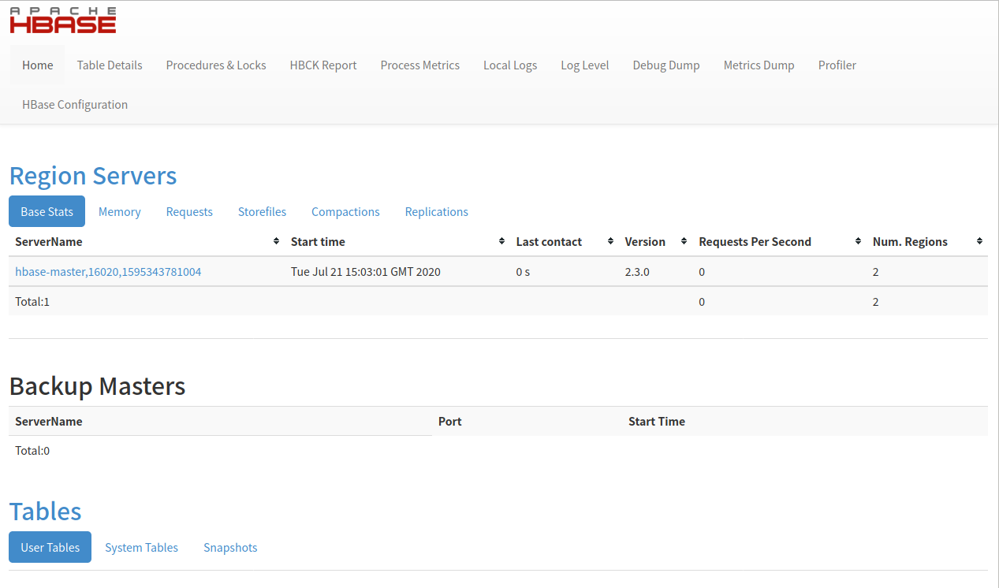

# 伪分布式搭建

## 搭建环境

1. 下载安装包

从地址[http://hbase.apache.org/downloads.html](http://hbase.apache.org/downloads.html)下载当下最新的hbase-2.3.0-bin.tar.gz。

2. 解压缩

运行`tar -zxvf hbase-2.3.0-bin.tar.gz -C /opt`把下载的安装包解压到`/opt`目录下，解压后就会存在`/opt/hbase-2.3.0`目录。

3. 配置环境变量

编辑`~/.bashrc`文件，在文件的最后配置JAVA_HOME和HBASE_HOME、PATH等。

```shell
export JAVA_HOME=/opt/jdk1.8
export HBASE_HOME=/opt/hbase-2.3.0
export PATH=$JAVA_HOME/bin:$HBASE_HOME/bin:$PATH
```

> JAVA_HOME也可以选择在HBASE的安装目录的`conf/hbase-env.sh`文件中进行配置。

运行`source ~/.bashrc`使配置立即生效。

4. 启动hbase

运行`start-hbase.sh`可以启动hbase。

```text
root@hbase-master:/# start-hbase.sh 
running master, logging to /opt/hbase-2.3.0/logs/hbase--master-hbase-master.out
```

输出上面的内容则表示hbase启动成功了。也可以通过运行`jps`检测是否启动了一个叫HMaster的服务，存在则表示hbase启动成功了。在单机环境下，所有的服务都包含在HMaster服务中，包括HRegionServer、Zookeeper。

```text
root@hbase-master:/# jps
522 Jps
155 HMaster
```

启动浏览器访问`http://hbase-master:16010`则可以看到如下内容。



5. 停掉hbase

通过`stop-hbase.sh`可以停掉hbase。

```text
root@hbase-master:/# jps
1411 Jps
140 HMaster
root@hbase-master:/# stop-hbase.sh 
stopping hbase...........
root@hbase-master:/# jps
1673 Jps
root@hbase-master:/# 
```

> 如上输出所示，停掉hbase后可以看到`HMaster`进程就不再了。

## 对hbase的基本操作

1. 连接hbase

运行`hbase shell`即可连接hbase。

```text
root@hbase-master:/# hbase shell
2020-07-21 15:21:21,695 WARN  [main] util.NativeCodeLoader: Unable to load native-hadoop library for your platform... using builtin-java classes where applicable
HBase Shell
Use "help" to get list of supported commands.
Use "exit" to quit this interactive shell.
For Reference, please visit: http://hbase.apache.org/2.0/book.html#shell
Version 2.3.0, re0e1382705c59d3fb3ad8f5bff720a9dc7120fb8, Mon Jul  6 22:27:43 UTC 2020
Took 0.0010 seconds 
hbase(main):001:0> 
```

2. 查看帮助文档

启动`hbase shell`后可以敲入`help`即可查看在该控制台可运行的指令。

```text
hbase(main):001:0> help
HBase Shell, version 2.3.0, re0e1382705c59d3fb3ad8f5bff720a9dc7120fb8, Mon Jul  6 22:27:43 UTC 2020
Type 'help "COMMAND"', (e.g. 'help "get"' -- the quotes are necessary) for help on a specific command.
Commands are grouped. Type 'help "COMMAND_GROUP"', (e.g. 'help "general"') for help on a command group.

COMMAND GROUPS:
  Group name: general
  Commands: processlist, status, table_help, version, whoami

  Group name: ddl
  Commands: alter, alter_async, alter_status, clone_table_schema, create, describe, disable, disable_all, drop, drop_all, enable, enable_all, exists, get_table, is_disabled, is_enabled, list, list_regions, locate_region, show_filters

  Group name: namespace
  Commands: alter_namespace, create_namespace, describe_namespace, drop_namespace, list_namespace, list_namespace_tables

  Group name: dml
  Commands: append, count, delete, deleteall, get, get_counter, get_splits, incr, put, scan, truncate, truncate_preserve

  Group name: tools
  Commands: assign, balance_switch, balancer, balancer_enabled, catalogjanitor_enabled, catalogjanitor_run, catalogjanitor_switch, cleaner_chore_enabled, cleaner_chore_run, cleaner_chore_switch, clear_block_cache, clear_compaction_queues, clear_deadservers, clear_slowlog_responses, close_region, compact, compact_rs, compaction_state, compaction_switch, decommission_regionservers, flush, get_largelog_responses, get_slowlog_responses, hbck_chore_run, is_in_maintenance_mode, list_deadservers, list_decommissioned_regionservers, major_compact, merge_region, move, normalize, normalizer_enabled, normalizer_switch, recommission_regionserver, regioninfo, rit, snapshot_cleanup_enabled, snapshot_cleanup_switch, split, splitormerge_enabled, splitormerge_switch, stop_master, stop_regionserver, trace, unassign, wal_roll, zk_dump

  Group name: replication
  Commands: add_peer, append_peer_exclude_namespaces, append_peer_exclude_tableCFs, append_peer_namespaces, append_peer_tableCFs, disable_peer, disable_table_replication, enable_peer, enable_table_replication, get_peer_config, list_peer_configs, list_peers, list_replicated_tables, remove_peer, remove_peer_exclude_namespaces, remove_peer_exclude_tableCFs, remove_peer_namespaces, remove_peer_tableCFs, set_peer_bandwidth, set_peer_exclude_namespaces, set_peer_exclude_tableCFs, set_peer_namespaces, set_peer_replicate_all, set_peer_serial, set_peer_tableCFs, show_peer_tableCFs, update_peer_config

  Group name: snapshots
  Commands: clone_snapshot, delete_all_snapshot, delete_snapshot, delete_table_snapshots, list_snapshots, list_table_snapshots, restore_snapshot, snapshot

  Group name: configuration
  Commands: update_all_config, update_config

  Group name: quotas
  Commands: disable_exceed_throttle_quota, disable_rpc_throttle, enable_exceed_throttle_quota, enable_rpc_throttle, list_quota_snapshots, list_quota_table_sizes, list_quotas, list_snapshot_sizes, set_quota

  Group name: security
  Commands: grant, list_security_capabilities, revoke, user_permission

  Group name: procedures
  Commands: list_locks, list_procedures

  Group name: visibility labels
  Commands: add_labels, clear_auths, get_auths, list_labels, set_auths, set_visibility

  Group name: rsgroup
  Commands: add_rsgroup, balance_rsgroup, get_rsgroup, get_server_rsgroup, get_table_rsgroup, list_rsgroups, move_namespaces_rsgroup, move_servers_namespaces_rsgroup, move_servers_rsgroup, move_servers_tables_rsgroup, move_tables_rsgroup, remove_rsgroup, remove_servers_rsgroup, rename_rsgroup

SHELL USAGE:
Quote all names in HBase Shell such as table and column names.  Commas delimit
command parameters.  Type <RETURN> after entering a command to run it.
Dictionaries of configuration used in the creation and alteration of tables are
Ruby Hashes. They look like this:

  {'key1' => 'value1', 'key2' => 'value2', ...}

and are opened and closed with curley-braces.  Key/values are delimited by the
'=>' character combination.  Usually keys are predefined constants such as
NAME, VERSIONS, COMPRESSION, etc.  Constants do not need to be quoted.  Type
'Object.constants' to see a (messy) list of all constants in the environment.

If you are using binary keys or values and need to enter them in the shell, use
double-quote'd hexadecimal representation. For example:

  hbase> get 't1', "key\x03\x3f\xcd"
  hbase> get 't1', "key\003\023\011"
  hbase> put 't1', "test\xef\xff", 'f1:', "\x01\x33\x40"

The HBase shell is the (J)Ruby IRB with the above HBase-specific commands added.
For more on the HBase Shell, see http://hbase.apache.org/book.html
```

> 如果需要查看具体某个指令的帮助文档，则可以键入`help "command"`，如想查看create指令的帮助文档，则可以键入`help "create"`。

根据上面的帮助文档运行`version`可以查看到当前的hbase的版本信息。

```text
hbase(main):002:0> version
2.3.0, re0e1382705c59d3fb3ad8f5bff720a9dc7120fb8, Mon Jul  6 22:27:43 UTC 2020
Took 0.0008 seconds
```

3. 创建表

使用create语句创建表，敲入`help "create"`可以看到create的语法如下。

```text
hbase(main):055:0* help "create"
Creates a table. Pass a table name, and a set of column family
specifications (at least one), and, optionally, table configuration.
Column specification can be a simple string (name), or a dictionary
(dictionaries are described below in main help output), necessarily
including NAME attribute.
Examples:

Create a table with namespace=ns1 and table qualifier=t1
  hbase> create 'ns1:t1', {NAME => 'f1', VERSIONS => 5}

Create a table with namespace=default and table qualifier=t1
  hbase> create 't1', {NAME => 'f1'}, {NAME => 'f2'}, {NAME => 'f3'}
  hbase> # The above in shorthand would be the following:
  hbase> create 't1', 'f1', 'f2', 'f3'
  hbase> create 't1', {NAME => 'f1', VERSIONS => 1, TTL => 2592000, BLOCKCACHE => true}
  hbase> create 't1', {NAME => 'f1', CONFIGURATION => {'hbase.hstore.blockingStoreFiles' => '10'}}
  hbase> create 't1', {NAME => 'f1', IS_MOB => true, MOB_THRESHOLD => 1000000, MOB_COMPACT_PARTITION_POLICY => 'weekly'}

Table configuration options can be put at the end.
Examples:

  hbase> create 'ns1:t1', 'f1', SPLITS => ['10', '20', '30', '40']
  hbase> create 't1', 'f1', SPLITS => ['10', '20', '30', '40']
  hbase> create 't1', 'f1', SPLITS_FILE => 'splits.txt', OWNER => 'johndoe'
  hbase> create 't1', {NAME => 'f1', VERSIONS => 5}, METADATA => { 'mykey' => 'myvalue' }
  hbase> # Optionally pre-split the table into NUMREGIONS, using
  hbase> # SPLITALGO ("HexStringSplit", "UniformSplit" or classname)
  hbase> create 't1', 'f1', {NUMREGIONS => 15, SPLITALGO => 'HexStringSplit'}
  hbase> create 't1', 'f1', {NUMREGIONS => 15, SPLITALGO => 'HexStringSplit', REGION_REPLICATION => 2, CONFIGURATION => {'hbase.hregion.scan.loadColumnFamiliesOnDemand' => 'true'}}
  hbase> create 't1', 'f1', {SPLIT_ENABLED => false, MERGE_ENABLED => false}
  hbase> create 't1', {NAME => 'f1', DFS_REPLICATION => 1}

You can also keep around a reference to the created table:

  hbase> t1 = create 't1', 'f1'

Which gives you a reference to the table named 't1', on which you can then
call methods.
```

如下则在默认命名空间下创建了一个表test，其拥有一个列族cf。

```hbase
create 'test', 'cf'
```

运用`desc 'test'`或`describe 'test'`可以查看表test的相关描述信息。

```text
hbase(main):108:0> describe 'test'
Table test is ENABLED                                                                                                                                                                                                                                                           
test                                                                                                                                                                                                                                                                            
COLUMN FAMILIES DESCRIPTION                                                                                                                                                                                                                                                     
{NAME => 'cf', VERSIONS => '1', EVICT_BLOCKS_ON_CLOSE => 'false', KEEP_DELETED_CELLS => 'FALSE', CACHE_DATA_ON_WRITE => 'false', DATA_BLOCK_ENCODING => 'NONE', TTL => 'FOREVER', MIN_VERSIONS => '0', REPLICATION_SCOPE => '0', BLOOMFILTER => 'ROW', CACHE_INDEX_ON_WRITE => '
false', IN_MEMORY => 'false', CACHE_BLOOMS_ON_WRITE => 'false', PREFETCH_BLOCKS_ON_OPEN => 'false', COMPRESSION => 'NONE', BLOCKCACHE => 'true', BLOCKSIZE => '65536'}                                                                                                          

1 row(s)

QUOTAS                                                                                                                                                                                                                                                                          
0 row(s)
Took 0.0738 seconds  
```

> 通过`list`可以列出已经存在的表。

4. 插入数据到表中

插入数据到表中使用命令`put`，可以通过`help 'put'`查看帮助信息。

```text
hbase(main):109:0> help 'put'
Put a cell 'value' at specified table/row/column and optionally
timestamp coordinates.  To put a cell value into table 'ns1:t1' or 't1'
at row 'r1' under column 'c1' marked with the time 'ts1', do:

  hbase> put 'ns1:t1', 'r1', 'c1', 'value'
  hbase> put 't1', 'r1', 'c1', 'value'
  hbase> put 't1', 'r1', 'c1', 'value', ts1
  hbase> put 't1', 'r1', 'c1', 'value', {ATTRIBUTES=>{'mykey'=>'myvalue'}}
  hbase> put 't1', 'r1', 'c1', 'value', ts1, {ATTRIBUTES=>{'mykey'=>'myvalue'}}
  hbase> put 't1', 'r1', 'c1', 'value', ts1, {VISIBILITY=>'PRIVATE|SECRET'}

The same commands also can be run on a table reference. Suppose you had a reference
t to table 't1', the corresponding command would be:

  hbase> t.put 'r1', 'c1', 'value', ts1, {ATTRIBUTES=>{'mykey'=>'myvalue'}}
```

上面的r1是一行的主键，列c1需要加上列族的前缀指定属于哪个列族下面的列的。比如下面的语句往test表中插入了一条rowid为row1的记录，列族cf下的列name的值为zhangsan。

```text
put 'test', 'row1', 'cf:name', 'zhangsan'
```

如果同一条记录有多个列，可以调用多次put指定相同的rowid。比如row1还有一个列age，值为30,则可以如下这样指定。

```text
put 'test', 'row1', 'cf:age', '30'
```

5. 查看表记录

可以通过scan查看表记录，它的语法如下。

```text
hbase(main):119:0> help 'scan'
Scan a table; pass table name and optionally a dictionary of scanner
specifications.  Scanner specifications may include one or more of:
TIMERANGE, FILTER, LIMIT, STARTROW, STOPROW, ROWPREFIXFILTER, TIMESTAMP,
MAXLENGTH, COLUMNS, CACHE, RAW, VERSIONS, ALL_METRICS, METRICS,
REGION_REPLICA_ID, ISOLATION_LEVEL, READ_TYPE, ALLOW_PARTIAL_RESULTS,
BATCH or MAX_RESULT_SIZE

If no columns are specified, all columns will be scanned.
To scan all members of a column family, leave the qualifier empty as in
'col_family'.

The filter can be specified in two ways:
1. Using a filterString - more information on this is available in the
Filter Language document attached to the HBASE-4176 JIRA
2. Using the entire package name of the filter.

If you wish to see metrics regarding the execution of the scan, the
ALL_METRICS boolean should be set to true. Alternatively, if you would
prefer to see only a subset of the metrics, the METRICS array can be
defined to include the names of only the metrics you care about.

Some examples:

  hbase> scan 'hbase:meta'
  hbase> scan 'hbase:meta', {COLUMNS => 'info:regioninfo'}
  hbase> scan 'ns1:t1', {COLUMNS => ['c1', 'c2'], LIMIT => 10, STARTROW => 'xyz'}
  hbase> scan 't1', {COLUMNS => ['c1', 'c2'], LIMIT => 10, STARTROW => 'xyz'}
  hbase> scan 't1', {COLUMNS => 'c1', TIMERANGE => [1303668804000, 1303668904000]}
  hbase> scan 't1', {REVERSED => true}
  hbase> scan 't1', {ALL_METRICS => true}
  hbase> scan 't1', {METRICS => ['RPC_RETRIES', 'ROWS_FILTERED']}
  hbase> scan 't1', {ROWPREFIXFILTER => 'row2', FILTER => "
    (QualifierFilter (>=, 'binary:xyz')) AND (TimestampsFilter ( 123, 456))"}
  hbase> scan 't1', {FILTER =>
    org.apache.hadoop.hbase.filter.ColumnPaginationFilter.new(1, 0)}
  hbase> scan 't1', {CONSISTENCY => 'TIMELINE'}
  hbase> scan 't1', {ISOLATION_LEVEL => 'READ_UNCOMMITTED'}
  hbase> scan 't1', {MAX_RESULT_SIZE => 123456}
For setting the Operation Attributes
  hbase> scan 't1', { COLUMNS => ['c1', 'c2'], ATTRIBUTES => {'mykey' => 'myvalue'}}
  hbase> scan 't1', { COLUMNS => ['c1', 'c2'], AUTHORIZATIONS => ['PRIVATE','SECRET']}
For experts, there is an additional option -- CACHE_BLOCKS -- which
switches block caching for the scanner on (true) or off (false).  By
default it is enabled.  Examples:

  hbase> scan 't1', {COLUMNS => ['c1', 'c2'], CACHE_BLOCKS => false}

Also for experts, there is an advanced option -- RAW -- which instructs the
scanner to return all cells (including delete markers and uncollected deleted
cells). This option cannot be combined with requesting specific COLUMNS.
Disabled by default.  Example:

  hbase> scan 't1', {RAW => true, VERSIONS => 10}

There is yet another option -- READ_TYPE -- which instructs the scanner to
use a specific read type. Example:

  hbase> scan 't1', {READ_TYPE => 'PREAD'}

Besides the default 'toStringBinary' format, 'scan' supports custom formatting
by column.  A user can define a FORMATTER by adding it to the column name in
the scan specification.  The FORMATTER can be stipulated:

 1. either as a org.apache.hadoop.hbase.util.Bytes method name (e.g, toInt, toString)
 2. or as a custom class followed by method name: e.g. 'c(MyFormatterClass).format'.

Example formatting cf:qualifier1 and cf:qualifier2 both as Integers:
  hbase> scan 't1', {COLUMNS => ['cf:qualifier1:toInt',
    'cf:qualifier2:c(org.apache.hadoop.hbase.util.Bytes).toInt'] }

Note that you can specify a FORMATTER by column only (cf:qualifier). You can set a
formatter for all columns (including, all key parts) using the "FORMATTER"
and "FORMATTER_CLASS" options. The default "FORMATTER_CLASS" is
"org.apache.hadoop.hbase.util.Bytes".

  hbase> scan 't1', {FORMATTER => 'toString'}
  hbase> scan 't1', {FORMATTER_CLASS => 'org.apache.hadoop.hbase.util.Bytes', FORMATTER => 'toString'}

Scan can also be used directly from a table, by first getting a reference to a
table, like such:

  hbase> t = get_table 't'
  hbase> t.scan

Note in the above situation, you can still provide all the filtering, columns,
options, etc as described above.

```

所以可以通过`scan 'test'`查看表test中的记录。

```text
hbase(main):120:0> scan 'test'
ROW                                                                   COLUMN+CELL                                                                                                                                                                                               
 row1                                                                 column=cf:age, timestamp=2020-07-28T15:18:54.058Z, value=30                                                                                                                                               
 row1                                                                 column=cf:name, timestamp=2020-07-28T15:18:15.945Z, value=zhangsan                                                                                                                                        
1 row(s)
Took 0.0585 seconds 
```

> 如上面输出的信息，上面只有一条记录，只是它包含两个列，所以输出了两行而已。

> 也可以通过`get`指令获取单条记录，如`get 'test', 'row1'`可以获取表test的row1这一行；`get 'test', 'row1', 'cf:name'`可以获取表test的row1这一行的列族cf的name列。

6. 禁用表

在删除一个表或更改表的配置前必须先禁用表，通过`disable`命令可以禁用一个表。如下则禁用了表test。

```text
hbase(main):003:0> disable 'test'
Took 0.4727 seconds
```

表禁用后通过`desc`指令可以看到表的状态变为`DISABLED`了。

```text
hbase(main):004:0> desc 'test'
Table test is DISABLED                                                          
test                                                                            
COLUMN FAMILIES DESCRIPTION                                                     
{NAME => 'cf', VERSIONS => '1', EVICT_BLOCKS_ON_CLOSE => 'false', KEEP_DELETED_C
ELLS => 'FALSE', CACHE_DATA_ON_WRITE => 'false', DATA_BLOCK_ENCODING => 'NONE', 
TTL => 'FOREVER', MIN_VERSIONS => '0', REPLICATION_SCOPE => '0', BLOOMFILTER => 
'ROW', CACHE_INDEX_ON_WRITE => 'false', IN_MEMORY => 'false', CACHE_BLOOMS_ON_WR
ITE => 'false', PREFETCH_BLOCKS_ON_OPEN => 'false', COMPRESSION => 'NONE', BLOCK
CACHE => 'true', BLOCKSIZE => '65536'}                                          

1 row(s)

QUOTAS                                                                          
0 row(s)
Took 0.1662 seconds 
```

7. 启用表

表被禁用后可以通过`enable`命令进行启用。

```text
hbase(main):005:0> enable 'test'
Took 0.7437 seconds
```

8. 删除表

使用`drop`命令可以删除表，`drop 'test'`则表示删除表test。如下当表test是启用的时，`drop 'test'`会报错，提示用户先禁用它。

```text
hbase(main):025:0> drop 'test'

ERROR: Table test is enabled. Disable it first.

For usage try 'help "drop"'

Took 0.0194 seconds 
```

先禁用再删除就一下子删除了。

```text
hbase(main):029:0> disable 'test'
Took 0.3658 seconds                                                             
hbase(main):030:0> drop 'test'
Took 0.1732 seconds 
```

9. 退出hbase shell

进去了hbase shell的命令窗口后可以通过`CTRL + C`或命令`quit`退出hbase shell的命令窗口。


## 参考文档

* [http://hbase.apache.org/book.html#quickstart](http://hbase.apache.org/book.html#quickstart)


