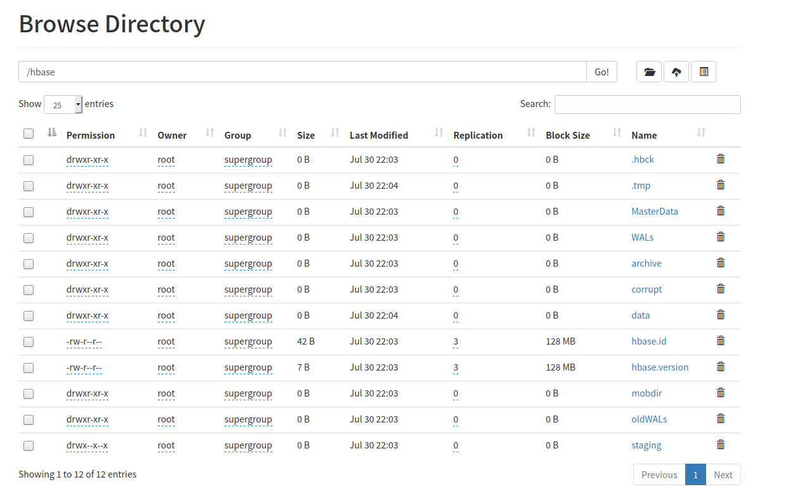

# 伪分布式集群搭建

伪分布式会有独立的`HMaster`、`HRegionServer`、`Zookeeper`服务，只是它们都是运行在同一台机器上的。

编辑`~/.bashrc`文件，在文件的最后配置JAVA_HOME和HBASE_HOME、PATH等。

```shell
export JAVA_HOME=/opt/jdk1.8
export HBASE_HOME=/opt/hbase-2.3.0
export PATH=$JAVA_HOME/bin:$HBASE_HOME/bin:$PATH
```

在hbase安装目录的`conf/hbase-env.sh`中设置`JAVA_HOME`环境变量。

```shell
export JAVA_HOME=/opt/jdk1.8
```

在hbase安装目录的`conf/hbase-site.xml`中进行如下配置。

```xml
<configuration>
<!--表示启用分布式集群配置-->
  <property>
    <name>hbase.cluster.distributed</name>
    <value>true</value>
  </property>
<!--指定hbase数据存储的根路径，这里指定的是一个HDFS的路径。也可以指定一个本地路径。-->
  <property>
    <name>hbase.rootdir</name>
    <value>hdfs://hadoop-master:9820/hbase</value>
  </property>
</configuration>
```

> 在hbase-site.xml可配置的更多信息可以参考[http://hbase.apache.org/book.html#hbase_default_configurations](http://hbase.apache.org/book.html#hbase_default_configurations)。

通过`start-hbase.sh`启动hbase，启动后会看到类似如下输出。

```text
root@hbase-master:/opt/hbase-2.3.0/conf# start-hbase.sh 
127.0.0.1: running zookeeper, logging to /opt/hbase-2.3.0/bin/../logs/hbase-root-zookeeper-hbase-master.out
running master, logging to /opt/hbase-2.3.0/logs/hbase--master-hbase-master.out
: running regionserver, logging to /opt/hbase-2.3.0/logs/hbase--regionserver-hbase-master.out
```

启动成功后运行`jps`可以看到`HMaster`、`HRegionServer`、`Zookeeper`服务。

```text
root@hbase-master:/opt/hbase-2.3.0/conf# jps
10291 HMaster
10154 HQuorumPeer
10430 HRegionServer
10703 Jps
```

此时我们可以从HDFS上查看到建立的`/hbase`目录，其目录结构如下。



至此我们的伪分布式hbase集群就搭建好了，可以通过`hbase shell`进入hbase的命令窗口进行相应的hbase操作了。

```text
root@hbase-master:/opt/hbase-2.3.0/conf# hbase shell
2020-07-30 14:11:55,902 WARN  [main] util.NativeCodeLoader: Unable to load native-hadoop library for your platform... using builtin-java classes where applicable
HBase Shell
Use "help" to get list of supported commands.
Use "exit" to quit this interactive shell.
For Reference, please visit: http://hbase.apache.org/2.0/book.html#shell
Version 2.3.0, re0e1382705c59d3fb3ad8f5bff720a9dc7120fb8, Mon Jul  6 22:27:43 UTC 2020
Took 0.0017 seconds                                                                                                                                                                                                                                                             
hbase(main):001:0> create 'test', 'cf1'
Created table test
Took 1.5887 seconds                                                                                                                                                                                                                                                             
=> Hbase::Table - test
hbase(main):002:0> put 'test','row1','cf1:name','zhangsan'
Took 0.2025 seconds                                                                                                                                                                                                                                                             
hbase(main):003:0> scan 'test'
ROW                                                                   COLUMN+CELL                                                                                                                                                                                               
 row1                                                                 column=cf1:name, timestamp=2020-07-30T14:12:33.890Z, value=zhangsan                                                                                                                                       
1 row(s)
Took 0.0583 seconds                                                                                                                                                                                                                                                             
hbase(main):004:0> 
```

## 启动HMaster的备服务

一共可以启动9个备HMaster服务。备HMaster服务是通过`local-master-backup.sh start [offset...]`启动的，HMaster一共需要占用两个端口，默认的HMaster占用了16000和16010端口，当参数中的offset为2时启动的备HMaster占用的端口为16002和16012；当offset为9时占用的端口为16009和16019。offset为10则会有端口冲突了。offset可以同时指定多个，表示同时启动多个备的HMaster，如下命令一共启动了3个备HMaster，分别占用端口为16005/16015、16006/16016和16007/16017。

```text
local-master-backup.sh start 5 6 7
```

运行后会看到如下输出：

```text
root@hbase-master:/# local-master-backup.sh start 5 6 7
running master, logging to /opt/hbase-2.3.0/logs/hbase--5-master-hbase-master.out
running master, logging to /opt/hbase-2.3.0/logs/hbase--6-master-hbase-master.out
running master, logging to /opt/hbase-2.3.0/logs/hbase--7-master-hbase-master.out
```

启动后运行`jps`后可以看到一共运行了4个HMaster服务。

```text
root@hbase-master:/# jps
1317 HQuorumPeer
2248 HMaster
1594 HRegionServer
2124 HMaster
2606 Jps
1454 HMaster
1998 HMaster
```

可以通过`local-master-backup.sh stop 5 6 7`停掉刚刚启动的3个备HMaster服务。

```text
root@hbase-master:/# local-master-backup.sh stop 5 6 7
running master, logging to /opt/hbase-2.3.0/logs/hbase--5-master-hbase-master.out
stopping master.
running master, logging to /opt/hbase-2.3.0/logs/hbase--6-master-hbase-master.out
stopping master.
running master, logging to /opt/hbase-2.3.0/logs/hbase--7-master-hbase-master.out
stopping master.
root@hbase-master:/# jps
1317 HQuorumPeer
2759 Jps
1594 HRegionServer
1454 HMaster
```

## 启动HRegionServer的备服务

可以通过`local-regionservers.sh`启动备的HRegionServer，它的用法跟`local-master-backup.sh`类似，也是同时启动多个时可以指定多个offset，默认会占用16020和16030端口。如下指令一共启动了4个HRegionServer，占用的端口分别是16022/16032、16023/16033、16024/16034、16025/16035。

```text
root@hbase-master:/# local-regionservers.sh start 2 3 4 5
running regionserver, logging to /opt/hbase-2.3.0/logs/hbase--2-regionserver-hbase-master.out
running regionserver, logging to /opt/hbase-2.3.0/logs/hbase--3-regionserver-hbase-master.out
running regionserver, logging to /opt/hbase-2.3.0/logs/hbase--4-regionserver-hbase-master.out
running regionserver, logging to /opt/hbase-2.3.0/logs/hbase--5-regionserver-hbase-master.out
root@hbase-master:/# jps
3074 HRegionServer
1317 HQuorumPeer
2839 HRegionServer
1594 HRegionServer
3259 HRegionServer
2955 HRegionServer
3453 Jps
1454 HMaster
```

如需停止上面的启动的4个备HRegionServer，则可以使用`local-regionservers.sh stop 2 3 4 5`。

```text
root@hbase-master:/# local-regionservers.sh stop 2 3 4 5
running regionserver, logging to /opt/hbase-2.3.0/logs/hbase--2-regionserver-hbase-master.out
stopping regionserver.
running regionserver, logging to /opt/hbase-2.3.0/logs/hbase--3-regionserver-hbase-master.out
stopping regionserver.
running regionserver, logging to /opt/hbase-2.3.0/logs/hbase--4-regionserver-hbase-master.out
stopping regionserver.
running regionserver, logging to /opt/hbase-2.3.0/logs/hbase--5-regionserver-hbase-master.out
stopping regionserver.
root@hbase-master:/# jps
1317 HQuorumPeer
3910 Jps
1594 HRegionServer
1454 HMaster
```

## 参考文档

* [http://hbase.apache.org/book.html#quickstart_pseudo](http://hbase.apache.org/book.html#quickstart_pseudo)

