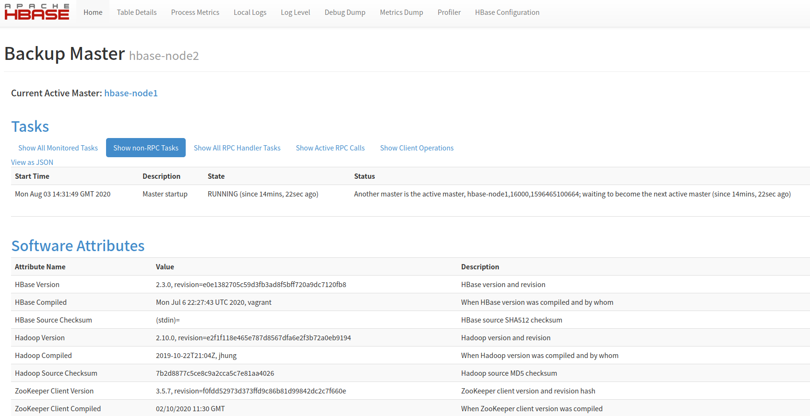

# 全分布式集群搭建

生产环境一般都采用全分布式集群，采用多台机器，分别部署HMaster、HRegionServer和Zookeeper。本集群搭建基于三台机器进行，规划如下。

| 节点 | HMaster | HRegionServer | Zookeeper |
| --- | --- | --- | --- |
| hbase-node1 | 主 | 不部署 | 部署 |
| hbase-node2 | 备 | 部署 | 部署 |
| hbase-node3 | 不部署 | 部署 | 部署 |

本文是在伪分布式的基础上进行的，假设你已经按照伪分布式中的操作配置好了node1、node2和node3。

## 开启node1到node2和node3的免密登录

在node1通过`ssh-keygen`生成密钥对。


```text
root@hbase-node1:/# ssh-keygen -t rsa
Generating public/private rsa key pair.
Enter file in which to save the key (/root/.ssh/id_rsa): 
Created directory '/root/.ssh'.
Enter passphrase (empty for no passphrase): 
Enter same passphrase again: 
Your identification has been saved in /root/.ssh/id_rsa.
Your public key has been saved in /root/.ssh/id_rsa.pub.
The key fingerprint is:
SHA256:XAh18r/ucTlKgg9h4P/STeLx8mP1qnQa/8XucGfm25w root@hbase-node1
The key's randomart image is:
+---[RSA 2048]----+
|      ..o .      |
|       . =       |
|      . . o      |
|     . o . .     |
|      . S   .    |
|       o oo ...o |
|        +o.**.*.B|
|        .++==O X*|
|         .o=BooEO|
+----[SHA256]-----+
```

在node1上执行`cat ~/.ssh/id_rsa.pub >> ~/.ssh/authorized_keys`以开启本机ssh的免密登录。

通过`scp ~/.ssh/id_rsa.pub hbase-node3:/root`把node1上的`id_rsa.pub`分别拷贝到node2和node3上。然后分别在node2和node3上执行`cat /root/id_rsa.pub >> ~/.ssh/authorized_keys`把node1上的公钥加入到可信密钥中。

## 配置node1

1. 编辑`conf/hregionservers`，注掉`localhost`那一行，增加两行，分别是`hbase-node2`和`hbase-node3`。
2. 在conf目录下新增`backup-masters`文件，在里面写一行`hbase-node2`。
3. 配置zookeeper

在`conf/hbase-site.xml`中增加如下配置。

```xml
<property>
  <name>hbase.zookeeper.quorum</name>
  <value>hbase-node1,hbase-node2,hbase-node3</value>
</property>
<property>
  <name>hbase.zookeeper.property.dataDir</name>
  <value>/usr/local/zookeeper</value>
</property>
```
 
> 在hbase-site.xml可配置的更多信息可以参考[http://hbase.apache.org/book.html#hbase_default_configurations](http://hbase.apache.org/book.html#hbase_default_configurations)。

## 配置node2和node3

把node1的hbase的conf目录下的配置拷贝到node2和node3。

## 启动集群

在node1上运行`start-hbase.sh`以启动集群，运行后你会看到类似如下这样的输出。

```text
root@hbase-node1:/opt/hbase-2.3.0# start-hbase.sh 
hbase-node3: running zookeeper, logging to /opt/hbase-2.3.0/bin/../logs/hbase-root-zookeeper-hbase-node3.out
hbase-node1: running zookeeper, logging to /opt/hbase-2.3.0/bin/../logs/hbase-root-zookeeper-hbase-node1.out
hbase-node2: running zookeeper, logging to /opt/hbase-2.3.0/bin/../logs/hbase-root-zookeeper-hbase-node2.out
running master, logging to /opt/hbase-2.3.0/logs/hbase-root-master-hbase-node1.out
hbase-node3: running regionserver, logging to /opt/hbase-2.3.0/bin/../logs/hbase-root-regionserver-hbase-node3.out
hbase-node2: running regionserver, logging to /opt/hbase-2.3.0/bin/../logs/hbase-root-regionserver-hbase-node2.out
hbase-node2: running master, logging to /opt/hbase-2.3.0/bin/../logs/hbase-root-master-hbase-node2.out
```

> 从日志输出上可以看出是先启动了Zookeeper，再启动主的HMaster，再是HRegionServer，最后是备的HMaster。

集群启动后，在node1上运行`jps`可以看到启动了HMaster和Zookeeper。

```text
root@hbase-node1:/opt/hbase-2.3.0# jps
2928 HMaster
3253 Jps
2810 HQuorumPeer
```

在node2上运行`jps`可以看到启动了备HMaster、HRegionServer和Zookeeper。

```text
root@hbase-node2:~# jps
1844 HRegionServer
2263 Jps
1695 HQuorumPeer
1983 HMaster
```

在node3上运行`jps`可以看到运行了HRegionServer和Zookeeper。

```text
root@hbase-node3:/# jps
785 HQuorumPeer
1162 Jps
942 HRegionServer
```

之后我们可以打开浏览器访问`http://hbase-node1:16010`查看node1上的HMaster的控制台，可以看到类似如下内容。


打开浏览器访问`http://hbase-node2:16010`查看node2上的备的HMaster的控制台，可以看到类似如下内容。



打开浏览器访问`http://hbase-node2:16030`查看node2上的RegionServer的控制台，可以看到类似如下内容。


打开浏览器访问`http://hbase-node3:16030`查看node3上的RegionServer的控制台，可以看到类似如下内容。


然后可以在任一节点上运行`hbase shell`进入hbase的命令窗口，之后可以通过hbase的相关命令进行表的创建、数据的插入等。

当node1挂了后，node2上备的HMaster会自动提升为主的HMaster。我们把node1上的HMaster进程杀掉后再访问`http://hbase-node2:16010`可以看到如下内容。


HRegionServer可以自动进行失效转移，如果你kill掉了其中的一个，剩下的那个也可以照常工作。

## 参考文档

* [http://hbase.apache.org/book.html#quickstart_fully_distributed](http://hbase.apache.org/book.html#quickstart_fully_distributed)
