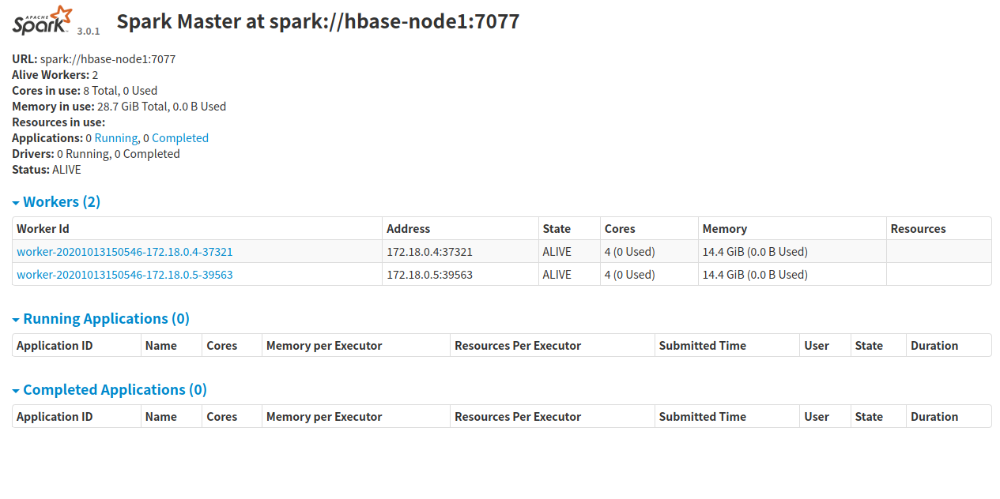

# 搭建Standalone spark集群

笔者准备了三台机器用于搭建该集群，对应的机器名分别为hbase-node1、hbase-node2和hbase-node3，其中hbase-node1用于启动master，另外两台作为worker启动。

从[https://archive.apache.org/dist/spark/](https://archive.apache.org/dist/spark/)下载最新的spark包，这里笔者下载的是[spark-3.0.1-bin-hadoop3.2.tgz](https://archive.apache.org/dist/spark/spark-3.0.1/spark-3.0.1-bin-hadoop3.2.tgz)。把它解压后放到hbase-node1的/opt目录下，它的目录结构如下：

```text
.
|-- LICENSE
|-- NOTICE
|-- R
|-- README.md
|-- RELEASE
|-- bin
|-- conf
|-- data
|-- examples
|-- jars
|-- kubernetes
|-- licenses
|-- logs
|-- python
|-- sbin
`-- yarn

```

conf目录下是各种配置文件，把`conf/spark-env.sh.template`复制为`conf/spark-env.sh`，然后在spark-env.sh中配置JAVA_HOME和SPARK_MASTER_HOST。

```shell
export JAVA_HOME=/opt/jdk1.8
export SPARK_MASTER_HOST=habase-node1
```

SPARK_MASTER_HOST用于指定Master节点的IP或主机名。在spark-env.sh中还可以配置如下这些环境变量。

| Environment Variable |	Meaning |
| ---- | ---- |
| SPARK_MASTER_HOST 	| Bind the master to a specific hostname or IP address, for example a public one. |
| SPARK_MASTER_PORT 	| Start the master on a different port (default: 7077). |
| SPARK_MASTER_WEBUI_PORT 	| Port for the master web UI (default: 8080). |
| SPARK_MASTER_OPTS 	| Configuration properties that apply only to the master in the form "-Dx=y" (default: none). See below for a list of possible options. |
| SPARK_LOCAL_DIRS 	| Directory to use for "scratch" space in Spark, including map output files and RDDs that get stored on disk. This should be on a fast, local disk in your system. It can also be a comma-separated list of multiple directories on different disks. |
| SPARK_WORKER_CORES 	| Total number of cores to allow Spark applications to use on the machine (default: all available cores). |
| SPARK_WORKER_MEMORY 	| Total amount of memory to allow Spark applications to use on the machine, e.g. 1000m, 2g (default: total memory minus 1 GiB); note that each application's individual memory is configured using its spark.executor.memory property. |
| SPARK_WORKER_PORT 	| Start the Spark worker on a specific port (default: random). |
| SPARK_WORKER_WEBUI_PORT 	| Port for the worker web UI (default: 8081). |
| SPARK_WORKER_DIR 	| Directory to run applications in, which will include both logs and scratch space (default: SPARK_HOME/work). |
| SPARK_WORKER_OPTS 	| Configuration properties that apply only to the worker in the form "-Dx=y" (default: none). See below for a list of possible options. |
| SPARK_DAEMON_MEMORY 	| Memory to allocate to the Spark master and worker daemons themselves (default: 1g). |
| SPARK_DAEMON_JAVA_OPTS 	| JVM options for the Spark master and worker daemons themselves in the form "-Dx=y" (default: none). |
| SPARK_DAEMON_CLASSPATH 	| Classpath for the Spark master and worker daemons themselves (default: none). |
| SPARK_PUBLIC_DNS 	| The public DNS name of the Spark master and workers (default: none). |

复制slaves-template为slaves，然后注掉里面的localhost，新增hbase-node2和hbase-node3。

```text
#localhost
hbase-node2
hbase-node3
```

hbase-node1是可以通过ssh登录到hbase-node2和hbase-node3的。然后通过scp把hbase-node1上的spark安装目录拷贝到hbase-node2和hbase-node3的相同目录下，即`/opt`目录下。

然后通过在hbase-node1上的spark安装目录下执行`sbin/start-all.sh`即可启动整个集群，启动后通过jps可以看到hbase-node1上启动了master服务，hbase-node2和hbase-node3上启动了worker服务。

```text
root@hbase-node1:/opt/spark-3.0.1-bin-hadoop3.2/conf# /opt/spark-3.0.1-bin-hadoop3.2/sbin/start-all.sh 
org.apache.spark.deploy.master.Master running as process 195.  Stop it first.
hbase-node2: starting org.apache.spark.deploy.worker.Worker, logging to /opt/spark-3.0.1-bin-hadoop3.2/logs/spark-root-org.apache.spark.deploy.worker.Worker-1-hbase-node2.out
hbase-node3: starting org.apache.spark.deploy.worker.Worker, logging to /opt/spark-3.0.1-bin-hadoop3.2/logs/spark-root-org.apache.spark.deploy.worker.Worker-1-hbase-node3.out
```

可以通过访问`http://hbase-node1:8080`查看spark的Master服务的Web界面。




> Spark的standalone集群也支持分别启动Master和Worker，启动Worker时需要指定Worker连接的Master的地址。更多信息可参考[官方文档](http://spark.apache.org/docs/latest/spark-standalone.html)。
> Spark的standalone集群的Worker和Master也可以都跑在同一台机器上，适用于测试。


单独启动Master(start-master.sh)和Slave(start-slave.sh)时还可以指定如下参数。

| Argument | 	Meaning |
| -------- | -------- |
| -h HOST, --host HOST | 	Hostname to listen on |
| -i HOST, --ip HOST | 	Hostname to listen on (deprecated, use -h or --host) |
| -p PORT, --port PORT | 	Port for service to listen on (default: 7077 for master, random for worker) |
| --webui-port PORT |  	Port for web UI (default: 8080 for master, 8081 for worker) |
| -c CORES, --cores CORES | Total CPU cores to allow Spark applications to use on the machine (default: all available); only on worker |
| -m MEM, --memory MEM 	| Total amount of memory to allow Spark applications to use on the machine, in a format like 1000M or 2G (default: your machine's total RAM minus 1 GiB); only on worker |
| -d DIR, --work-dir DIR | Directory to use for scratch space and job output logs (default: SPARK_HOME/work); only on worker |
| --properties-file FILE | Path to a custom Spark properties file to load (default: conf/spark-defaults.conf) |


## 参考文档

* [http://spark.apache.org/docs/latest/spark-standalone.html](http://spark.apache.org/docs/latest/spark-standalone.html)

