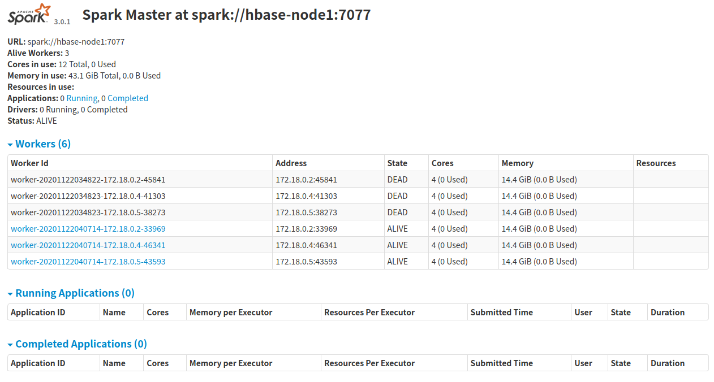
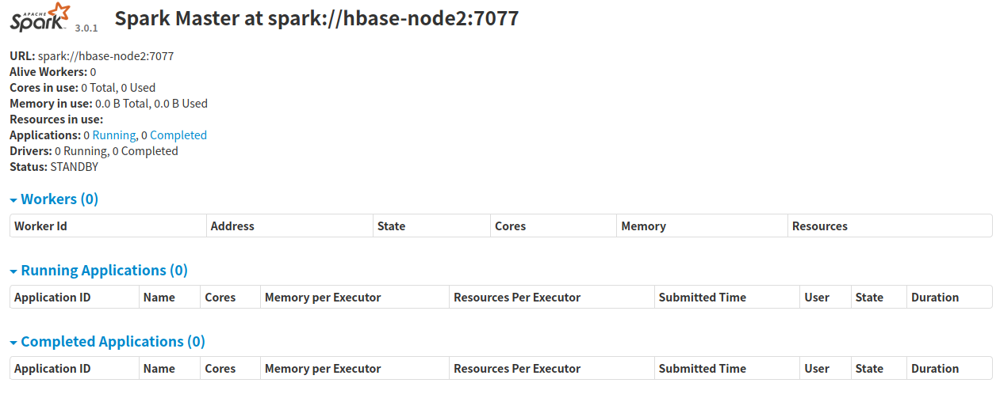
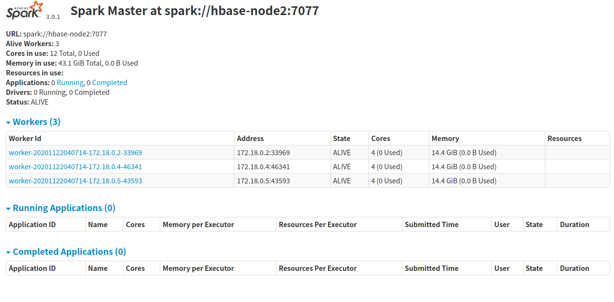

# 基于Zookeeper搭建的高可用Standalone集群

原来的Standalone集群中的Master节点有单机风险。基于Zookeeper部署多个Master节点可以解决该问题。

## 规划

一共三台机器，hbase-node1、hbase-node2、hbase-node3。hbase-node1和hbase-node2部署为Master，hbase-node1、hbase-node2、hbase-node3部署为Worker。

## 配置

需要在`spark-env.sh`中配置环境变量`SPARK_DAEMON_JAVA_OPTS`，需要配置三个参数。

| Property Name |	Default |	Meaning	|
| ---- | ---- | ---- |
| spark.deploy.recoveryMode | NONE | The recovery mode setting to recover submitted Spark jobs with cluster mode when it failed and relaunches. This is only applicable for cluster mode when running with Standalone or Mesos. |
| spark.deploy.zookeeper.url | None |When `spark.deploy.recoveryMode` is set to ZOOKEEPER, this configuration is used to set the zookeeper URL to connect to. |
| spark.deploy.zookeeper.dir | None | When `spark.deploy.recoveryMode` is set to ZOOKEEPER, this configuration is used to set the zookeeper directory to store recovery state. |

先在hbase-node1的`spark-env.sh`中进行如下配置。

```shell
export JAVA_HOME=/opt/jdk1.8
export SPARK_MASTER_HOST=hbase-node1
export SPARK_DAEMON_JAVA_OPTS="-Dspark.deploy.recoveryMode=ZOOKEEPER -Dspark.deploy.zookeeper.url=hbase-node1:2181,hbase-node2:2181,hbase-node3:2181 -Dspark.deploy.zookeeper.dir=/spark-standalone"
```

在hbase-node1的slaves中配置如下内容：

```shell
hbase-node1
hbase-node2
hbase-node3
```

然后把`spark-evn.sh`和`slaves`这两个文件拷贝到hbase-node2和hbase-node3。

然后在hbase-node1上运行`sbin/start-all.sh`启动standalone集群。

然后修改hbase-node2中的`spark-env.sh`中的环境变量`SPARK_MASTER_HOST`的值为`hbase-node2`，之后在hbase-node2上运行`sbin/start-master.sh`就会在hbase-node2上启动一个Master服务。

之后访问`hbase-node1:8080`可以看到hbase-node1是ACTIVE状态。



访问`hbase-node2:8080`可以看到hbase-node2是STANDBY状态。



这时候kill掉hbase-node1上的Master，然后查看hbase-node2的控制台可以发现hbase-node2已经变成ACTIVE了，这个切换过程大概需要一两分钟。



如果你又把hbase-node1上的Master启起来，你会看到它的状态为STANDBY。

## 提交任务到高可用的Standalone集群

当有多个Master节点时，提交任务时需要指定--master为多个地址，多个地址之间通过英文逗号分隔。如：

```shell
bin/spark-submit --master spark://hbase-node1:7077,hbase-node2:7077 --class org.apache.spark.examples.SparkPi examples/jars/spark-examples_2.12-3.0.1.jar 100000
```

## 参考文档

* [http://spark.apache.org/docs/latest/spark-standalone.html#high-availability](http://spark.apache.org/docs/latest/spark-standalone.html#high-availability)
