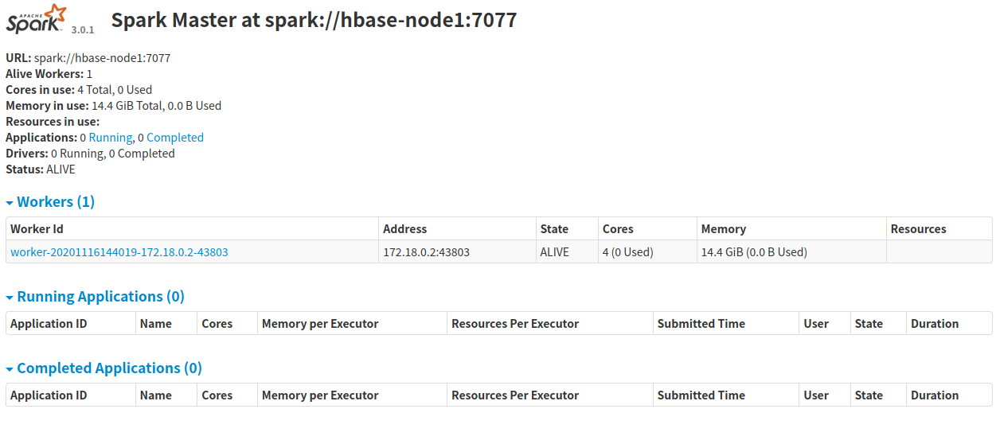
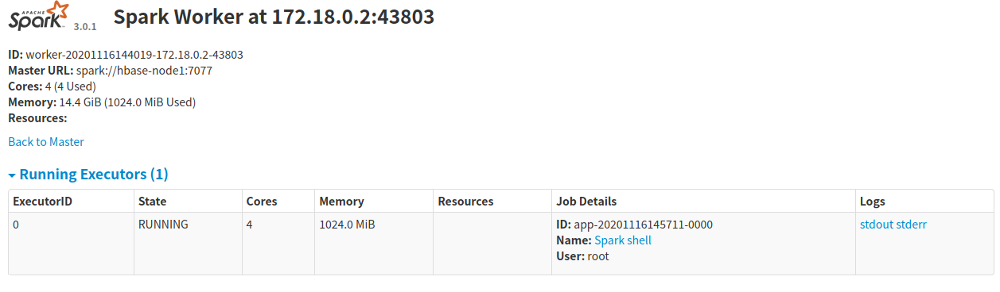
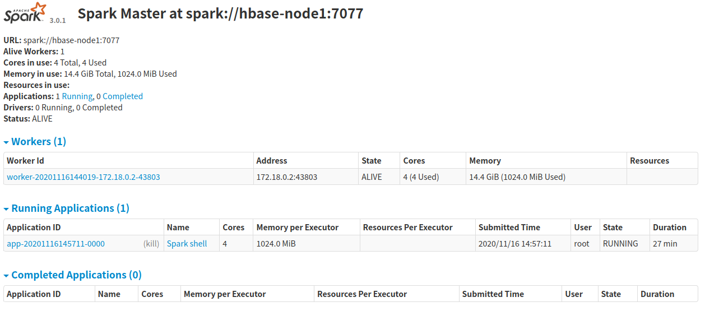
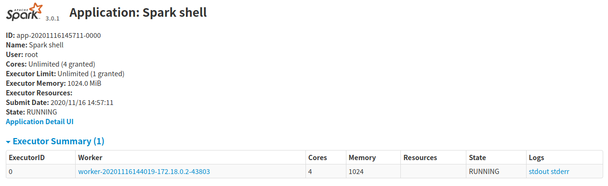
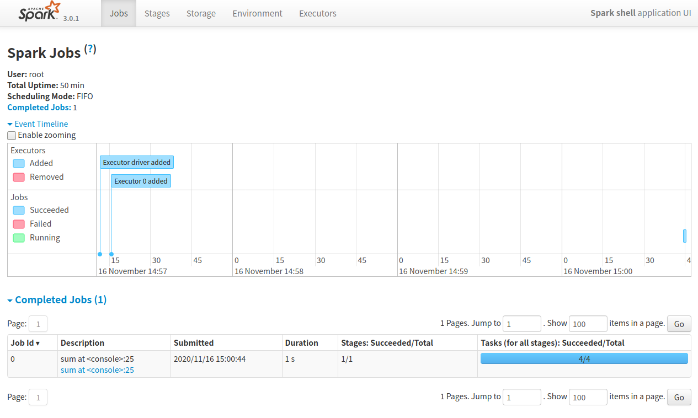

# Spark WebUI

Master节点的WebUI默认监听在端口8080,可以在`spark-env.sh`中通过环境变量`SPARK_MASTER_WEBUI_PORT`进行修改。Worker节点的WebUI默认监听在端口8081。

Master节点的示例如下。

Worker节点的示例如下。

当有应用运行的时候可以在Master节点的WebUI看到运行的应用的概览。

点击应用的链接可以看到某个应用的相关信息。

点击上图中的`Application Detail UI`可以查看应用运行的详细信息，上面有多个页签，分别提供Job、Stage、Storage、Environment和Executor信息。应用信息的UI一般监听的是4040端口。

