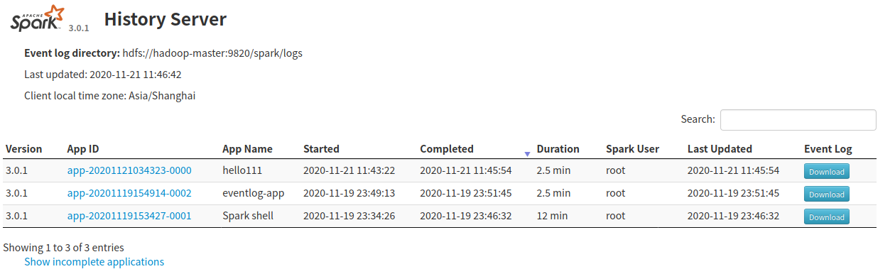

# 监控

Monitoring and Instrumentation

There are several ways to monitor Spark applications: web UIs, metrics, and external instrumentation.
Web Interfaces

Every SparkContext launches a Web UI, by default on port 4040, that displays useful information about the application. This includes:

*    A list of scheduler stages and tasks
*    A summary of RDD sizes and memory usage
*    Environmental information.
*    Information about the running executors

You can access this interface by simply opening http://<driver-node>:4040 in a web browser. If multiple SparkContexts are running on the same host, they will bind to successive ports beginning with 4040 (4041, 4042, etc).

> Note that this information is only available for the duration of the application by default. To view the web UI after the fact, set spark.eventLog.enabled to true before starting the application. This configures Spark to log Spark events that encode the information displayed in the UI to persisted storage.

## 在应用运行完后查看应用信息

应用在运行时默认会启动Web UI监听4040端口，通过它可以查看应用的运行情况等信息。但是一旦应用执行完成后就不能继续查看到了。如果需要查看则需要在客户端指定`spark.eventLog.enabled=true`，同时也可以通过`spark.eventLog.dir`指定日志存放路径。比如下面这样。

```shell
bin/spark-shell --master spark://hbase-node1:7077 -c spark.eventLog.enabled=true -c spark.eventLog.dir=hdfs://hadoop-master:9820/spark/logs
```

> spark.eventLog.dir指定的目录必须是存在的，不存在时启动会报错。

进行了上面的配置后，上面的`spark-shell`程序运行时就会把日志信息写入到指定的目录下。

如果需要在客户端启动多个应用，每个应用都手写`spark.eventLog.enabled`配置会比较麻烦，此时可以把它们定义在客户端的spark的`conf/spark-default.conf`文件中，比如下面这样。

```text
# Default system properties included when running spark-submit.
# This is useful for setting default environmental settings.

# Example:
# spark.master                     spark://master:7077
spark.eventLog.enabled           true
spark.eventLog.dir               hdfs://hadoop-master:9820/spark/logs
# spark.serializer                 org.apache.spark.serializer.KryoSerializer
# spark.driver.memory              5g
# spark.executor.extraJavaOptions  -XX:+PrintGCDetails -Dkey=value -Dnumbers="one two three"
```

### 通过history Server进行查看

It is still possible to construct the UI of an application through Spark’s history server, provided that the application’s event logs exist. You can start the history server by executing:

```
./sbin/start-history-server.sh
```

This creates a web interface at http://<server-url>:18080 by default, listing incomplete and completed applications and attempts.

When using the file-system provider class (see spark.history.provider below), the base logging directory must be supplied in the spark.history.fs.logDirectory configuration option, and should contain sub-directories that each represents an application’s event logs.

The spark jobs themselves must be configured to log events, and to log them to the same shared, writable directory. For example, if the server was configured with a log directory of hdfs://namenode/shared/spark-logs, then the client-side options would be:

```
spark.eventLog.enabled true
spark.eventLog.dir hdfs://namenode/shared/spark-logs
```

这需要我们通过`spark.history.fs.logDirectory`配置history server需要读取日志文件的目录，需要配置成跟`spark.eventLog.dir`一致。然后通过`sbin/start-history-server.sh`启动history server，它默认监听在18080端口。启动后我们可以访问history server所在机器的180810端口查看已经运行（包括正在运行的）的应用。



点击App Id上的链接可以看到当时该应用的运行情况。


关于history server的更多配置等内容可以参考[官方文档](http://spark.apache.org/docs/latest/monitoring.html)


## 参考文档

* [http://spark.apache.org/docs/latest/monitoring.html](http://spark.apache.org/docs/latest/monitoring.html)
