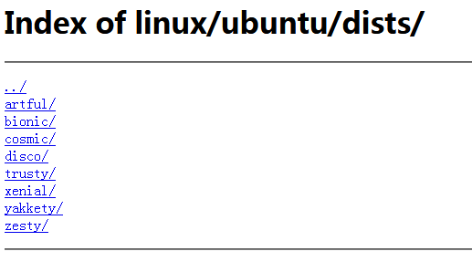
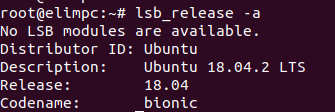
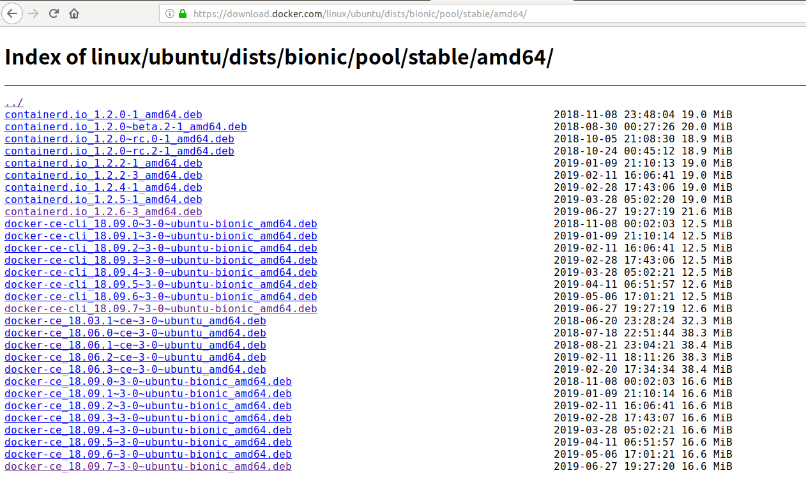
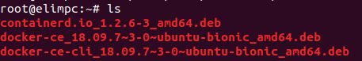

# Docker安装

Docker有社区版和企业版之分，个人使用选择社区版即可。笔者使用的操作系统是Ubuntu18.04，以下介绍的Docker的安装是基于该版本进行的。

> 国内用户在使用Ubuntu安装软件时下载软件会非常慢，因为默认使用的源都是外国的。国内有很多大型公司或机构也提供了Ubuntu相关的软件源，到网上搜可以有很多，比如阿里云的、网易的、清华大学的，等等。笔者使用的是阿里云的，使用阿里云的Ubuntu软件源的方法如下（涉及到的指令都是使用root用户操作的，如果没有切换到root用户请在指令前加上sudo）：
> 1. 软件源信息是定义在`/etc/apt/sources.list`文件中的，可以选择先将该文件进行备份，也可以直接覆盖其中的内容。如果是备份可以使用`mv /etc/apt/sources.list /etc/apt/sources.list.bak`。
> 2. 把下面的内容拷贝到`/etc/apt/sources.list`文件中。
> ```text
> deb http://mirrors.aliyun.com/ubuntu/ bionic main restricted universe multiverse
> deb http://mirrors.aliyun.com/ubuntu/ bionic-security main restricted universe multiverse
> deb http://mirrors.aliyun.com/ubuntu/ bionic-updates main restricted universe multiverse
> deb http://mirrors.aliyun.com/ubuntu/ bionic-proposed main restricted universe multiverse
> deb http://mirrors.aliyun.com/ubuntu/ bionic-backports main restricted universe multiverse
> deb-src http://mirrors.aliyun.com/ubuntu/ bionic main restricted universe multiverse
> deb-src http://mirrors.aliyun.com/ubuntu/ bionic-security main restricted universe multiverse
> deb-src http://mirrors.aliyun.com/ubuntu/ bionic-updates main restricted universe multiverse
> deb-src http://mirrors.aliyun.com/ubuntu/ bionic-proposed main restricted universe multiverse
> deb-src http://mirrors.aliyun.com/ubuntu/ bionic-backports main restricted universe multiverse
> ```
>
> 3. 执行`apt update`指令。
> 4. 执行`apt upgrade`指令。


Docker只能在64位机器上跑，所以在安装前需要确保你的操作系统是64位的。

## Docker安装

Docker的安装有3种方式。

### 通过repository安装

1. 更新apt包索引

```shell
apt-get update
```

2. 安装https相关的包

```shell
apt-get install apt-transport-https ca-certificates curl gnupg-agent software-properties-common
```

3. 添加Docker官方的GPG密钥

```shell
curl -fsSL https://download.docker.com/linux/ubuntu/gpg | apt-key add -
```

4. 使用下面的指令添加Docker的repository

```shell
add-apt-repository "deb [arch=amd64] https://download.docker.com/linux/ubuntu $(lsb_release -cs) stable"
```

5. 添加了新的repository后需要重新更新apt包索引

```shell
apt-get update
```

6. 使用下面的指令安装最新的docker-ce和docker-ce-cli。

```shell
apt-get install docker-ce docker-ce-cli containerd.io
```

7. 经过上面的步骤后Docker基本就安装完成了，可以通过下面的指令来验证。执行指令后如果输出的日志中显示Docker从远程拉取了`hello-world`镜像，并且在运行后输出了`Hello from Docker!`等相关信息则说明你的Docker安装是OK的。

```shell
docker run hello-world
```

> 对于非root用户需要运行如下指令创建一个docker用户组，然后把需要使用docker的用户加入该组即可。
> 
> ```shell
> sudo groupadd docker     #添加docker用户组
> sudo gpasswd -a $USER docker     #将登陆用户加入到docker用户组中
> newgrp docker     #更新用户组
> ```

## 通过下载.deb包安装

可以通过访问[https://download.docker.com/linux/ubuntu/dists/](https://download.docker.com/linux/ubuntu/dists/)下载相关的Ubuntu系统下的Docker安装包。打开这个网址后，你会看到如下列表信息。



这个列表展示的是你要选择的Ubuntu版本，Ubuntu的每一个版本都有一个代号，这个列表展示的就是各个版本对应的代号。可以通过指令`lsb_release -a`来查看当前的版本相关信息。



如上图所示，Codename那一行对应的就是这个代号的名字。所以笔者的操作系统的版本代号就是bionic。然后依次点击pool、stable、amd64，最终你会看到如下这样一个deb包列表。分别选择docker-ce、docker-ce-cli和containerd.io的最新版本下载即可。



笔者下载了如下包，并把它们放到了home目录下。



然后安装的时候需要先安装containerd.io和docker-ce-cli。依次执行下列指令分别安装containerd.io、docker-ce-cli和docker-ce。

```shell
dpkg -i containerd.io_1.2.6-3_amd64.deb
dpkg -i docker-ce-cli_18.09.7~3-0~ubuntu-bionic_amd64.deb
dpkg -i docker-ce_18.09.7~3-0~ubuntu-bionic_amd64.deb
```

执行完上述指令后Docker基本上就安装好了，同样可以通过执行`docker run hello-world`进行验证。


## 通过官方提供的shell脚本安装

Docker官方提供了一个安装Docker的shell脚本，该脚本将安装Docker需要的各种依赖包，并最终安装最新版本的Docker。可以通过如下方式获取该安装脚本。

```shell
curl -fsSL https://get.docker.com -o get-docker.sh
```

执行上述指令后就会在当前目录获取到一个get-docker.sh脚本文件，需要使用root权限执行该脚本。

```shell
sh get-docker.sh
```

执行成功后就会在当前机器安装好了Docker。如果当前用户不是root，需要通过`sudo sh get-docker.sh`进行安装，安装完成后还需要把当前用户添加到docker用户组，比如下面就把用户elim添加到了用户组docker中。

```shell
sudo usermod -aG docker elim
```

## Docker卸载

Ubuntu卸载软件是通过`apt-get remove`指令来卸载的，安装Docker时我们安装了docker-ce、docker-ce-cli、containerd.io，所以卸载时我们应该卸载这三个软件。执行如下指令可以卸载这三个软件。

```shell
apt-get remove docker-ce docker-ce-cli containerd.io
```


Docker的下载的镜像等相关信息都存放在`/var/lib/docker`目录下，卸载Docker时不会自动删除相关的信息，所以如果这些信息你已经不需要了，可以在卸载完Docker后执行`rm -rf /var/lib/docker`以彻底删除`/var/lib/docker`目录。


其它操作系统安装和卸载Docker也是大同小异的，有需要可以参考官方文档。

### 参考文档

[https://docs.docker.com/install/linux/docker-ce/ubuntu/](https://docs.docker.com/install/linux/docker-ce/ubuntu/)
