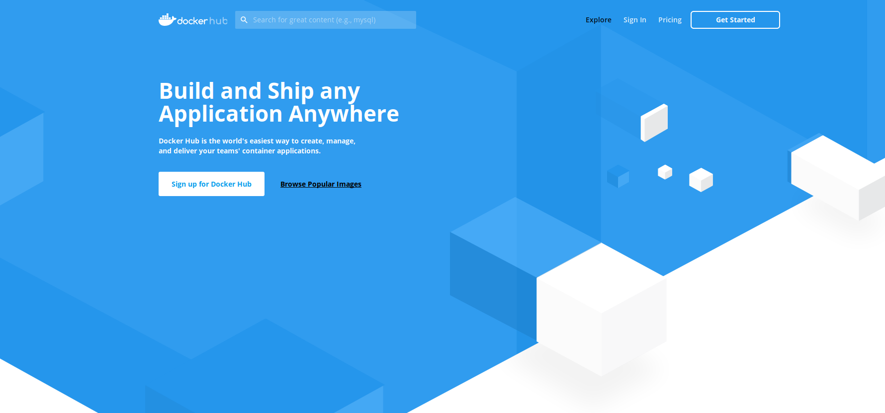
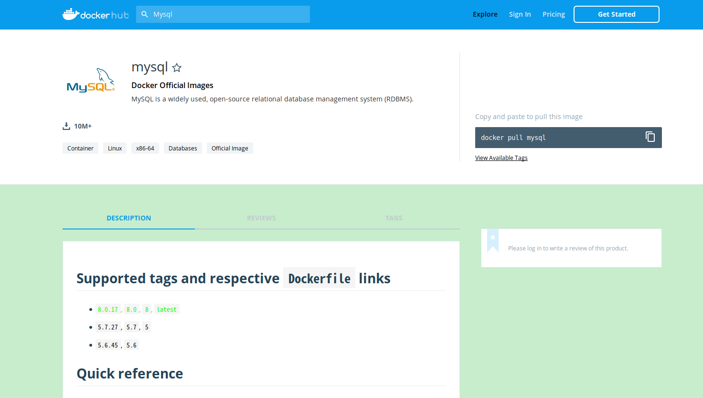
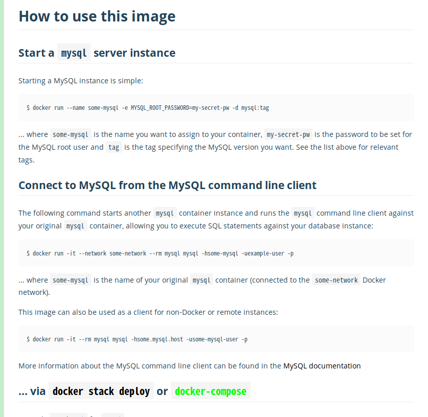

# 寻找镜像并运行

docker运行的是镜像image，image运行后就变成了一个container实例。如果你想运行一个image，你应该先从docker的官方镜像库[https://hub.docker.com/](https://hub.docker.com/)去搜索对应的镜像，查看其版本号和用法。如下就是docker官方镜像库的主界面。



如果你想找mysql的镜像，则在搜索框中输入mysql进行搜索，然后点击搜索结果中选中的mysql镜像就会出现mysql镜像的详细信息界面。mysql镜像的详细信息地址是[https://hub.docker.com/_/mysql](https://hub.docker.com/_/mysql)。进去后你会看到类似如下这样的界面。里面列出了mysql镜像支持的tag，要运行一个镜像必须是镜像名加tag的形式，不指定tag则表示运行名为latest的tag。



下面还会有mysql镜像的用法。



使用`docker run`指令可以运行一个镜像，运行`docker run --help`可以看到该指令的用法如下。

```text

Usage:	docker run [OPTIONS] IMAGE [COMMAND] [ARG...]

Run a command in a new container

Options:
      --add-host list                  Add a custom host-to-IP mapping
                                       (host:ip)
  -a, --attach list                    Attach to STDIN, STDOUT or STDERR
      --blkio-weight uint16            Block IO (relative weight),
                                       between 10 and 1000, or 0 to
                                       disable (default 0)
      --blkio-weight-device list       Block IO weight (relative device
                                       weight) (default [])
      --cap-add list                   Add Linux capabilities
      --cap-drop list                  Drop Linux capabilities
      --cgroup-parent string           Optional parent cgroup for the
                                       container
      --cidfile string                 Write the container ID to the file
      --cpu-period int                 Limit CPU CFS (Completely Fair
                                       Scheduler) period
      --cpu-quota int                  Limit CPU CFS (Completely Fair
                                       Scheduler) quota
      --cpu-rt-period int              Limit CPU real-time period in
                                       microseconds
      --cpu-rt-runtime int             Limit CPU real-time runtime in
                                       microseconds
  -c, --cpu-shares int                 CPU shares (relative weight)
      --cpus decimal                   Number of CPUs
      --cpuset-cpus string             CPUs in which to allow execution
                                       (0-3, 0,1)
      --cpuset-mems string             MEMs in which to allow execution
                                       (0-3, 0,1)
  -d, --detach                         Run container in background and
                                       print container ID
      --detach-keys string             Override the key sequence for
                                       detaching a container
      --device list                    Add a host device to the container
      --device-cgroup-rule list        Add a rule to the cgroup allowed
                                       devices list
      --device-read-bps list           Limit read rate (bytes per second)
                                       from a device (default [])
      --device-read-iops list          Limit read rate (IO per second)
                                       from a device (default [])
      --device-write-bps list          Limit write rate (bytes per
                                       second) to a device (default [])
      --device-write-iops list         Limit write rate (IO per second)
                                       to a device (default [])
      --disable-content-trust          Skip image verification (default true)
      --dns list                       Set custom DNS servers
      --dns-option list                Set DNS options
      --dns-search list                Set custom DNS search domains
      --entrypoint string              Overwrite the default ENTRYPOINT
                                       of the image
  -e, --env list                       Set environment variables
      --env-file list                  Read in a file of environment variables
      --expose list                    Expose a port or a range of ports
      --group-add list                 Add additional groups to join
      --health-cmd string              Command to run to check health
      --health-interval duration       Time between running the check
                                       (ms|s|m|h) (default 0s)
      --health-retries int             Consecutive failures needed to
                                       report unhealthy
      --health-start-period duration   Start period for the container to
                                       initialize before starting
                                       health-retries countdown
                                       (ms|s|m|h) (default 0s)
      --health-timeout duration        Maximum time to allow one check to
                                       run (ms|s|m|h) (default 0s)
      --help                           Print usage
  -h, --hostname string                Container host name
      --init                           Run an init inside the container
                                       that forwards signals and reaps
                                       processes
  -i, --interactive                    Keep STDIN open even if not attached
      --ip string                      IPv4 address (e.g., 172.30.100.104)
      --ip6 string                     IPv6 address (e.g., 2001:db8::33)
      --ipc string                     IPC mode to use
      --isolation string               Container isolation technology
      --kernel-memory bytes            Kernel memory limit
  -l, --label list                     Set meta data on a container
      --label-file list                Read in a line delimited file of labels
      --link list                      Add link to another container
      --link-local-ip list             Container IPv4/IPv6 link-local
                                       addresses
      --log-driver string              Logging driver for the container
      --log-opt list                   Log driver options
      --mac-address string             Container MAC address (e.g.,
                                       92:d0:c6:0a:29:33)
  -m, --memory bytes                   Memory limit
      --memory-reservation bytes       Memory soft limit
      --memory-swap bytes              Swap limit equal to memory plus
                                       swap: '-1' to enable unlimited swap
      --memory-swappiness int          Tune container memory swappiness
                                       (0 to 100) (default -1)
      --mount mount                    Attach a filesystem mount to the
                                       container
      --name string                    Assign a name to the container
      --network string                 Connect a container to a network
                                       (default "default")
      --network-alias list             Add network-scoped alias for the
                                       container
      --no-healthcheck                 Disable any container-specified
                                       HEALTHCHECK
      --oom-kill-disable               Disable OOM Killer
      --oom-score-adj int              Tune host's OOM preferences (-1000
                                       to 1000)
      --pid string                     PID namespace to use
      --pids-limit int                 Tune container pids limit (set -1
                                       for unlimited)
      --privileged                     Give extended privileges to this
                                       container
  -p, --publish list                   Publish a container's port(s) to
                                       the host
  -P, --publish-all                    Publish all exposed ports to
                                       random ports
      --read-only                      Mount the container's root
                                       filesystem as read only
      --restart string                 Restart policy to apply when a
                                       container exits (default "no")
      --rm                             Automatically remove the container
                                       when it exits
      --runtime string                 Runtime to use for this container
      --security-opt list              Security Options
      --shm-size bytes                 Size of /dev/shm
      --sig-proxy                      Proxy received signals to the
                                       process (default true)
      --stop-signal string             Signal to stop a container
                                       (default "SIGTERM")
      --stop-timeout int               Timeout (in seconds) to stop a
                                       container
      --storage-opt list               Storage driver options for the
                                       container
      --sysctl map                     Sysctl options (default map[])
      --tmpfs list                     Mount a tmpfs directory
  -t, --tty                            Allocate a pseudo-TTY
      --ulimit ulimit                  Ulimit options (default [])
  -u, --user string                    Username or UID (format:
                                       <name|uid>[:<group|gid>])
      --userns string                  User namespace to use
      --uts string                     UTS namespace to use
  -v, --volume list                    Bind mount a volume
      --volume-driver string           Optional volume driver for the
                                       container
      --volumes-from list              Mount volumes from the specified
                                       container(s)
  -w, --workdir string                 Working directory inside the container

```

我们之前看到Mysql镜像有一个名为5.7的tag，所以如果我们需要运行一个5.7版本的mysql可以运行`docker run mysql:5.7`，镜像名和tag之间通过冒号隔开。如果你不指定tag，即运行`docker run mysql`则默认会使用名为latest的tag，相当于最新的一个版本，也就相当于运行了`docker run mysql:latest`。当你运行`docker run mysql:5.7`时实际上该镜像是运行不起来的，运行时会报错提示`error: database is uninitialized and password option is not specified You need to specify one of MYSQL_ROOT_PASSWORD, MYSQL_ALLOW_EMPTY_PASSWORD and MYSQL_RANDOM_ROOT_PASSWORD`。它的意思是我们的mysql没有指定root用户的密码，可以通过环境变量`MYSQL_ROOT_PASSWORD`指定root用户密码，或者指定环境变量`MYSQL_ALLOW_EMPTY_PASSWORD`的值为true启用一个空密码。docker运行镜像时可以通过`-e`指定一个环境变量。比如需要指定root用户密码为123456则运行`docker run -e MYSQL_ROOT_PASSWORD=123456 mysql:5.7`，此时你会看到mysql镜像运行成功了，并且会有相应的日志输出。
