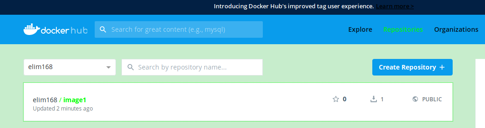

# 发布镜像到docker仓库

自己的镜像如果想跟别人分享，希望别人也能够使用，可以考虑把它放到docker仓库上。docker官方的仓库地址是[https://hub.docker.com/](https://hub.docker.com/)，我们可以把自己创建的镜像发布到docker官方仓库。要想把镜像发布到docker官方仓库，你需要先在官方仓库注册一个自己的帐号。笔者注册了一个帐号`elim168`。按照docker的规范，如果需要把镜像发布到docker官方仓库，镜像名需要命名为`username/imageName`的形式，比如笔者的镜像image1如果需要发布到笔者的elim168帐号下面，则需要命名为`elim168/image1`。在之前介绍通过Dockerfile构建自己的镜像时通过`docker build`的`-t`参数可以指定镜像名，此时可以指定镜像名为`username/imageName`的形式。但是如果你的镜像已经命名为image1了，此时你想推送它到docker仓库怎么办呢？这个时候可以使用`docker tag`命令创建一个基于现有镜像的引用的镜像，它可以命名为另一个名字。运行`docker tag --help`可以看到该指令的语法如下。

```text
elim@elim-pc:~$ docker tag --help
Usage:	docker tag SOURCE_IMAGE[:TAG] TARGET_IMAGE[:TAG]
```

所以如果我们已经有了镜像image1，想把它发布到docker仓库的elim168帐号下，则可以使用如下指令创建一个指向旧的镜像的新的镜像。

```text
elim@elim-pc:~$ docker tag image1:1.0 elim168/image1:1.0
```

> 这里是带了版本号的写法。

创建完后可以运行`docker images`查看本地的镜像列表。

```text
elim@elim-pc:~$ docker images
REPOSITORY          TAG                 IMAGE ID            CREATED             SIZE
image1              1.0                 466863601eda        7 days ago          506MB
elim168/image1      1.0                 466863601eda        7 days ago          506MB
```

> 从上面可以看到有一个名为image1的镜像和一个名为elim168/image1的镜像，它们的IMAGE ID是一样的，因为它们底层对应的就是同一个镜像。

有了这个镜像后就可以把它发布到远程仓库了，步骤如下。

1.需要先在命令行使用`docker login`进行登录，使用的是[https://hub.docker.com/](https://hub.docker.com/)上注册的用户名和密码。

```text
elim@elim-pc:~$ docker login
Login with your Docker ID to push and pull images from Docker Hub. If you don't have a Docker ID, head over to https://hub.docker.com to create one.
Username: elim168
Password: 
WARNING! Your password will be stored unencrypted in /home/elim/.docker/config.json.
Configure a credential helper to remove this warning. See
https://docs.docker.com/engine/reference/commandline/login/#credentials-store

Login Succeeded
```

> 登录的时候也可以直接通过-u参数指定用户名，通过-p参数指定密码。这两个参数可以通过`docker login --help`查看到。
> ```text
> Usage:	docker login [OPTIONS] [SERVER]
> Log in to a Docker registry
> 
> Options:
>   -p, --password string   Password
>       --password-stdin    Take the password from stdin
>   -u, --username string   Username
> ```

2.登录后即可通过`docker push`指令把镜像推送到远程仓库，其语法如下。

```text
Usage:	docker push [OPTIONS] NAME[:TAG]

Push an image or a repository to a registry

Options:
      --disable-content-trust   Skip image signing (default true)
```

所以要推送我们的elim168/image1镜像到docker仓库，可运行`docker push elim168/image1:1.0`。

```text
elim@elim-pc:~$ docker push elim168/image1:1.0
The push refers to repository [docker.io/elim168/image1]
63c8eec667d8: Pushed 
aa0c58fa2fa1: Pushed 
b8a7fd87be39: Mounted from library/tomcat 
bf5bd6b2aa06: Mounted from library/tomcat 
46cfea45a8aa: Mounted from library/tomcat 
795c58d007a6: Mounted from library/tomcat 
32c83575bd30: Pushed 
c109878b2e37: Mounted from library/tomcat 
e7c6a88ad7ae: Mounted from library/tomcat 
057abc6c6937: Mounted from library/tomcat 
d09a13f05627: Mounted from library/tomcat 
f73e7e79899a: Mounted from library/tomcat 
1.0: digest: sha256:ed019494930dee5a80d3dd7f8dea6edc42ae1d6411b51012e03cb503dfed6e05 size: 2836
```

然后到docker的官方仓库[https://hub.docker.com/](https://hub.docker.com/)个人的镜像列表下可以看到刚刚发布的镜像。



然后我们演示一下使用刚刚发布的远程镜像的方法。由于本地已经有了`elim168/image1:1.0`这个镜像。所以我们先把本地的这个镜像删除。

```text
elim@elim-pc:~$ docker rmi elim168/image1:1.0
Untagged: elim168/image1:1.0
Untagged: elim168/image1@sha256:ed019494930dee5a80d3dd7f8dea6edc42ae1d6411b51012e03cb503dfed6e05
```

然后我们通过`docker images`检查下本地的镜像列表中是没有`elim168/image1:1.0`这个镜像的。

```text
elim@elim-pc:~$ docker images
REPOSITORY          TAG                 IMAGE ID            CREATED             SIZE
image1              1.0                 466863601eda        7 days ago          506MB
```

然后通过`docker pull`从远程拉取`elim168/image1:1.0`镜像。

```text
elim@elim-pc:~$ docker pull elim168/image1:1.0
1.0: Pulling from elim168/image1
Digest: sha256:ed019494930dee5a80d3dd7f8dea6edc42ae1d6411b51012e03cb503dfed6e05
Status: Downloaded newer image for elim168/image1:1.0
```

到这里我们就把远程的镜像拉取到本地了。然后再运行`docker images`检测一下。

```text
elim@elim-pc:~$ docker images
REPOSITORY          TAG                 IMAGE ID            CREATED             SIZE
elim168/image1      1.0                 466863601eda        7 days ago          506MB
image1              1.0                 466863601eda        7 days ago          506MB
```