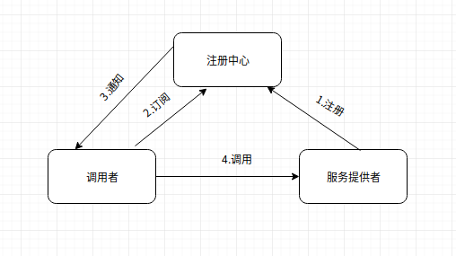
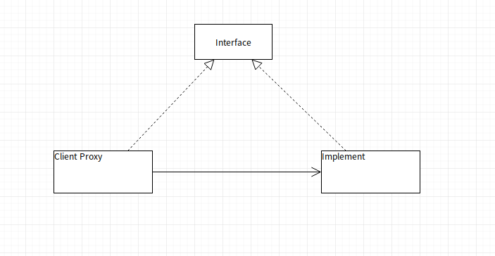

# 初体验

Dubbo是Alibaba开源的分布式RPC框架，目前已经捐赠给了Apache基金会，项目主页是[http://dubbo.apache.org](http://dubbo.apache.org)。Dubbo核心架构中有几个重要的概念，包括注册中心、服务提供者和服务消费者，它们的关系如下图所示。



注册中心作为服务提供者和调用者之间产生关系的桥梁。服务提供者先在注册中心注册它自己的相关信息，主要包括它的地址信息和其它一些配置参数。作为服务的消费者，也就是调用者一方需要从注册中心订阅服务信息，当服务信息发生变化时，注册中心将通知调用者，调用者获取到了服务的信息后就可以直接对服务提供者发起调用了，即调用过程是不需要注册中心的参与。服务提供者和调用者之间的关系可以简单的通过下面这张图来表示。



服务提供者发布的服务需要是基于某个接口的，服务调用者在调用服务时也是基于这个接口的。客户端会生成一个该接口的代理，当调用接口的方法时，代理会向服务提供者发起远程请求，如果接口方法是包含参数的，那么对应的参数将被序列化，需要确保实现了`java.io.Serializable`接口，请求到达服务端时方法参数会进行反序列化，然后在调用服务提供者类的对应方法，如果方法有返回值，那么返回结果给客户端之前也需要对返回结果对象进行序列化，客户端收到响应后也会对响应结果进行反序列化。

使用Dubbo时大的方向有两种方式，一种是基于Spring的方式使用，第二种是不依赖于Spring，直接使用Dubbo底层的API编程，这种通常对应于非Spring项目或者是需要很高的灵活性，基于Spring的配置满足不了等。基于Spring进行配置和使用又分基于XML配置和基于注解配置，笔者在这里先介绍基于XML配置的。Dubbo基于Spring的XML配置扩展了一个它自己的namespace，基于XML的配置将基于该namespace进行。使用基于XML的配置需要在Spring的配置文件中引入dubbo namespace，比如下面这样。

```xml
<?xml version="1.0" encoding="UTF-8"?>
<beans xmlns:xsi="http://www.w3.org/2001/XMLSchema-instance"
       xmlns:dubbo="http://dubbo.apache.org/schema/dubbo"
       xmlns="http://www.springframework.org/schema/beans"
       xsi:schemaLocation="http://www.springframework.org/schema/beans
       http://www.springframework.org/schema/beans/spring-beans.xsd
       http://dubbo.apache.org/schema/dubbo
       http://dubbo.apache.org/schema/dubbo/dubbo.xsd">

</beans>
```

## 服务发布

无论是作为服务提供者一方还是消费者都需要添加Dubbo的相关依赖，如果是基于Maven进行项目管理，请在项目的pom.xml中添加如下依赖。

```xml
<properties>
    <dubbo.version>2.7.2</dubbo.version>
</properties>

<dependencies>
    <dependency>
        <groupId>org.apache.dubbo</groupId>
        <artifactId>dubbo</artifactId>
        <version>${dubbo.version}</version>
    </dependency>
    <dependency>
        <groupId>org.apache.dubbo</groupId>
        <artifactId>dubbo-dependencies-zookeeper</artifactId>
        <version>${dubbo.version}</version>
        <type>pom</type>
    </dependency>
</dependencies>
```

现解设服务提供者需要发布一个HelloService服务，该接口定义如下。

```java
public interface HelloService {

    void sayHello(String name);

}
```

接口实现类HelloServiceImpl定义如下。

```java
public class HelloServiceImpl implements HelloService {
    @Override
    public void sayHello(String name) {
        System.out.println("Hello " + name);
    }
}
```

无论是服务提供者还是消费者都需要定义一个`<dubbo:application/>`来指定应用的名称，便于分析应用之间的依赖关系。

```xml
<dubbo:application name="hello-provider"/>
```

需要定义一个注册中心，通常应用Zookeeper作为注册中心，除了Zookeeper外还可以使用Redis等。

```xml
<dubbo:registry address="zookeeper://localhost:2181"/>
```

也可以配置如下。

```xml
<dubbo:registry protocol="zookeeper" address="localhost:2181"/>
```

Zookeeper是基于目录服务的，它默认使用的顶级目录是dubbo。如果你的Zookeeper需要同时为多应用所使用，同时又希望它们之间的服务是隔离的，你可能需要为不同的应用组指定不同的顶级目录，这是通过`<dubbo:registry/>`的group属性来定义的。

```xml
<dubbo:registry protocol="zookeeper" address="localhost:2181" group="dubbo1" />
```

然后需要指定服务提供者需要对外发布服务的协议，如dubbo、http、hessian、rmi等，默认使用的是dubbo协议，端口号是20880，也可以像如下这样定义。

```xml
<dubbo:protocol name="dubbo" port="20880"/>
```

可以通过`<dubbo:provider/>`定义服务提供者一些通用的信息，比如下面就定义了服务方法默认的超时时间是2秒。timeout这个参数比较特殊，它虽然是定义在服务端，但是服务端不会使用它，而是客户端进行使用，即它声明的是客户端进行请求的超时时间，当客户端没有指定超时时间时默认就会使用服务端定义的timeout。

```xml
<dubbo:provider timeout="2000"/>
```

可以通过`<dubbo:service/>`定义需要对外发布的服务，在一个JVM中可以发布多个服务，通过interface属性需要对外发布的服务对应的接口，通过ref属性指定该服务的实现者。

```xml
<dubbo:service interface="com.elim.study.dubbo.service.HelloService" ref="helloService"/>
```

服务提供者发布HelloService的完整配置如下。

```xml
<?xml version="1.0" encoding="UTF-8"?>
<beans xmlns:xsi="http://www.w3.org/2001/XMLSchema-instance"
       xmlns:dubbo="http://dubbo.apache.org/schema/dubbo"
       xmlns="http://www.springframework.org/schema/beans"
       xsi:schemaLocation="http://www.springframework.org/schema/beans
       http://www.springframework.org/schema/beans/spring-beans.xsd
       http://dubbo.apache.org/schema/dubbo
       http://dubbo.apache.org/schema/dubbo/dubbo.xsd">

    <dubbo:application name="hello-provider"/>
    <dubbo:protocol name="dubbo" port="20880"/>
    <dubbo:provider timeout="2000"/>
    <dubbo:registry address="zookeeper://localhost:2181"/>
    <dubbo:service interface="com.elim.study.dubbo.service.HelloService" ref="helloService"/>
    <bean id="helloService" class="com.elim.study.dubbo.service.HelloServiceImpl"/>

</beans>
```

发布服务的测试代码如下，Spring容器启动后，对应的服务就自动发布了，并注册到了注册中心。

```java
@Test
public void provider() throws Exception {
    new ClassPathXmlApplicationContext("/hello-server.xml");
    System.in.read();
}
```

如果在方法级别需要有特殊的配置，也是可以的，可以通过`<dubbo:method/>`定义方法级别的控制参数，基本与`<dubbo:service/>`相同。比如下面就指定了调用方法名为`sayHello`的方法时超时时间是500毫秒，其它方法将使用默认的。

```xml
<dubbo:service interface="com.elim.study.dubbo.service.HelloService" ref="helloService">
    <dubbo:method name="sayHello" timeout="500"/>
</dubbo:service>
```

如果有多个同名的重载方法，但是只需要对其中的某一个来进行特殊配置，此时还需要考虑通过参数来区别具体的方法。可以通过`<dubbo:argument/>`来定义对应的方法参数。

```xml
<dubbo:service interface="com.elim.study.dubbo.service.HelloService" ref="helloService">
    <dubbo:method name="sayHello" timeout="500">
        <dubbo:argument type="java.lang.String"/>
    </dubbo:method>
</dubbo:service>
```

## 服务消费

作为服务的调用者，也就是消费者一方，其需要配置一个服务提供者接口的代理类。这是通过`<dubbo:reference/>`配置的，id和interface属性都必须要配置。

```xml
<dubbo:reference id="helloService" interface="com.elim.study.dubbo.service.HelloService"/>
```

除此之外，它也需要通过`<dubbo:application/>`指定应用名称，通过`<dubbo:registry/>`指定配置中心的配置。相对于服务端的`<dubbo:provider/>`而言，客户端也有一个`<dubbo:consumer/>`用来定义作为消费者一方的一些默认配置，这些默认配置都是可以在`<dubbo:reference/>`中进行覆盖的，比如下面就定义了消费者消费失败时默认重试次数为0,即不重试，如果不指定该属性，默认是会最多重试两次的。

```xml
<dubbo:consumer retries="0"/>
```

服务消费者配置HelloService代理的完整配置如下。

```xml
<?xml version="1.0" encoding="UTF-8"?>
<beans xmlns:xsi="http://www.w3.org/2001/XMLSchema-instance"
       xmlns:dubbo="http://dubbo.apache.org/schema/dubbo"
       xmlns="http://www.springframework.org/schema/beans"
       xsi:schemaLocation="http://www.springframework.org/schema/beans
       http://www.springframework.org/schema/beans/spring-beans.xsd
       http://dubbo.apache.org/schema/dubbo
       http://dubbo.apache.org/schema/dubbo/dubbo.xsd">

    <dubbo:application name="hello-consumer"/>
    <dubbo:registry protocol="zookeeper" address="localhost:2181"/>
    <dubbo:consumer retries="0"/>
    <dubbo:reference id="helloService" interface="com.elim.study.dubbo.service.HelloService"/>

</beans>
```

消费者使用HelloService的测试代码如下，当进行调用以后服务端的控制台将会打印出`Hello Elim`。

```java
@Test
public void testConsumer() throws Exception {
    ClassPathXmlApplicationContext applicationContext = new ClassPathXmlApplicationContext("/hello-client.xml");
    HelloService helloService = applicationContext.getBean(HelloService.class);
    helloService.sayHello("Elim");
}
```

调用方如果需要配置方法级别的配置，也可以通过`<dubbo:method/>`和`<dubbo:argument/>`进行配置。

```xml
<dubbo:reference id="helloService" interface="com.elim.study.dubbo.service.HelloService">
    <dubbo:method name="sayHello" timeout="500">
        <dubbo:argument type="java.lang.String"/>
    </dubbo:method>
</dubbo:reference>
```

各配置之间的优先级关系可以参考下图（来自于官网）。


Dubbo的官方文档也是相当丰富的，更多信息可以参考[http://dubbo.apache.org/zh-cn/index.html](http://dubbo.apache.org/zh-cn/index.html)。

(注：本文基于Dubbo2.7.2所写)