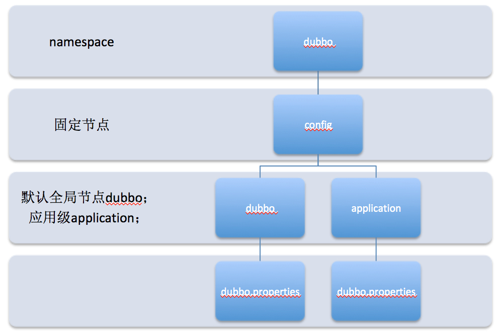

# 配置中心

配置中心也是为了把配置文件外部化的，它的作用与dubbo.properties是一样的，只是它是定义在应用之外的。Dubbo的配置中心有多种实现，包括Zookeeper/Apollo等。本文将以Zookeeper的支持作为示例进行讲解。配置包括全局配置和应用级配置，Zookeeper是目录结构的，它的全局配置对应的目录结构是`/dubbo/config/dubbo/dubbo.properties`，应用级配置对应的目录结构是`/dubbo/config/application/dubbo.properties`。其中application需要换成应用的名称。它们的关系如下图所示。



全局配置就是把你需要定义的配置文件，dubbo.properties文件的内容写入到Zookeeper的`/dubbo/config/dubbo/dubbo.properties`节点中，比如写下如下内容。

```properties
dubbo.registry.address=zookeeper://localhost:2181
dubbo.protocol.dubbo.name=dubbo
dubbo.protocol.dubbo.port=20881
dubbo.provider.retries=1
dubbo.provider.timeout=5000
```

可以通过相关API往Zookeeper中写入需要的内容，比如下面这样。

```java
@Test
public void test() throws Exception {
  CuratorFramework curatorFramework = CuratorFrameworkFactory.builder().connectString("localhost:2181").retryPolicy(new RetryOneTime(1000)).build();
  curatorFramework.start();
  byte[] bytes = Files.readAllBytes(Paths.get("path/to/dubbo.properties"));
  String path = "/dubbo/config/dubbo/dubbo.properties";

  String result = curatorFramework.create().creatingParentsIfNeeded().forPath(path, bytes);
  System.out.println(result);

}
```

然后在配置的时候需要通过`<dubbo:config-center/>`指定配置中心的相关信息。

```xml
<dubbo:config-center address="zookeeper://localhost:2181"/>
```

这时候还必须通过`<dubbo:application/>`指定应用的名称，因为从配置中心获取配置信息时除了获取全局的配置信息，还可以获取特定应用的配置信息。这时候我们的XML配置信息可能是如下这样。

```xml
<?xml version="1.0" encoding="UTF-8"?>
<beans xmlns:xsi="http://www.w3.org/2001/XMLSchema-instance"
       xmlns:dubbo="http://dubbo.apache.org/schema/dubbo"
       xmlns="http://www.springframework.org/schema/beans"
       xsi:schemaLocation="http://www.springframework.org/schema/beans
       http://www.springframework.org/schema/beans/spring-beans.xsd
       http://dubbo.apache.org/schema/dubbo
       http://dubbo.apache.org/schema/dubbo/dubbo.xsd">

  <dubbo:application name="hello-provider"/>

  <dubbo:config-center address="zookeeper://localhost:2181"/>

  <dubbo:service interface="com.elim.study.dubbo.service.HelloService" ref="helloService" />

  <bean id="helloService" class="com.elim.study.dubbo.service.HelloServiceImpl"/>

</beans>
```

如果没有定义应用特定的配置，此时应用使用的注册中心就是定义在配置中心全局配置中的`zookeeper://localhost:2181`，超时时间是5000毫秒。

此时应用的特定配置是定义在Zookeeper的节点`/dubbo/config/hello-provider/dubbo.properties`上，可以设置该节点的内容为如下内容。

```properties
dubbo.provider.retries=3
dubbo.provider.timeout=2000
```

这样，当前应用的最大重试次数是3，超时时间就是2000毫秒。

当使用了配置中心时，配置中心的配置将拥有更高的优先级。如果需要本地的配置的优先级比配置中心定义的配置的优先级更高，则可以指定系统属性`-Ddubbo.config-center.highest-priority=false`，或者是如下这样。

```xml
<dubbo:config-center address="zookeeper://localhost:2181" highest-priority="false"/>
```

当同一个Zookeeper作为多个应用的配置中心时，它们的配置可能是有冲突的。为此你可能需要将它们进行隔离。Dubbo有一个namespace的概念可以将它们进行隔离，默认就是配置中心的第一级目录dubbo，可以通过namespace属性指定为其它值。

```xml
<dubbo:config-center address="zookeeper://localhost:2181" namespace="hello"/>
```

（注：本文是基于Dubbo2.7.2所写）