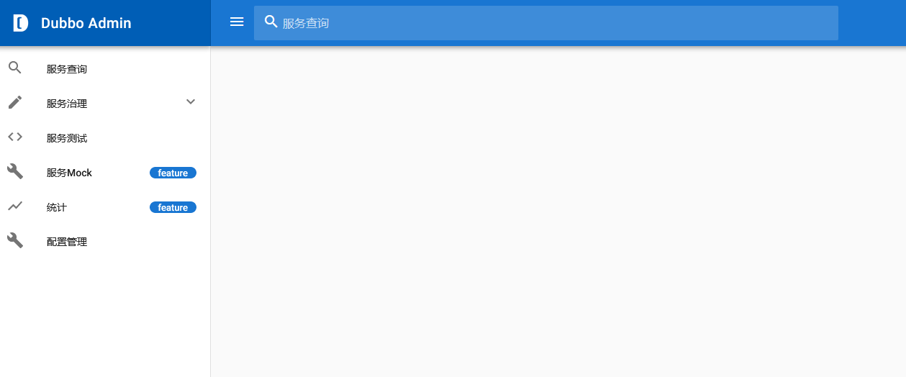
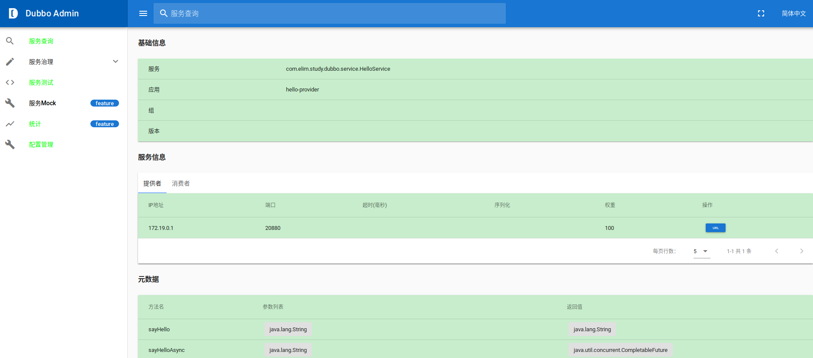

# 控制台

Dubbo提供了一个管理控制台可以对Dubbo服务进行管理。Dubbo管理控制台的Github地址是[https://github.com/apache/dubbo-admin/](https://github.com/apache/dubbo-admin/)。使用控制台时需要从Github上克隆其源代码。

```text
git clone https://github.com/apache/dubbo-admin.git
```

dubbo-admin下包含后端和前端代码，后端代码在dubbo-admin-server下，前端代码在dubbo-admin-ui下。后端是基于Spring Boot开发的，可以在`dubbo-admin-server/src/main/resources/application.properties`中修改相关的配置信息，主要是修改配置中心的信息。

然后可以在dubbo-admin根目录下执行`mvn clean package`进行打包。

然后运行dubbo-admin-server。

```text
mvn --projects dubbo-admin-server spring-boot:run
```

也可以直接运行dubbo-admin-server/target目录下的dubbo-admin-server.jar。

```text
java -jar dubbo-admin-server/target/dubbo-admin-server-0.1.jar
```

dubbo-admin-server启动后默认会监听在端口8080上，可以访问`localhost:8080`查看控制台。



如果想看到服务的元数据信息，比如服务有哪些方法，方法有哪些参数，返回值类型等，需要使用配置中心，在dubbo-admin-server的application.properties中指定配置中心和元数据的地址。

```properties
admin.config-center=zookeeper://127.0.0.1:2181
admin.metadata-report.address=zookeeper://127.0.0.1:2181
```

然后，服务的发布者也需要使用配置中心获取配置，并在配置中心的配置的dubbo.properties中加上如下内容。

```properties
dubbo.registry.address=zookeeper://127.0.0.1:2181
dubbo.metadata-report.address=zookeeper://127.0.0.1:2181
```

> 实际使用过程中记得修改对应的IP地址。

然后在访问dubbo控制台查看服务的详细信息页面就可以看到对应的元数据信息了。




（注：本文是基于Dubbo2.7.2所写）
