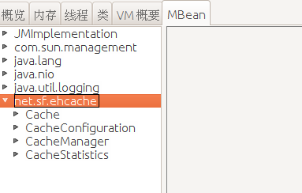

Ehcache提供了基于JMX的监控支持，支持对以下几类信息的监控。
* CacheManager
* Cache
* CacheConfiguration
* CacheStatistics

按照JMX的规范，为了支持对这几类信息的监控支持，Ehcache分别为它们建立了对应的MBean接口，这些接口都定义在net.sf.ehcache.management包中，分别是CacheManagerMBean、CacheMBean、CacheConfigurationMBean和CacheStatisticsMBean。按照JMX的规范，JMX监控页面只能查看MBean中定义的属性（get方法）和执行MBean接口中定义的操作（方法）。比方说CacheManagerMBean的定义如下，它能看到的属性就是status、name、cacheNames、caches、transactionCommittedCount、transactionRolledBackCount和transactionTimedOutCount。能进行的操作是shutdown()和clearAll()。
```java
public interface CacheManagerMBean {

    /**
     * Gets the status attribute of the Ehcache
     *
     * @return The status value, as a String from the Status enum class
     */
    String getStatus();

    /**
     * Gets the name of the cache manager
     *
     * @return The name of the CacheManager
     */
    String getName();

     /**
     * Shuts down the CacheManager.
     * <p/>
     * If the shutdown occurs on the singleton, then the singleton is removed, so that if a singleton access method
     * is called, a new singleton will be created.
     */
    void shutdown();


    /**
     * Clears  the contents of all caches in the CacheManager, but without
     * removing any caches.
     * <p/>
     * This method is not synchronized. It only guarantees to clear those elements in a cache
     * at the time that the {@link net.sf.ehcache.Ehcache#removeAll()} mehod  on each cache is called.
     */
    void clearAll();


    /**
     * Returns a JMX Cache bean
     *
     */
    Cache getCache(String name);


    /**
     * Gets the cache names managed by the CacheManager
     */
    String[] getCacheNames() throws IllegalStateException;

    /**
     * Gets a list of caches in this CacheManager
     * @return a list of JMX Cache objects
     */
    List getCaches();

    /**
     * Get the committed transactions count
     * @return the committed transactions count
     */
    long getTransactionCommittedCount();

    /**
     * Get the rolled back transactions count
     * @return the rolled back transactions count
     */
    long getTransactionRolledBackCount();

    /**
     * Get the timed out transactions count. Note that only transactions which failed to
     * commit due to a timeout are taken into account
     * @return the timed out transactions count
     */
    long getTransactionTimedOutCount();

}
```

注册这些MBean，Ehcache提供了一个工具类，ManagementService，可以通过它的registerMBeans方法进行注册，该方法定义如下，后面对应的4个boolean类型的参数，表示是否需要注册对应的MBean，依次表示CacheManager、Cache、CacheConfiguration和CacheStatistics。该工具方法最终会生成一个ManagementService实例，ManagementService实现了CacheManagerEventListener接口，所以它能感知到Cache的变化。
```java
public static void registerMBeans(
    net.sf.ehcache.CacheManager cacheManager,
    MBeanServer mBeanServer,
    boolean registerCacheManager,
    boolean registerCaches,
    boolean registerCacheConfigurations,
    boolean registerCacheStatistics) throws CacheException {
//...
}
```

以下是一个注册Ehcache对应的MBean的示例代码：
```java
CacheManager cacheManager = new CacheManager();
String cacheName = "test";
Ehcache cache = cacheManager.addCacheIfAbsent(cacheName);
cache.put(new Element("key is a object", "value is a object"));

MBeanServer mBeanServer = ManagementFactory.getPlatformMBeanServer();
ManagementService.registerMBeans(cacheManager, mBeanServer, true, true, true, true);
```

注册之后我们就可以通过jconsole的JMX界面看到对应的MBean的信息了。



Ehcache相关的MBean的objectName的命名规范如下：
* CacheManager - “net.sf.ehcache:type=CacheManager,name=<CacheManager>”
* Cache - “net.sf.ehcache:type=Cache,CacheManager=<cacheManagerName>,name=<cacheName>”
* CacheConfiguration - “net.sf.ehcache:type=CacheConfiguration,CacheManager=<cacheManagerName>,name=<cacheName>”
* CacheStatistics - “net.sf.ehcache:type=CacheStatistics,CacheManager=<cacheManagerName>,name=<cacheName>”

**参考文档**
[http://www.ehcache.org/documentation/2.7/operations/jmx.html](http://www.ehcache.org/documentation/2.7/operations/jmx.html)


（本文是基于Ehcache2.10.4所写，由Elim写于2017年10月8日）
