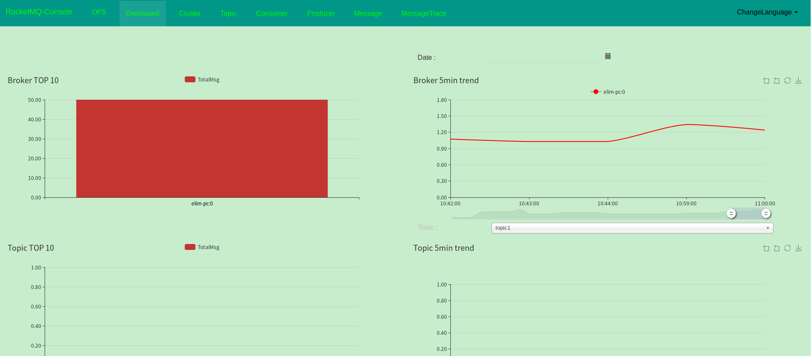
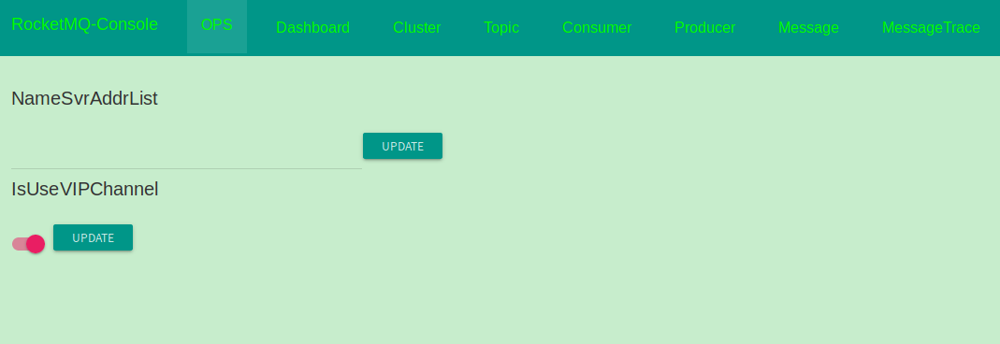
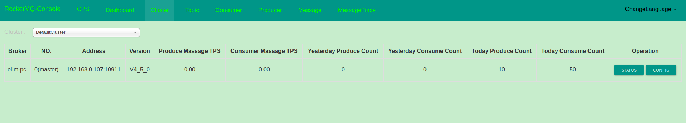
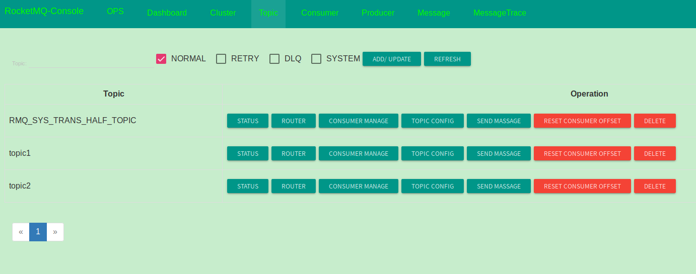
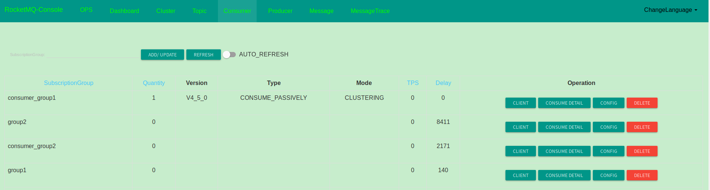
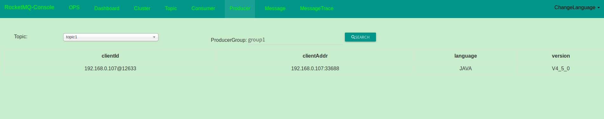
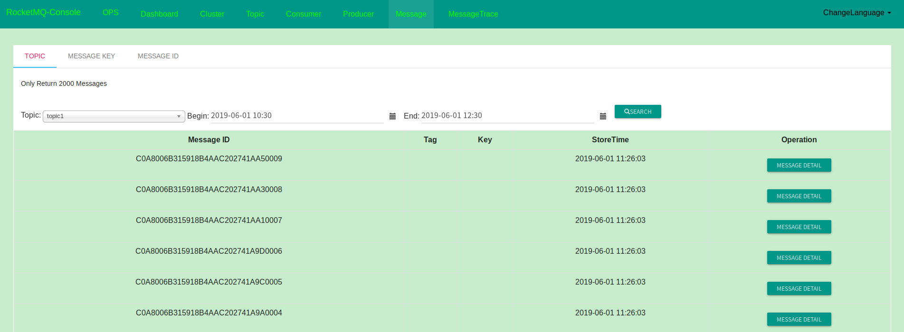

# RocketMQ控制台

RocketMQ提供了一个管理控制台，可以查看RocketMQ的相关信息和进行一些管理操作。RocketMQ在Github上专门有一个仓库用来存放一些与RocketMQ相关的项目，地址是`https://github.com/apache/rocketmq-externals`，控制台就是其中一个。如果需要使用控制台，需要从Github上clone `https://github.com/apache/rocketmq-externals`仓库到本地，然后进入到`rocketmq-console`。它是基于Spring Boot实现的，配置信息都定义在`src/main/resources/application.properties`文件中，需要通过`rocketmq.config.namesrvAddr`属性指定需要连接的NameServer地址，默认为空，即默认将采用系统属性、环境变量等方式获取NameServer的地址。指定了NameServer的地址后可以通过`mvn spring-boot:run`的方式启动RocketMQ控制台。也可以把它打包为一个jar包，然后通过`java -jar rocketmq-console-xxx.jar`启动，NameServer的地址也可以按照Spring Boot的规范放在命令行后指定，如`java -jar target/rocketmq-console-ng-1.0.1.jar --rocketmq.config.namesrvAddr=localhost:9876`。一开始在不指定NameServer的地址也可以启动RocketMQ Console，可以在启动后再在其OPS面板下指定NameServer地址。RocketMQ Console默认监听的是8080端口，可以通过`server.port`进行更改。启动后可以打开浏览器访问`http://localhost:8080`，然后可以看到类似如下这样的一个界面。

这是Dashboard面板，可以看到Broker和Topic两个维度的消息量。RocketMQ Console的顶部一共有8个菜单，OPS可以对控制台进行一些配置，主要是指定需要连接的NameServer的地址。如果在配置文件中一开始没有指定NameServer地址，或者指定的NameServer地址不是你想要的，也可以在这里进行重新指定。

Cluster可以查看集群信息，界面类似如下这样。

选定了集群后，底下会出现集群中包含的Broker相关信息。可以通过某个Broker右边的Operation列中的STATUS按钮查看Broker的一些运行时信息，通过CONFIG按钮可以查看该Broker的配置信息。

点击顶部的Topic菜单可以看到如下内容。

该界面可以查看到所有的Topic信息，包括系统的一些Topic。还可以在这里创建、修改和删除Topic。还可以手动发送消息。操作里面的`RESET CONSUMER OFFSET`按钮还可以重置某个消费者对该Topic的消费位置到某个时间点，这可以让Consumer对某些消费过的消息进行重新消费。

顶部的Consumer菜单可以查看消费者相关信息。

Producer菜单可以查看生产者相关信息，它需要通过Topic和Group进行搜索。

Message菜单可以从Topic、消息Key、消息ID三个维度来查询消息，查询完消息后可以查看消息的详细信息，也可以控制消息重新发送。

关于RocketMQ控制台的更多信息可以可以参考官方文档[https://github.com/apache/rocketmq-externals/blob/master/rocketmq-console/doc/1_0_0/UserGuide_CN.md](https://github.com/apache/rocketmq-externals/blob/master/rocketmq-console/doc/1_0_0/UserGuide_CN.md)。
