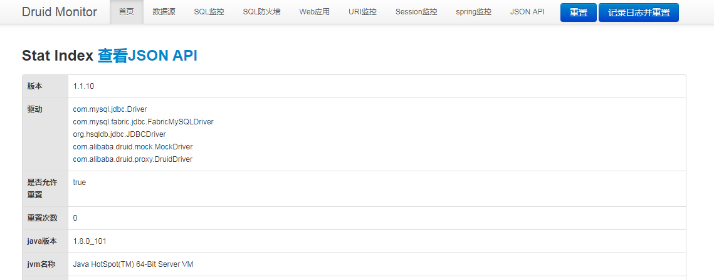

# 使用Alibaba Druid DataSource

DruidDataSource是Alibaba开源的一个数据库连接池，其GitHub地址是[https://github.com/alibaba/druid](https://github.com/alibaba/druid)。需要在Spring Boot应用中使用DruidDataSource，可以在pom.xml中加入如下依赖。`1.1.10`版本是目前最新的一个版本。

```xml
<dependency>
    <groupId>com.alibaba</groupId>
    <artifactId>druid-spring-boot-starter</artifactId>
    <version>1.1.10</version>
</dependency>
```

之后可以使用标准的`spring.datasource.*`指定数据库连接信息。

```properties
spring.datasource.url=jdbc:mysql://localhost/test
spring.datasource.driver-class-name=com.mysql.jdbc.Driver
spring.datasource.username=root
spring.datasource.password=elim
```

也可以使用`spring.datasource.druid.*`指定数据库连接信息，比如下面这样。

```properties
spring.datasource.druid.url=jdbc:mysql://localhost/test
spring.datasource.druid.driver-class-name=com.mysql.jdbc.Driver
spring.datasource.druid.username=root
spring.datasource.druid.password=elim
```

如果需要配置DruidDataSource特定的配置信息，则只能使用`spring.datasource.druid.*`配置，比如进行如下这些信息的配置。

```properties
spring.datasource.druid.initial-size=5
spring.datasource.druid.max-active=20
spring.datasource.druid.min-idle=5
spring.datasource.druid.max-wait=10000
spring.datasource.druid.validation-query=select 1
spring.datasource.druid.validation-query-timeout=2
spring.datasource.druid.test-on-borrow=true
spring.datasource.druid.test-on-return=true
spring.datasource.druid.test-while-idle=true
spring.datasource.druid.filters= stat,wall
```

> 关于DruidDataSource常用的配置属性信息可以参考[https://github.com/alibaba/druid/wiki/DruidDataSource%E9%85%8D%E7%BD%AE%E5%B1%9E%E6%80%A7%E5%88%97%E8%A1%A8](https://github.com/alibaba/druid/wiki/DruidDataSource%E9%85%8D%E7%BD%AE%E5%B1%9E%E6%80%A7%E5%88%97%E8%A1%A8)。更详细的可配置信息请参考DruidDataSource的API文档或源码。

默认会自动配置StatFilter，如果需要禁用StatFilter，可以配置`spring.datasource.druid.filter.stat.enabled=false`。其它Filter的启动和禁用也是类似的配置，比如需要启动WallFilter，则可以配置`spring.datasource.druid.filter.wall.enabled=true`。更多Filter的配置信息可以参考`com.alibaba.druid.spring.boot.autoconfigure.stat.DruidFilterConfiguration`的源码。也可以通过`spring.datasource.druid.filters= stat,wall`这样的方式指定需要启动的Filter。

默认会注册StatViewServlet，默认的映射地址是`/druid/*`。通过访问`/druid/index.html`可以看到类似下面这样的监控页面。



可以通过配置`spring.datasource.druid.stat-view-servlet.enabled=false`禁用自动注册StatViewServlet。可以通过`spring.datasource.druid.stat-view-servlet.url-pattern=/druid2/*`指定StatViewServlet的映射地址是`/druid2/*`。

可以通过如下配置指定在访问监控页面时需要进行登录，且登录的用户是user，使用的密码是pass。

```properties
spring.datasource.druid.stat-view-servlet.login-username=user
spring.datasource.druid.stat-view-servlet.login-password=pass
```

默认会注册WebStatFilter，用来对Web进行监控统计，默认映射的路径是`/*`，并且不会对一些静态资源拦截。可以通过`spring.datasource.druid.web-stat-filter.enabled=false`来禁用该Filter。关于WebStatFilter的更多配置可以参考`com.alibaba.druid.spring.boot.autoconfigure.stat.DruidWebStatFilterConfiguration`。

DruidDataSource的自动配置由`com.alibaba.druid.spring.boot.autoconfigure.DruidDataSourceAutoConfigure`负责。

## 参考文档

[https://github.com/alibaba/druid/tree/master/druid-spring-boot-starter](https://github.com/alibaba/druid/tree/master/druid-spring-boot-starter)

（本文是基于Spring Boot 2.0.3所写）