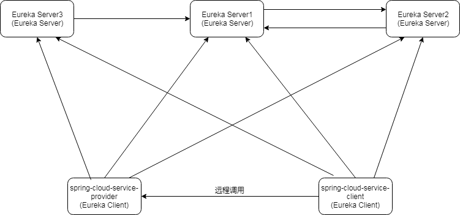

# Eureka Server

Eureka Server是Netflix提供的基于Rest的服务注册和发现框架，Spring Cloud对其进行了集成。使用Eureka Server需要添加`spring-cloud-starter-netflix-eureka-server`依赖。

```xml
<dependency>
    <groupId>org.springframework.cloud</groupId>
    <artifactId>spring-cloud-starter-netflix-eureka-server</artifactId>
</dependency>
```

然后在配置类（通常是启动类）上添加`@EnableEurekaServer`。

```java
@SpringBootApplication
@EnableEurekaServer
public class Application {

    public static void main(String[] args) {
        SpringApplication.run(Application.class, args);
    }
    
}
```

这样Eureka Server默认就启动了。默认使用的Web容器是Tomcat，监听端口号是8080，可以通过`server.port=8081`来改变监听的端口号。Eureka Server的配置参数是类似`eureka.server.*`的形式，可配置的参数可以参考`org.springframework.cloud.netflix.eureka.server.EurekaServerConfigBean`中定义的属性，该Class是一个`@ConfigurationProperties`，对应的prefix就是`eureka.server`，但是官方一般不建议我们去修改这些参数。Eureka Server内部也包含了Eureka Client，当多个Eureka Server之间需要进行通信时，它就充当Eureka Client的角色。所以Eureka Client的配置参数也是适用于Eureka Server的，详细的Eureka Client的配置参数将在介绍Eureka Client一文进行介绍。对于单机环境而言，Eureka Server是不需要连接其它Eureka Server的，此时可以通过`eureka.client.registerWithEureka=false`关闭注册服务功能，通过`eureka.client.fetchRegistry=false`关闭从Eureka Server获取注册信息功能，否则自带的Eureka Client默认会访问`http://localhost:8761/eureka/`以进行服务注册或获取注册信息。所以单机环境下通常也会把`eureka.client.serviceUrl`的值指定为`http://localhost:${server.port}/eureka/`，其中`${server.port}`为当前Eureka Server运行的端口号。

```yml
server.port: 8761
eureka:
  client:
    registerWithEureka: false
    fetchRegistry: false
    serviceUrl:
      defaultZone: http://localhost:${server.port}/eureka/
  instance:
    preferIpAddress: true
```

> 指定`eureka.instance.preferIpAddress=true`可以让Eureka在需要获取hostname时都改为获取当前机器的IP地址。

通过运行上面的Application.java启动了Eureka Server后就可以通过Eureka Server的IP和端口号访问Eureka Server的控制台查看上面注册的服务了，比如对于上面的配置可以在本机访问`http://localhost:8761`，然后可以看到类似如下这样的界面。


Eureka Client在从Eureka Server获取到了服务的注册信息后会将其缓存在本地，Eureka Client的服务调用方在调用Eureka Client服务提供方时是不会经过Eureka Server的，而是直接调用Eureka Client的服务提供方，对应的服务提供方的信息来自于Eureka Server。Eureka Server只有单机器时，如果Eureka Server挂了，此时Eureka Client将能够继续运行，只是Eureka Client的信息不能从Eureka Server得到更新了，它不能发现新的服务了，也不能及时发现哪个服务提供方的服务已经不可用了。Eureka Server也支持高可用，即Eureka Server也可以部署多台。当Eureka Server拥有多台时需要它们之间是相互连通的，连通方式是彼此之间指定`eureka.client.serviceUrl.defaultZone`为相互连通即可。比如现在有A、B、C三台Eureka Server，可以指定A的`eureka.client.serviceUrl.defaultZone`为B机器，指定B机器的`eureka.client.serviceUrl.defaultZone`为C机器，指定C机器的`eureka.client.serviceUrl.defaultZone`为A或者B，这样A、B、C三台Eureka Server之间就建立起了联系，彼此之间相互成为副本，会互相同步注册的服务信息，比如有服务S1、S2、S3分别在A、B、C三台机器上进行了注册，那么A、B、C三台Eureka Server上将同时拥有S1、S2、S3的注册信息，服务调用方无论从A、B、C的哪台机器上都可以获取到S1、S2、S3的信息。

来看一个配置示例。假如下面的配置是Eureka Server1的，其监听端口是8081，配置的`eureka.client.serviceUrl.defaultZone`是监听在8082端口的本地Eureka Server2的。

```yml
server.port: 8081
eureka:
  client:
    serviceUrl:
      defaultZone: http://localhost:8082/eureka/
  instance:
    preferIpAddress: true
    instanceId: ${spring.cloud.client.ip-address}:${server.port}
```

> `eureka.instance.instanceId`是用来指定实例ID的，`${spring.cloud.client.ip-address}`是内置的占位符，表示当前机器的IP地址。

Eureka Server2的配置信息如下，其监听端口是8082，配置的`eureka.client.serviceUrl.defaultZone`是Eureka Server1。

```yml
server.port: 8082
eureka:
  client:
    serviceUrl:
      defaultZone: http://localhost:8081/eureka/
  instance:
    preferIpAddress: true
    instanceId: ${spring.cloud.client.ip-address}:${server.port}
```

Eureka Server3的配置信息如下，其监听端口是8083，配置的`eureka.client.serviceUrl.defaultZone`也是Eureka Server1。

```yml
server.port: 8083
eureka:
  client:
    serviceUrl:
      defaultZone: http://localhost1:8081/eureka/
  instance:
    preferIpAddress: true
    instanceId: ${spring.cloud.client.ip-address}:${server.port}
```

这样Eureka Server3和Eureka Server2都跟Eureka Server1通信，彼此之间建立起了连接。现有一个Eureka Client作为服务提供方，提供`spring-cloud-service-provider`服务，其配置如下，从配置中可以看到它指定的Eureka Server是Eureka Server群集中的所有实例，此时Eureka Client将向群集中一个可用的Eureka Server注册它自己，一旦在一个Eureka Server注册成功后，Eureka Server之间会自动同步注册的服务信息，即群集中的每一个Eureka Server都将拥有`spring-cloud-service-provider`服务信息。

```properties
spring.application.name=spring-cloud-service-provider
server.port=8900
eureka.client.serviceUrl.defaultZone=http://localhost:8081/eureka/,http://localhost:8082/eureka/,http://localhost:8083/eureka/
eureka.instance.preferIpAddress=true
eureka.instance.instanceId=${spring.cloud.client.ip-address}:${server.port}
```

有一个Eureka Client作为服务调用方，其配置如下。其指定了Eureka Server为 Eureka Server群集中的所有的实例，它需要使用`spring-cloud-service-provider`服务，然后它会向其中一个可用的Eureka Server寻求`spring-cloud-service-provider`服务的信息，群集中指定的多个Eureka Server只要有一个是正常的，Eureka Client就能正常与Eureka Server进行通信。

```properties
eureka.client.registerWithEureka=false
eureka.client.serviceUrl.defaultZone=http://localhost:8081/eureka/,http://localhost:8082/eureka/,http://localhost:8083/eureka/
```

上面配置的应用之间的关系如下图所示：



有兴趣的朋友可以基于上述的配置搭建自己完整的测试代码进行验证。


（注：本文是基于Spring cloud Finchley.SR1所写）