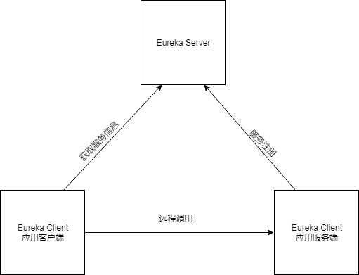

# Eureka Client介绍

Eureka Client是对应于Eureka Server的客户端，用于与Eureka Server进行通信。对于应用来说，Eureka Client又可以分为应用的服务端和应用的客户端，它们之间的关系如下图所示。应用服务端向Eureka Server注册它自己，应用客户端从Eureka Server获取应用服务信息，从而能够直接对应用服务端发起调用。



使用Eureka Client需要添加如下依赖。

```xml
<dependency>
    <groupId>org.springframework.cloud</groupId>
    <artifactId>spring-cloud-starter-netflix-eureka-client</artifactId>
</dependency>
```

添加了`spring-cloud-starter-netflix-eureka-client`依赖后Eureka Client默认会自动向Eureka Server进行注册，默认访问的Eureka Server是`http://localhost:8761/eureka/`。如果你的Eureka Server不是部署在localhost或者监听端口不是8761，可以在application.properties文件中通过`eureka.client.serviceUrl.defaultZone`进行指定。Eureka Client向Eureka Server注册的服务id会取`spring.application.name`的值，如果没有在application.properties文件中定义`spring.application.name`，则默认会是UNKOWN。所以作为Eureka Client的应用服务端，通常需要在application.properties中定义`spring.application.name`。对于服务提供者来说，作为Eureka Client时最重要的是instanceId，每个instanceId都要是唯一的，默认的instanceId是如下形式的。

```
${spring.cloud.client.hostname}:${spring.application.name}:${spring.application.instance_id:${server.port}}}
```

也就是说，如果你的应用是一个服务提供者，对应的应用名称是app1，hostname是host1，发布的端口号是8080，则对应的instanceId是`host1:app1:8080`，如果同样一个服务在8081端口也发布了，则其instanceId默认是`host1:app1:8081`。

> `server.port`需要在application.properties文件中指定，其不是默认自动获取的，而`spring.cloud.client.hostname`将自动获取本机的hostname。

可以通过`eureka.instance.instanceId`自定义instanceId的取值，比如下面就定义了instanceId为`hostname:port`形式。

```
eureka.instance.instanceId=${spring.cloud.client.hostname}:${server.port}
```

对于Eureka Client还可以通过`eureka.instance.preferIpAddress=true`指定在需要获取hostname时优先返回当前主机的IP地址。此时可以通过`${spring.cloud.client.ip-address}`作为当前主机IP的占位符，所以可以在定义instanceId时使用`${spring.cloud.client.ip-address}`占位符获取当前主机的IP地址，比如下面就定义了instanceId为`ip:port`形式。

```
eureka.instance.preferIpAddress=true
eureka.instance.instanceId=${spring.cloud.client.ip-address}:${server.port}
```

如果你应用是纯粹的作为应用客户端，那么你对应的Eureka Client可能就不需要向Eureka Server进行注册了，此时可以通过`eureka.client.registerWithEureka=false`指定不注册到Eureka Server。

Eureka Client作为从Client的角度可以配置的完整配置信息可以参考`org.springframework.cloud.netflix.eureka.EurekaClientConfigBean`的API文档或源码，从Instance的角度可以配置的完整配置信息可以参考`org.springframework.cloud.netflix.eureka.EurekaInstanceConfigBean`的API文档或源码。Eureka Client默认会每30秒发送一次心跳到Eureka Server，从Eureka Server的角度默认90秒收不到一个Eureka Client的心跳即认为该Eureka Client不可用了。可以在Eureka Client通过`eureka.instance.leaseRenewalIntervalInSeconds=20`指定Eureka Client每20秒发送一次心跳到Eureka Server。可以在Eureka Server通过`eureka.instance.leaseExpirationDurationInSeconds=60`指定当超过60秒还收不到一个Eureka Client的心跳，则认为该Eureka Client不可用了。Eureka Client默认每30秒从Eureka Server获取一次注册的服务信息，可以通过`eureka.client.registryFetchIntervalSeconds=10`指定每10秒获取一次服务注册信息。Eureka Server默认会每60秒做一次清理不可用的Eureka Client的操作，可以通过`eureka.server.evictionIntervalTimerInMs=120000`指定每120秒做一次清理操作。

作为应用的客户端，我们可以通过注入`com.netflix.discovery.EurekaClient`实例，然后通过EurekaClient实例获取提供某个服务的应用服务端的一个实例地址，从而能够进行对应的业务调用。在下面的`instanceUrl()`中通过注入的EurekaClient实例的`getNextServerFromEureka()`获取了服务`spring-cloud-service-provider`（其对应应用服务端的`${spring.application.name}`）的一个实例信息，进而获取到了该实例的首页地址。

```java
@Autowired
private EurekaClient eurekaClient;

@GetMapping("instance")
public String instanceUrl() {
    String virtualHostname = "spring-cloud-service-provider";
    InstanceInfo instanceInfo = this.eurekaClient.getNextServerFromEureka(virtualHostname, false);
    return instanceInfo.getHomePageUrl();
}
```

除了使用原生的EurekaClient，也可以选择使用Spring包装的`org.springframework.cloud.client.discovery.DiscoveryClient`，其用法更简单。

```java
@Autowired
private DiscoveryClient discoveryClient;

@GetMapping("instance2")
public String instanceUrl2() {
    String serviceId = "spring-cloud-service-provider";
    List<ServiceInstance> instances = this.discoveryClient.getInstances(serviceId);
    if (CollectionUtils.isNotEmpty(instances)) {
        return instances.get(0).getUri().toString();
    }
    return null;
}
```

> DiscoveryClient是Spring Cloud对服务发现的一个抽象包装，其可以有很多不同的实现，除了基于Eureka的实现外EurekaDiscoveryClient，还会有基于Consul的实现ConsulDiscoveryClient等。如果有需要用户也可以实现自己的DiscoveryClient实现。使用自定义的DiscoveryClient实现时，通常你还会实现自定义的ServiceRegistry。ServiceRegistry看着名字应该就知道是用来进行服务注册的。

取到了应用服务提供者的服务地址后，就可以调用对应的服务了，比如服务提供者`spring-cloud-service-provider`在`/hello`这个路径上发布了一个服务，通过下面的方式就可以访问到这个服务，并获得对应的返回。

```
@Autowired
private RestTemplateBuilder restTemplateBuilder;

@GetMapping("world")
public String helloWorld() throws Exception {
    String instanceUrl = this.instanceUrl();
    String serviceUrl = instanceUrl + "hello";
    String result = this.restTemplateBuilder.build().getForObject(new URI(serviceUrl), String.class);
    return result;
}
```

使用Spring Cloud的应用通常我们不会直接使用DiscoveryClient或EurekaClient获取到服务地址，再往指定的服务地址发起请求，而是使用更加简单的Feign。

（注：本文是基于Spring cloud Finchley.SR1所写）