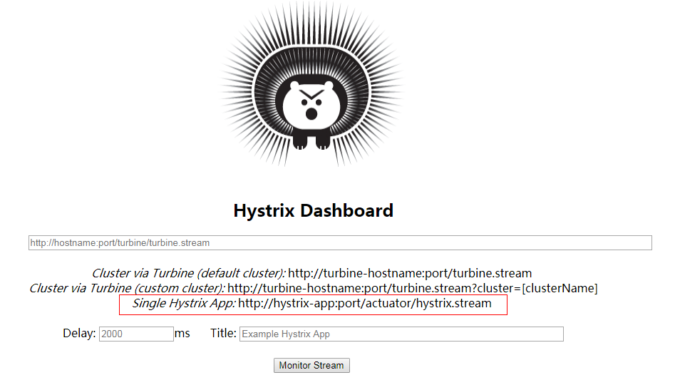
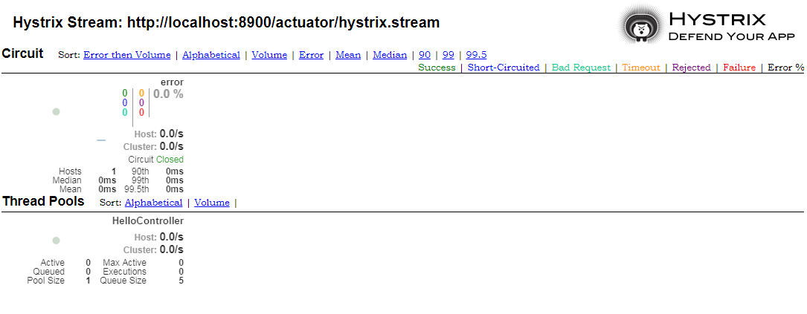
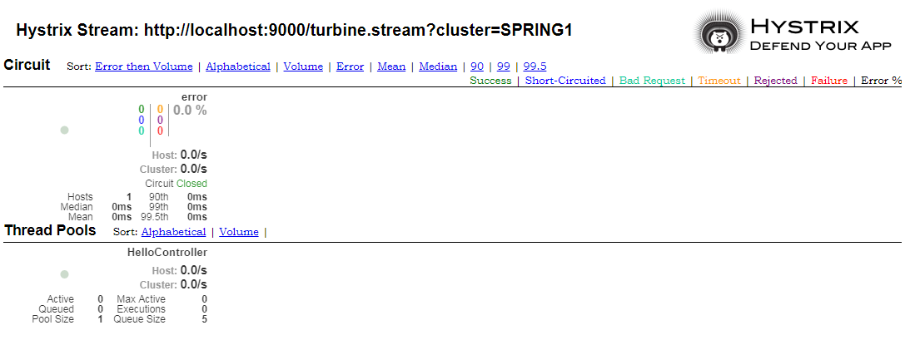

# Hystrix Dashboard

Spring Cloud也基于Spring Boot的监控规范提供了Hystrix的指标监控信息。为了看到这些监控信息，首先需要在pom.xml中添加如下依赖。

```xml
<dependency>
    <groupId>org.springframework.boot</groupId>
    <artifactId>spring-boot-starter-actuator</artifactId>
</dependency>
```

Spring Cloud提供的Hystrix监控信息的endpoint ID是`hystrix.stream`，为了看到对应的监控信息，还需要把Hystrix对应的endpoint以http的方式发布出来。可以以下面的方式明确的指定需要发布`hystrix.stream`。

```properties
management.endpoints.web.exposure.include=hystrix.stream
```

也可以直接指定发布所有的endpoint。

```properties
management.endpoints.web.exposure.include=*
```

发布了`hystrix.stream`后，跟其它endpoint一样，可以通过`/actuator/endpointId`获取对应endpoint发布的信息，所以可以通过`/actuator/hystrix.stream`访问到Hystrix发布的监控信息，此时可以看到类似如下这样的信息。


> 你也可能看到界面上一直显示的是`ping:`，这是因为应用刚启动，还没有对`@HystrixCommand`标注的方法发起请求，还没有产生对应的信息。

`hystrix.stream`直接看到的是JSON格式的数据，不直观。Hystrix有对应的图形监控界面，Spring Cloud也实现了对其的整合。使用图形监控界面需要在pom.xml中添加如下依赖。

```xml
<dependency>
    <groupId>org.springframework.cloud</groupId>
    <artifactId>spring-cloud-starter-netflix-hystrix-dashboard</artifactId>
</dependency>
```

然后在配置类上加上`@EnableHystrixDashboard`以启用对dashboard的支持。

```java
@SpringBootApplication
@EnableHystrixDashboard
@EnableCircuitBreaker
public class Application {

    public static void main(String[] args) {
        SpringApplication.run(Application.class, args);
    }

}
```

之后可以通过`/hystrix`访问到监控界面的首页，你会看到如下界面。



如上图红色标记部分所示，单机版访问的收集监控信息的地址是`http://hystrix-app:port/actuator/hystrix.stream`格式，笔者的应用部署在本机的8900端口，所以笔者收集监控信息的地址是`http://localhost:8900/actuator/hystrix.stream`，把它填入到第一个输入框，然后点击按钮`Monitor Stream`开始监控，你会看到类似如下界面。



在这个监控页面中可以看到各`@HystrixCommand`对应的断路器的状态，各请求的耗时情况，失败率，以及对应的线程池的状态等。

## turbine

`hystrix.stream`只能看到单个应用的监控信息。通常同一个服务会部署多份，使用`hystrix.stream`查看每个单个应用的情况会比较麻烦，也不利于分析。Netflix提供了一个可以聚合多个应用的监控信息的工具，叫turbine。使用turbine时，一般会独立一个工程，在pom.xml中添加如下依赖。

```xml
<dependency>
    <groupId>org.springframework.cloud</groupId>
    <artifactId>spring-cloud-starter-netflix-hystrix-dashboard</artifactId>
</dependency>
<dependency>
    <groupId>org.springframework.cloud</groupId>
    <artifactId>spring-cloud-starter-netflix-turbine</artifactId>
</dependency>
```

turbine在聚合多个应用实例的监控信息是通过Eureka进行实例发现的，所以它本身将作为一个Eureka Client，还需要往pom.xml中添加Eureka Client的依赖。

```xml
<dependency>
    <groupId>org.springframework.cloud</groupId>
    <artifactId>spring-cloud-starter-netflix-eureka-client</artifactId>
</dependency>
```

使用turbine的工程的配置类上需要加上`@EnableHystrixDashboard`启用Hystrix Dashboard，加上`@EnableTurbine`启用turbine支持。而此时被聚合的应用可以不再启用Hystrix Dashboard。

```java
@SpringBootApplication
@EnableHystrixDashboard
@EnableTurbine
public class Application {

    public static void main(String[] args) {
        SpringApplication.run(Application.class, args);
    }

}
```

使用turbine还需要进行一些配置，如下配置指定了Eureka Server的地址，且当前应用不需要向Eureka Server进行注册。`turbine.appConfig`指定了需要聚合的应用，对应于向Eureka Server注册的serviceId，即`spring.application.name`指定的值，下面的配置指定的需要聚合的服务是spring1。`turbine.aggregator.clusterConfig`指定了集群的名称，集群的名称只是用来把`turbine.appConfig`配置的服务名称分个组，默认是服务名称的大写形式，所以我们这里配置为SPRING1。

```properties
eureka.client.serviceUrl.defaultZone=http://localhost:8089/eureka/
eureka.client.registerWithEureka=false
server.port=9000

turbine.appConfig=spring1
turbine.aggregator.clusterConfig=SPRING1
```

服务启动后，就可以通过`/turbine.stream?cluster=SPRING1`访问到类似如下这样收集到的群集SPRING1的信息。


跟`hystrix.stream`一样，上面收集到的信息是JSON格式，不直观。我们也可以在Hystrix Dashboard中查看对应的图形界面信息。通过访问`/hystrix`进入Hystrix Dashboard的首页，在输入监控地址的位置输入`http://localhost:9000/turbine.stream?cluster=SPRING1`，然后点击`Monitor Stream`按钮进入监控页面，你会看到类似如下这样的界面。



turbine也可以同时监控多个不同的服务，监控多个不同的服务时，多个不同的服务之间以英文的逗号分隔，集群名称之间也是以英文逗号分隔。比如下面的配置，可以通过集群SPRING1监控服务spring1的相关信息，通过集群SPRING2监控服务spring2的相关信息。

```properties
turbine.appConfig=spring1,spring2
turbine.aggregator.clusterConfig=SPRING1,SPRING2
```

当一个turbine中同时指定了多个集群信息时，可以通过`/clusters`查看定义好的集群信息。基于上面的配置信息访问`http://localhost:9000/clusters`可以看到如下信息。


当使用的集群名称是default时，访问turbine.stream可以不指定cluster。可以通过下面的配置指定cluster名称为default。下面的配置相当于指定了服务spring1和spring2的集群名称都是default，在监控的时候可以同时监控这两个服务的相关信息。

```properties
turbine.appConfig=spring1,spring2
turbine.clusterNameExpression="default"
```

> 如果是基于YAML配置，需要指定`turbine.clusterNameExpression`的值为`"'default'"`。


（注：本文是基于Spring cloud Finchley.SR1所写）


