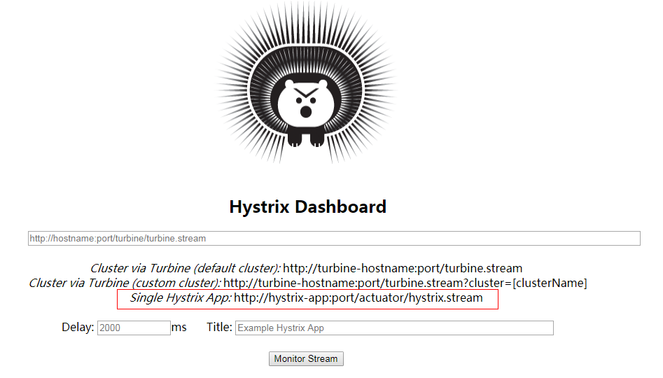

# 服务注册与发现工具-Consul

Spring Cloud也可以使用[Consul](https://learn.hashicorp.com/consul)作为服务注册与发现工具。Consul和Eureka一样，也有服务端和客户端的概念，它们都需要基于Consul Agent运行，即Agent有Server模式和Client模式，开发环境可以直接通过`consul agent -dev`启动一个Agent，它默认会监听8500端口。

## 注册服务

作为服务提供方如果需要通过Consul注册服务，则需要在应用中添加`spring-cloud-starter-consul-discovery`依赖。

```xml
<dependency>
  <groupId>org.springframework.cloud</groupId>
  <artifactId>spring-cloud-starter-consul-discovery</artifactId>
</dependency>
```

另外我们的应用需要通过http提供服务，所以还需要加上`spring-boot-starter-web`依赖。

```xml
<dependency>
  <groupId>org.springframework.boot</groupId>
  <artifactId>spring-boot-starter-web</artifactId>
</dependency>
```

不需要加其它特殊的配置了。服务启动后会自动向本机的8500端口发起服务注册请求。注册的服务名将取`${spring.application.name}`，端口号取`${server.port}`。

```java
@SpringBootApplication
public class Application {

  public static void main(String[] args) {
    SpringApplication.run(Application.class, args);
  }

}
```

所以当我们在application.properties中定义了如下配置后，注册的服务名是`spring-cloud-consul-server`，传递的端口号是9100。

```properties
server.port=9100
spring.application.name=spring-cloud-consul-server
```

如果Consul Client的host不是localhost或者port不是8500，则可以通过如下方式进行指定。比如下面指定了Consul Client的主机地址是10.10.10.3，端口号是8501。

```properties
spring.cloud.consul.host=10.10.10.3
spring.cloud.consul.port=8501
```

注册服务时默认会传递当前主机的主机名，如果希望使用IP，则可以指定`spring.cloud.consul.discovery.prefer-ip-address=true`。此时注册到Consul的当前服务的主机就会改用当前主机的IP地址，比如当前服务的主机IP地址是`10.10.10.1`，服务端口号是8080，则注册到Consul的服务主机地址是`10.10.10.1`，客户端就可以通过`http://10.10.10.1:8080/xxx`访问到当前服务。

```properties
spring.cloud.consul.discovery.prefer-ip-address=true
```

可以通过`spring.cloud.consul.discovery.enabled=false`来禁用Consul。


## 服务发现

服务发现是针对于客户端来说的，服务端注册了服务后，客户端可以通过Consul获取服务端的地址。作为客户端的一方也需要加入`spring-cloud-starter-consul-discovery`依赖，但是它通常不需要向Consul注册服务，所以通常我们需要定义`spring.cloud.consul.discovery.register=false`以关闭自动向Consul注册服务。

### 直接通过DiscoveryClient获取

可以直接通过Spring Cloud抽象的`org.springframework.cloud.client.discovery.DiscoveryClient`来获取某个服务的地址。下面的代码中就直接注入了DiscoveryClient，然后通过它获取到了服务`spring-cloud-consul-server`的相关实例信息。

```java
@SpringBootTest(classes = Application.class)
@RunWith(SpringRunner.class)
public class DiscoveryClientTest {

  private final String serviceId = "spring-cloud-consul-server";

  @Autowired
  private DiscoveryClient discoveryClient;

  @Test
  public void test() {
    List<String> serviceIds = this.discoveryClient.getServices();
    Assert.assertTrue(serviceIds.contains(serviceId));

    List<ServiceInstance> instances = this.discoveryClient.getInstances(serviceId);
    Assert.assertEquals(9100, instances.get(0).getPort());

  }

}
```

### 通过Ribbon获取

当存在Ribbon的依赖时，比如`spring-cloud-starter-netflix-ribbon`，可以通过RestTemplate来访问Consul上注册的服务。RestTemplate可以利用Ribbon进行客户端的负载均衡，下面的代码中定义了`org.springframework.web.client.RestTemplate`类型的bean，而且加上了`@LoadBalanced`，表明该RestTemplate拥有了基于Ribbon的负载均衡能力。

```java
@SpringBootApplication
public class Application {

  public static void main(String[] args) {
    SpringApplication.run(Application.class, args);
  }

  @Bean
  @LoadBalanced
  public RestTemplate restTemplate() {
    return new RestTemplate();
  }

}
```

然后就可以像下面这样在需要使用RestTemplate的地方注入RestTemplate，调用某个具体的服务时就可以不用指定服务主机地址了，改为使用serviceId，即之前注册服务时定义的服务名称，比如下面的`spring-cloud-consul-server`。下面就调用了服务`spring-cloud-consul-server`的`/hello`，返回的是一串`hello worldXXX`。

```java
@SpringBootTest(classes = Application.class)
@RunWith(SpringRunner.class)
public class RestTemplateTest {

  private final String serviceId = "spring-cloud-consul-server";

  @Autowired
  private RestTemplate restTemplate;

  @Test
  public void test() {
    String url = "http://" + serviceId + "/hello";
    String result = this.restTemplate.getForObject(url, String.class);
    Assert.assertTrue(result.startsWith("hello world"));

    ResponseEntity<String> responseEntity = this.restTemplate.getForEntity(url, String.class);
    Assert.assertEquals(200, responseEntity.getStatusCodeValue());
    Assert.assertTrue(responseEntity.getBody().startsWith("hello world"));
  }

}
```

### 通过Feign访问

Feign底层也是使用的Ribbon进行负载均衡的，如果需要整合使用Feign和Consul，可以在客户端工程中加上feign的依赖。

```xml
<dependency>
  <groupId>org.springframework.cloud</groupId>
  <artifactId>spring-cloud-starter-openfeign</artifactId>
</dependency>
```

其它操作就和之前介绍的基于Eureka进行服务发现使用Feign的方式是一样的。先在`@Configuration`类（通常是启动类Application）上加上`@EnableFeignClients`以启用FeignClient。

```java
@SpringBootApplication
@EnableFeignClients
public class Application {

  public static void main(String[] args) {
    SpringApplication.run(Application.class, args);
  }

}
```

然后就可以定义自己的FeignClient了，如下面代码中定义了一个HelloService接口，接口上使用`@FeignClient`指定了对应的服务名称是`${feign.client.hello}`（占位符，可以在application.properties中通过feign.client.hello属性名指定真正的服务名）。

```java
@FeignClient("${feign.client.hello}")
public interface HelloService {

  @GetMapping("/hello")
  String hello();

}
```

上面的HelloService会被扫描到并注册为一个Spring bean，可以在其它地方进行注入使用。

> 关于Feign的其它配置信息可以参考之前写的一篇专门介绍Feign的文章。

## 整合Hystrix

单纯的Hystrix的使用是与Consul无关的，即无论服务提供方以何种方式注册服务，其都可以使用Hystrix进行熔断。但是当我们的服务提供方使用了Consul进行服务注册后，在通过Turbine进行服务的熔断信息监控时，我们的Turbine应用也需要基于Consul获取服务信息。

### 服务提供方

服务提供方使用Hystrix时需要在pom.xml中添加如下依赖，`spring-cloud-starter-netflix-hystrix`是为了引入Hystrix的支持，`spring-boot-starter-actuator`是为了获取监控信息的。

```xml
<dependency>
  <groupId>org.springframework.boot</groupId>
  <artifactId>spring-boot-starter-actuator</artifactId>
</dependency>
<dependency>
  <groupId>org.springframework.cloud</groupId>
  <artifactId>spring-cloud-starter-netflix-hystrix</artifactId>
</dependency>
```

对应的监控信息由`hystrix.stream`这个Endpoint发布，所以还需指定`management.endpoints.web.exposure.include=hystrix.stream`以对外发布`hystrix.stream`，从而可以收集到Hystrix的相关信息。

然后需要在配置类上加上`@EnableHystrix`以启用Hystrix的支持。

```java
@SpringBootApplication
@EnableHystrix
public class Application {

  public static void main(String[] args) {
    SpringApplication.run(Application.class, args);
  }

}
```

然后就可以在需要进行断路器控制的方法上加上`@HystrixCommand`了。

```java
@GetMapping("{times}")
@HystrixCommand(fallbackMethod = "sayHelloTimesFallback")
public String sayHelloTimes(@PathVariable("times") int times) {
Preconditions.checkArgument(times % 3 != 0);
  return "hello times: " + times + "----" + LocalDateTime.now();
}

public String sayHelloTimesFallback(int times) {
  return "hello times from callback: " + times + "----" + LocalDateTime.now();
}
```

### Turbine应用

对于Turbine应用因为需要使用Consul进行服务发现，所以首先需要加上`spring-cloud-starter-consul-discovery`依赖。然后是Web应用，需要加上`spring-boot-starter-web`。Turbine支持需要加上`spring-cloud-netflix-turbine`。Hystrix的Dashboard需要加上`spring-cloud-starter-netflix-hystrix-dashboard`依赖。

```xml
<dependency>
  <groupId>org.springframework.cloud</groupId>
  <artifactId>spring-cloud-starter-consul-discovery</artifactId>
</dependency>
<dependency>
  <groupId>org.springframework.boot</groupId>
  <artifactId>spring-boot-starter-web</artifactId>
</dependency>
<dependency>
  <groupId>org.springframework.cloud</groupId>
  <artifactId>spring-cloud-netflix-turbine</artifactId>
</dependency>
<dependency>
  <groupId>org.springframework.cloud</groupId>
  <artifactId>spring-cloud-starter-netflix-hystrix-dashboard</artifactId>
</dependency>
```

然后需要在配置类上加上`@EnableTurbine`以启用Turbine，加上`@EnableHystrixDashboard`以启用Hystrix的Dashboard。

```java
@SpringBootApplication
@EnableTurbine
@EnableHystrixDashboard
public class Application {

  public static void main(String[] args) {
    SpringApplication.run(Application.class, args);
  }

}

```

然后需要在application.properties文件中配置需要聚合的服务的信息。

```properties
turbine.aggregator.cluster-config=spring-cloud-consul-server
turbine.app-config=spring-cloud-consul-server
```

假设Turbine应用部署的端口号是9102，接着访问`http://localhost:9102/hystrix`可以看到如下Hystrix Dashboard。



然后在输入框中输入`http://localhost:9102/turbine.stream?cluster=spring-cloud-consul-server`后点击下面的监控按钮就可以查看到服务`spring-cloud-consul-server`的Hystrix相关信息了，比如下面这样。


（注：本文是基于Spring Cloud Finchley.SR1所写）