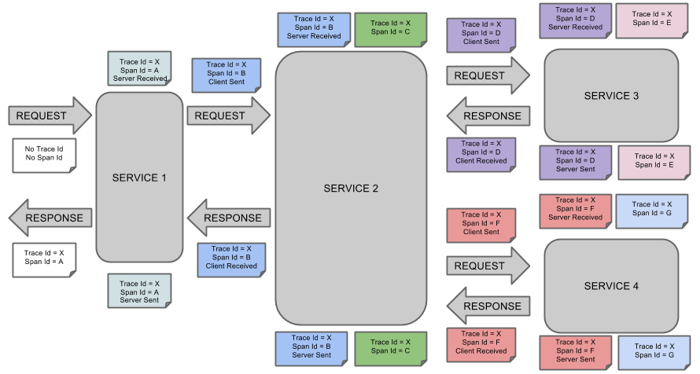
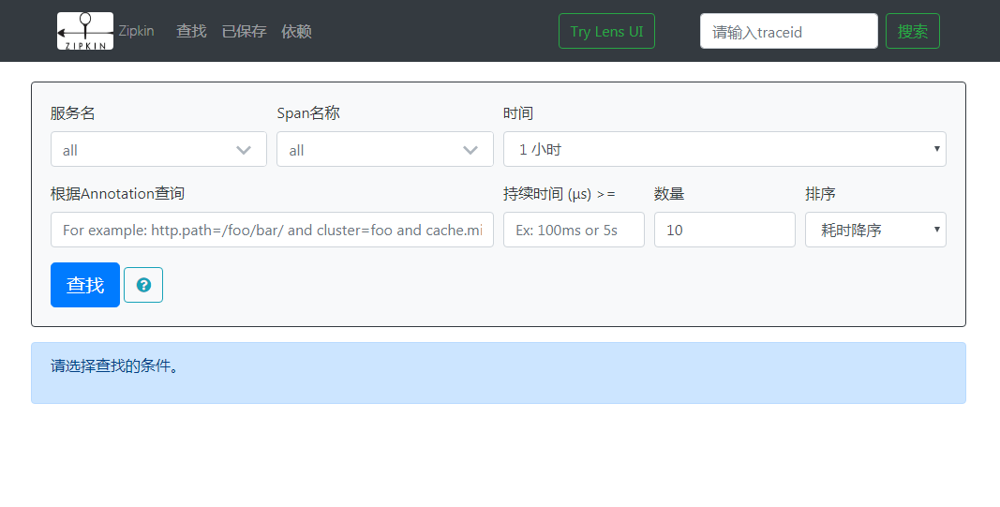
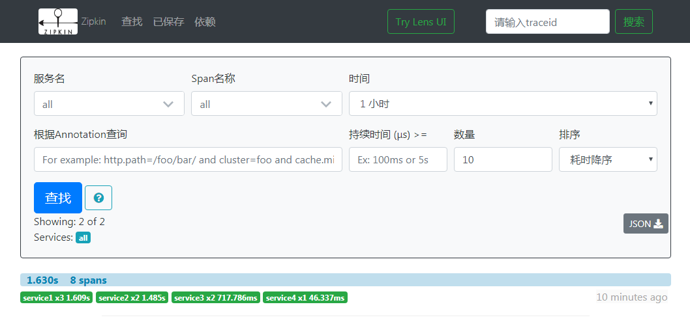
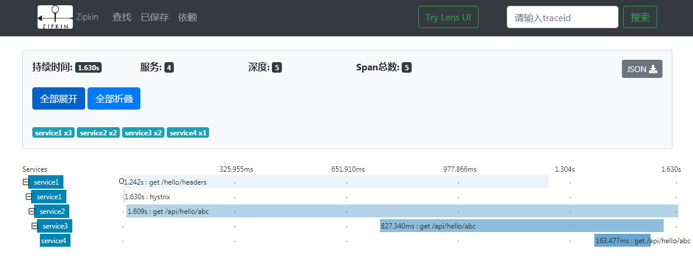
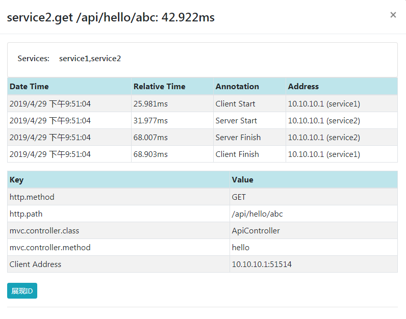
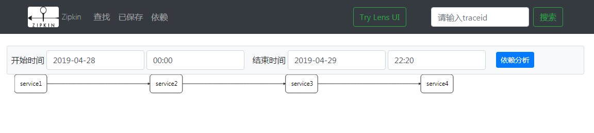
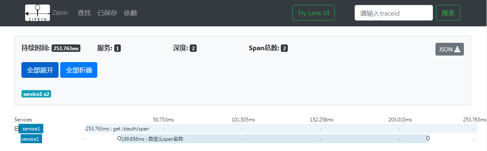
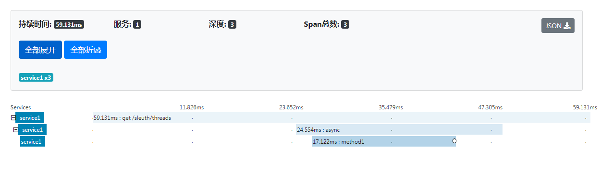

# 追踪工具Sleuth

Spring Cloud Sleuth可以用来追踪微服务请求中的整个请求，通过它可以记录各个请求之间的耗时、异常等情况。使用Spring Cloud Sleuth时一般会跟Zipkin一起使用。Spring Cloud Sleuth收集到的一些跟踪信息可以发送给Zipkin，Zipkin提供了图形化界面方便查看服务之间的调用关系和调用耗时等情况。我们先来看几个Spring Cloud Sleuth里面的基本概念。

* service: 服务名，它默认就取`spring.application.name`。
* span : 直接翻译就是跨度，比如service1调用service2，这一个来回可以算一个span。每个span都由一个唯一的spanId标识。
* trace: 直接翻译就是追踪的意思。它由一系列的span组成。通常在第一个服务接收到请求时开启一个trace，生成一个唯一的traceId，后续的所有追踪都可以沿用这同一个traceId，这样就可以来唯一的标识这一整个调用链路。 
* annotation: 标记追踪过程中的一个事件，记录事件发生的时间。通过记录多个事件发生的时间就可以知道任意两个事件之间的耗时情况。Spring Cloud Sleuth默认会记录如下这几种事件。
  - Client Sent: 客户端发送。记录客户端发起请求的时间，也是一个span的起点。
  - Server Received: 服务端接收。记录服务端接收到请求的时间，它的时间减去客户端发送的时间就是客户端到服务端的网络时延。
  - Server Sent: 服务端发送。记录服务端处理结束，进行结果响应的时间。它的时间减去服务端接收的时间就是服务端业务逻辑处理的时间。
  - Client Received: 客户端接收。记录客户端完成整个请求，接收到服务端响应内容的时间。它的时间减去客户端发送的时间就是客户端发起请求到接收到服务端响应需要的时间。
* tag: 标签，可以往span中添加一些Key、Value信息。
  
往Spring Cloud应用中添加Spring Cloud Sleuth的支持，只需要在pom.xml中添加`spring-cloud-starter-zipkin`依赖即可。

```xml
<dependency>
    <groupId>org.springframework.cloud</groupId>
    <artifactId>spring-cloud-starter-zipkin</artifactId>
</dependency>
```

当收到请求时其会自动开始追踪，生成一个唯一的traceId，创建初始span，在发起远程请求时会启用一个新的span，并把traceId和新创建的spanId放到Http请求头信息一起传到服务端。当请求到达远程服务时，如果远程服务的Classpath下也有`spring-cloud-starter-zipkin`依赖，那么它就可以从头信息中获取客户端传递过来的traceId和spanId，然后以该trace和span作为自己的初始trace和span继续按照相同的方式进行工作。如果服务的调用链很长，那么这个traceId可以一直传递下去，而每次调用新服务时那个spanId是新生成的。下图是在官网找的一张图片，很好的描述了这样一个过程。



## 启动Zipkin Server

当一个span完成后其会被上送到Zipkin Server。因为对于每一个单独的服务而言，其接收到请求后会生成一个新的span，span结束后会上送span信息到Zipkin Server，这一切都依赖于Spring Cloud Sleuth Zipkin。所以如果你的调用链里面的某个服务是没有`spring-cloud-starter-zipkin`依赖的，那么对该服务的调用信息是不会被上送到Zipkin Server的。从[https://repo1.maven.org/maven2/io/zipkin/java/zipkin-server/2.12.9/zipkin-server-2.12.9-exec.jar](https://repo1.maven.org/maven2/io/zipkin/java/zipkin-server/2.12.9/zipkin-server-2.12.9-exec.jar)下载zipkin服务的程序包，通过`java -jar zipkin-server-2.12.9-exec.jar`即可启动Zipkin-Server，其默认会监听9411端口。如果你的机器的9411端口号已经被占用了，或者你不想使用9411端口号。因为zipkin-server-xxx.jar内部也是基于Spring Boot开发的，那么你也可以通过`--server.port`指定需要监听的端口号。比如运行`java -jar zipkin-server-2.12.9-exec.jar --server.port=9999`即表示启动Zipkin-Server并且监听在端口9999上。假设我们应用的是默认端口9411，当启动zipkin-server后，打开浏览器访问`http://localhost:9411`会看到如下界面。



上面有一些选项可以选择一些筛选条件，选择好了后就可以进行查找，然后满足条件的trace就会一条条的列在下面。当你的应用中加入了`spring-cloud-starter-zipkin`依赖，你也发起了请求，但是当你访问zipkin Server时可能看不到任何调用记录。这是因为Spring Cloud Sleuth默认不是对所有的请求都进行追踪，它有一个Sampler的概念，可以用来确认是否一个请求需要进行追踪。Spring Cloud Sleuth Zipkin默认使用的是基于概率的ProbabilityBasedSampler实现，默认是10%的概率。可以通过`spring.sleuth.sampler.probability`来指定，取值范围是0-1。当取值为0时表示所有请求都不追踪，而取值为1时表示所有请求都进行追踪。所以如果你期望追踪所有的请求，则可以配置`spring.sleuth.sampler.probability=1`。

```yaml
spring:
  sleuth:
    sampler:
      probability: 1.0
```

指定追踪的概率时只需要在调用链的起始处进行指定，因为当一个请求在调用链的第一个服务已经是追踪的，那么它在整个调用链里面调用任何服务都将是追踪的。比如笔者的服务调用关系是service1->service2->service3->service4，那么需要指定所有请求都追踪时只需要在service1中进行指定。笔者进行了一次调用后到Zipkin Server的首页点击查找就会列出一条trace信息。



从上图可以看到这次调用一个花费了1.63秒，涉及8个span。其中service1包含3个span，花费1.609秒；service2包含2个span，花费1.485s；service3包含2个span，花费717.786毫秒；service4包含1个span，花费46.337毫秒。每条trace都是可以点击进去查看详细信息的，点击进去查看详细信息时会看到类似如下这样的界面。



看到这里你可能会觉得奇怪，在列表页看到的span数量明明是8，点进来怎么就变成了5呢？这是因为span之间是有重叠的。service1调用service2时新建的span与service2接收到请求到返回响应新建的span物理上是两个span对象，但是从逻辑上来说其实是同一个span，拥有相同的spanId。同理，service2->service3有一个共用的span，service3->service4有一个共用的span。所以实际的span应该是5个。而列表展示的是各个service包含的span数量的总和。点击其中的一条span记录会出现类似下面这样的详情页。



从上面的span详情可以看到，这是service1调用service2。记录了service1发起请求、接收到响应的事件和service2接收到请求和响应结束的事件。下面的Key、Value列出的是当前span中包含的一些tag信息，其默认把Spring MVC处理器相关的一些信息记录到了tag中。我们可以看到其中记录了Controller类名称，调用的方法名称。Http请求的方法、路径和客户端IP信息。

通过点击Zipkin Server控制台顶部的“依赖”可以查看到某段时间的服务调用关系，从而分析出服务之间的依赖关系。笔者的服务调用关系是service1->service2->service3->service4，点击后可以看到如下这样的依赖关系。



## 指定Zipkin Server地址

当一个span结束后，其会被上送到Zipkin Server，默认的Zipkin Server地址是`http://localhost:9411`。如果你使用的是远程的Zipkin Server，或者监听的端口号不是9411，那么你就需要手动指定Zipkin Server的地址，可以通过`spring.zipkin.baseUrl`进行指定。

```yaml
spring:
  zipkin:
    base-url: http://10.10.10.3:9411/
```

## 指定服务名称

上送span信息到Zipkin Server时默认上送的service名称是取自Spring Environment中的`spring.application.name`，如果你不希望获取的服务名称取自`spring.application.name`，则可以通过`spring.zipkin.service.name`来指定，比如下面就指定了应用上送span信息到zipkin Server时应用的服务名称为service1。

```yaml
spring:
  zipkin:
    service:
      name: service1
```

## 自定义Sampler

Zipkin是通过Sampler来决定是否需要对一个请求进行追踪的。它默认使用的是ProbabilityBasedSampler，如果该Sampler实现不能满足你的需要，也可以定义自己的Sampler。如果需要使用非默认的ProbabilityBasedSampler，只需要把想用的Sampler定义为一个spring bean即可。比如下面就定义了使用了zipkin brave自带的RateLimitingSampler。

```java
@SpringBootApplication
@EnableFeignClients
public class Application {

    public static void main(String[] args) {
        SpringApplication.run(Application.class, args);
    }

    @Bean
    public Sampler sampler() {
        int tracePerSecond = 1;
        return RateLimitingSampler.create(tracePerSecond);
    }

}
```

RateLimitingSampler可以用来限制每秒追踪请求的最大数量。我们上面的代码配置了每秒最多追踪一个请求。也就是说如果一秒接收到了10个请求，那么只有第一个请求会被追踪。使用RateLimitingSampler需要添加brave依赖。

```xml
<dependency>
    <groupId>io.zipkin.brave</groupId>
    <artifactId>brave</artifactId>
    <version>5.6.3</version>
</dependency>
```

## 手动创建span等相关信息

前面介绍的都是我们直接使用了Spring Cloud Sleuth自动添加的追踪信息，其实有需要我们也可以对这些追踪信息进行一些修改，比如添加span、annotation等。

### 创建span

Spring Cloud Sleuth Zipkin会自动创建用于追踪的`brave.Tracer` bean，通过注入它即可通过Tracer对象来创建span。比如下面代码中我们就通过注入的Tracer对象的`newTrace()`创建了一个全新的span。span创建好后必须调用其`start()`，span结束后必须调用其`finish()`，这样span才正常开始和结束，其相关信息才能上送到zipkin Server。

```java
@RestController
@RequestMapping("sleuth")
public class SleuthController {

  @Autowired
  private Tracer tracer;

  @GetMapping("span")
  public String span() throws Exception {
    Span rootSpan = this.tracer.newTrace();
    rootSpan.name("自定义span名称");
    rootSpan.start();
    rootSpan.annotate("start");
    try {
      TimeUnit.MILLISECONDS.sleep(200);
    } finally {
      rootSpan.annotate("finish");
      rootSpan.finish();
    }

    return "span";
  }

}
```

上面代码中我们创建了一个全新的span，并且自定义了它的名称，添加了一个start事件，完了后加上了一个finish事件，这样整个span的开始时间和结束时间都记录上了。发生异常时也通过`span.error(e)`记录了异常信息。当我们访问`/sleuth/span`后，通过Zipkin Server可以看到一共产生了两条追踪信息，分别对应两个span。第一个是由Spring Cloud Sleuth自动添加的访问Spring MVC的Controller方法记录的追踪信息，第二个是我们自己通过Tracer的`newTrace()`创建的全新的span，因为通过`newTrace()`创建的直接是根span，所以它跟我们同一个请求线程中Spring MVC Controller记录的span是完全独立的，也就产生了两条追踪信息。如果需要保持同一条追踪链，即需要把Spring MVC Controller对应的span作为新增的span的父span，这只需要调用Tracer的`nextSpan()`，其会自动把当前span作为父span，如果没有当前span，那么它自己就是根span。

```java
@GetMapping("span")
public String span() throws Exception {
    Span rootSpan = this.tracer.newTrace();
    rootSpan.name("自定义span名称");
    rootSpan.start();
    rootSpan.annotate("start");
    try {
      TimeUnit.MILLISECONDS.sleep(200);
    } catch (Exception e) {
      rootSpan.error(e);
    } finally {
      rootSpan.annotate("finish");
      rootSpan.finish();
    }
    
    return "span";
}
```

经过调整后再访问上面的方法，之后查看Zipkin Server就可以看到只有一条追踪信息，其包含两个span。



也可以通过注解来创建一个span。如果某个方法是需要记录一个全新的span的。则可以在该方法上添加`@NewSpan`。通过该方式创建的span等同于调用`nextSpan()`，即会自动把上一个span作为它的父span。

```java
  @GetMapping("span")
  @NewSpan
  public String span() throws Exception {
    Span currentSpan = this.tracer.currentSpan();
    currentSpan.annotate("start");
    try {
      TimeUnit.MILLISECONDS.sleep(200);
    } finally {
      currentSpan.annotate("finish");
    }

    return "span";
  }
```

上面的代码中我们通过`@NewSpan`标记该方法需要使用一个全新的span进行记录，span的名称默认会取方法名称。在方法体内部可以通过Tracer的`currentSpan()`获取到当前的span，如果当前上下文中没有span，则返回的是null。可以通过`@NewSpan("abc")`指定新的span的名称为`abc`。

与`@NewSpan`类似的还有一个`@ContinueSpan`，`@ContinueSpan`不创建新的span，而是沿用当前的span，但是它会在方法调用的前后分别记录一个事件，这样就可以记录一个方法调用的时间。事件的前缀需要通过log属性来指定，比如指定了`log="method"`，则会在方法调用前加上一个名为`method.before`的事件，方法调用完成后加上一个名为`method.after`的事件。

```java
  @ContinueSpan(log = "method")
  public void method() {
    System.out.println("-----Method-----");
  }
```

### 添加annotation

添加annotation首先需要有一个span，可以通过前面介绍的方式获取当前span或者创建一个新的span，然后通过其`annotate()`创建一个annotation。它没有对应的注解。

### 添加tag

可以直接通过span的`tag()`进行添加，只需要指定其key和value就好。下面的代码中就添加了5个tag。

```java
Span currentSpan = this.tracer.currentSpan();
for (int i=0; i<5; i++) {
  String key = "key" + i;
  String value = "value" + i;
  currentSpan.tag(key, value);
}
```

除了直接通过span添加tag外，我们也可以在方法参数上添加`@SpanTag`来指定当前的方法参数需要作为一个tag。可以通过其value或key属性指定tag的key。下面代码就定义了当调用方法method1时会添加一个key为tag123的tag，其值为传递的方法参数。所以当我们调用`method1("ABC")`时会添加一个Key为tag123，Value为ABC的tag。

```java
  @NewSpan
  public void method1(@SpanTag("tag123") String tagValue) {
    System.out.println("添加名为tag123的tag，值为" + tagValue);
  }
```

## 线程池调用

Spring Cloud Sleuth 应用中利用Executor类型的bean执行异步任务时，异步任务会自动被封装为一个span，且其父span为当前span，即异步任务也会维持在同一个追踪链中。来看一个示例，有如下这样一个Controller方法，其调用了sleuthLocalService的threads方法。

```java
  @GetMapping("threads")
  public String threads() {
    this.sleuthLocalService.threads();
    return "threads";
  }
  
```

SleuthLocalService内部又新启了一个线程调用了SleuthLocalService2的method1方法。

```java
@Service
public class SleuthLocalService {

  @Autowired
  private TaskExecutor taskExecutor;
  @Autowired
  private SleuthLocalService2 sleuthLocalService2;

  public void threads() {
    this.taskExecutor.execute(() -> {
      this.sleuthLocalService2.method1();
    });
  }

}
```

SleuthLocalService2的method1方法上加了`@NewSpan`，所以其会创建一个新的span。

```java
@Service
public class SleuthLocalService2 {

  @Autowired
  private Tracer tracer;

  @NewSpan
  public void method1() {
    Span span = this.tracer.currentSpan();
    span.tag("tagA", "123");
    span.annotate("finish...");
  }

}
```

整个过程应该是有3个span。服务端接收到客户端发起的Http请求会有一个span，接着是通过线程池发起异步请求会有一个span，异步线程中调用SleuthLocalService2.method1会有一个span。请求完后我们打开Zipkin Server可以看到如下这样一条追踪信息。



这种通过线程池发起的异步调用创建的span的名称默认是`async`。我们也可以显式的来指定我们的Runnable运行时对应的span的名称。这主要有三种方式。方法一是在实现了Runnable接口的Class上重写其`toString()`，通过`toString()`来指定span的名称。然后把该Runnable对象用Spring Cloud Sleuth提供的`TraceRunnable`对象进行包装。TraceRunnable对象需要用到Tracing对象和SpanNamer对象，这些Spring Cloud Sleuth都已经为我们准备好了，可以直接注入。比如下面这样。

```java
@Service
public class SleuthLocalService {

  @Autowired
  private TaskExecutor taskExecutor;
  @Autowired
  private SleuthLocalService2 sleuthLocalService2;
  @Autowired
  private Tracing tracing;
  @Autowired
  private SpanNamer spanNamer;

  public void threads() {
    Task task = new Task();
    TraceRunnable runnable = new TraceRunnable(this.tracing, this.spanNamer, task);
    this.taskExecutor.execute(runnable);
  }

  public class Task implements Runnable {

    @Override
    public void run() {
      sleuthLocalService2.method1();
    }

    @Override
    public String toString() {
      return "通过ToString指定span的名称";
    }
  }

}
```

如果你打开Zipkin Server查看，你会发现原来那个名为async的span还在，然后又多了一个我们自定义名称的span。这是正常的，因为TraceRunnable在执行的时候使用的是默认的async命名，执行TraceRunnable包装的Runnable时会重新创建一个新的span，并使用包装的Runnable的`toString()`作为span的名称。

方法二还是用TraceRunnable包装，但是通过其构造方法直接指定包装的Runnable执行时span的名称。比如下面就指定了包装的Runnable执行时的span的名称为`spanName-ABCDE`。

```java
  public void threads() {
    Task task = new Task();
    TraceRunnable runnable = new TraceRunnable(this.tracing, this.spanNamer, task, "spanName-ABCDE");
    this.taskExecutor.execute(runnable);
  }
```

方式三是在实现了Runnable接口的Class上通过`@SpanName`来指定span的名称。比如下面代码中就指定了包装的Runnable对应的span的名称是`AAAAA`。

```java
@Service
public class SleuthLocalService {

  @Autowired
  private TaskExecutor taskExecutor;
  @Autowired
  private SleuthLocalService2 sleuthLocalService2;

  @Autowired
  private Tracing tracing;
  @Autowired
  private SpanNamer spanNamer;

  public void threads() {
    Task task = new Task();
    TraceRunnable runnable = new TraceRunnable(this.tracing, this.spanNamer, task);
    this.taskExecutor.execute(runnable);
  }

  @SpanName("AAAAA")
  public class Task implements Runnable {

    @Override
    public void run() {
      sleuthLocalService2.method1();
    }

  }

}
```

在调用`Callable`时也是同样的效果，默认会新建一个名为async的span。如果需要显式的指定Callable调用的span的名称，需要使用Spring Cloud Sleuth提供的`TraceCallable`进行包装，它与TraceRunnable一样拥有三种方式指定span的名称。比如下面代码中就指定了运行包装的Callable时创建的span的名称是`callable-task`。

```java
@Service
public class SleuthLocalService {

  @Autowired
  private ThreadPoolTaskExecutor taskExecutor;
  @Autowired
  private Tracing tracing;
  @Autowired
  private SpanNamer spanNamer;

  public void threads() throws Exception {
    CallableTask callableTask = new CallableTask();
    TraceCallable<Integer> traceCallable = new TraceCallable<>(this.tracing, this.spanNamer, callableTask);
    Future<Integer> future = this.taskExecutor.submit(traceCallable);
    System.out.println(future.get());
  }

  @SpanName("callable-task")
  public class CallableTask implements Callable<Integer> {

    @Override
    public Integer call() throws Exception {
      return 100;
    }
  }

}
```

对于`@Async`标注的方法进行异步调用时也会新建一个span，默认的span的名称将取方法名称，然后tag里面会加上Class名称和方法名称。可以通过`@SpanName`手动指定对应的名称，比如下面这样。

```java
  @Async
  @SpanName("async-task-1")
  public void asyncTask() throws Exception {
    TimeUnit.MILLISECONDS.sleep(100);
  }
```

> 如果不希望对`@Async`方法进行追踪，则可以指定`spring.sleuth.async.enabled=false`。

对于`@Scheduled`标注的方法在调用时也会新建一个span，默认的span名称也是方法名称，其也会把Class名称和方法名称添加到tag中。它的span名称不能通过`@SpanName`指定。如果不希望对`@Scheduled`方法进行追踪，可以指定`spring.sleuth.scheduled.enabled=false`。如果只是不希望对某些`@Scheduled`方法进行追踪，可以通过`spring.sleuth.scheduled.skipPattern`指定不需要追踪的`@Scheduled`方法的Class全名称，它是一个正则表达式。比如我如果不想对`com.elim.app.p1`包下面的所有Class中定义的所有的`@Scheduled`方法进行追踪，则可以指定`spring.sleuth.scheduled.skipPattern=com\.elim\.app\.p1\..*`。


## 日志输出支持

Spring Cloud Sleuth的追踪信息中的traceId、spanId会自动的添加到Slf4j的MDC中。所以如果你使用的日志框架是走的SLF4j规范的，则可以在日志中使用traceId、spanId变量。比如笔者使用的是Logback，则可以在定义其pattern时使用traceId和spanId。

```xml
<appender name="STDOUT" class="ch.qos.logback.core.ConsoleAppender">
    <encoder>
        <pattern>%d{HH:mm:ss.SSS}-[%X{traceId}-%X{spanId}] [%thread] %-5level %logger{36} -%msg%n</pattern>
    </encoder>
</appender>
```

## TracingFilter

TracingFilter实现了`javax.servlet.Filter`接口，它由Spring Cloud Sleuth自动创建。当Web容器接收到一个请求后，TracingFilter将对该请求进行拦截。其会从头信息中获取traceId、spanId等信息，并基于它们重新构造一个span，该span和客户端发送请求的span将是同一个span。而客户端在进行Http请求时将视客户端实现而定来把traceId、spanId等信息封装到Header中。比如Feign Client的将由`TracingFeignClient`负责。如果想了解其内部实现，可以参考`brave.servlet.TracingFilter`的源码。

## SpanAdjuster

SpanAdjuster可以在把span信息发送到Zipkin Server之前对span进行一些处理。如果我们有这样的需求，只需要定义自己的SpanAdjuster bean即可。比如下面就定义了这样一个bean，它在发送span信息之前把span的名称加了一个固定的前缀`app-`，并添加了一个发送时间的事件。

```java
  @Bean
  public SpanAdjuster spanAdjuster() {
    return span -> {
      Span result = span.toBuilder().name("app-" + span.name()).addAnnotation(System.currentTimeMillis() * 1000, "reporting").build();
      return result;
    };
  }
```

## 取消hystrix span

当我们的请求需要经过Hystrix对应的HystrixCommand时，会自动创建一个名称为hystrix的span。如果不需要这层span，可以指定`spring.sleuth.hystrix.strategy.enabled=false`。

## 参考文档

* [https://cloud.spring.io/spring-cloud-static/Finchley.SR2/multi/multi__spring_cloud_sleuth.html](https://cloud.spring.io/spring-cloud-static/Finchley.SR2/multi/multi__spring_cloud_sleuth.html)

（注：本文是基于Spring Cloud Finchley.SR1所写）